# OpenROAD Native Build and Environment Setup on Ubuntu

---

# Overview

This phase focused on setting up and building OpenROAD natively on Ubuntu rather than relying solely on the prebuilt Docker environment provided by OpenROAD Flow Scripts (ORFS).

The objective was to gain a deeper understanding of the OpenROAD toolchain by:

* verifying the ORFS Docker environment
* attempting local OpenROAD installation
* cloning the OpenROAD source repository
* installing required build dependencies
* resolving compilation and dependency issues
* building OpenROAD from source
* validating the locally generated executable

Unlike the containerized workflow, this phase exposed the internal build process and demonstrated how large EDA tools are compiled and assembled from source code.

---

## Understanding the Existing OpenROAD Environment

Before building OpenROAD from source, the existing ORFS environment was examined to understand how OpenROAD was being provided and whether it could be installed directly on the local machine.

### Checking the Host System

The local Ubuntu environment was checked to verify whether OpenROAD was already installed.

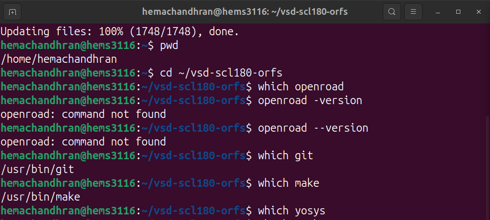

The following commands were executed:

```bash
which openroad
openroad --version
```

The output showed that OpenROAD was not available on the host system.

### Attempting Native Installation

A native installation was then attempted using the VSD installation script.

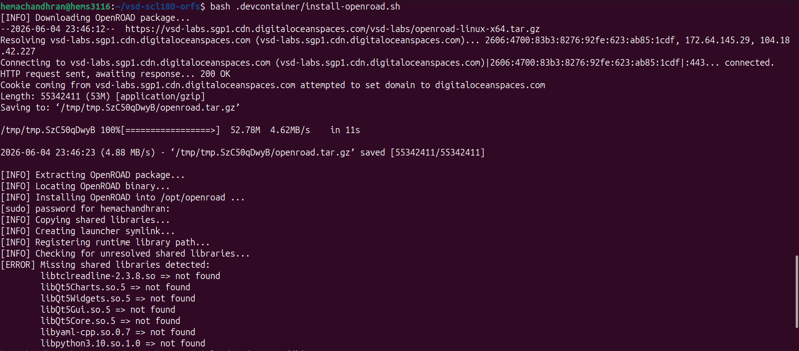

The installer successfully downloaded and extracted the OpenROAD package and began the installation process.

### Installation Failure

During installation, several required shared libraries were found to be missing.


Missing dependencies included Qt and Python runtime libraries, preventing OpenROAD from running correctly on the local system.

### Verifying the ORFS Docker Environment

Since the native installation was unsuccessful, the ORFS Docker environment was inspected.

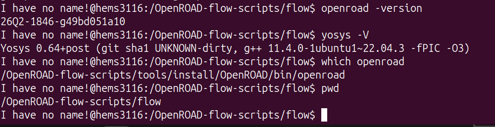

Inside the Docker container, OpenROAD and Yosys were immediately available and working without any additional setup.

### Observation

This experiment demonstrated the difference between native and containerized installations.

| Environment                 | OpenROAD Status |
| --------------------------- | --------------- |
| Host Ubuntu                 | Not Installed   |
| Native Installation Attempt | Failed          |
| ORFS Docker Container       | Working         |

The ORFS Docker environment provided a fully configured OpenROAD setup with all required dependencies already installed, while native installation required additional dependency management.

---

# Cloning the OpenROAD Repository

To perform a complete local build, the OpenROAD source repository was cloned from GitHub.

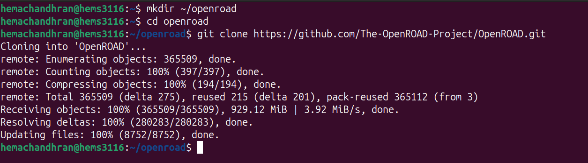

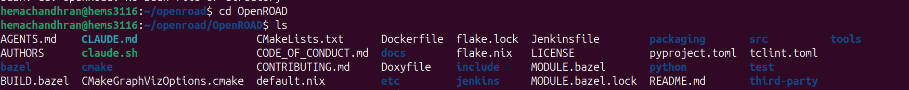

### Observation

The repository download exceeded 900 MB and contained:

* source code
* documentation
* build scripts
* test infrastructure
* third-party dependencies

This provided access to the complete OpenROAD development environment.

---

# Installing Build Dependencies

The dependency installation scripts supplied by OpenROAD were executed.

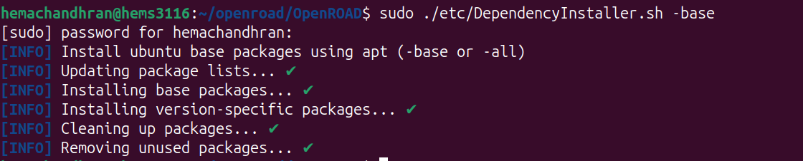


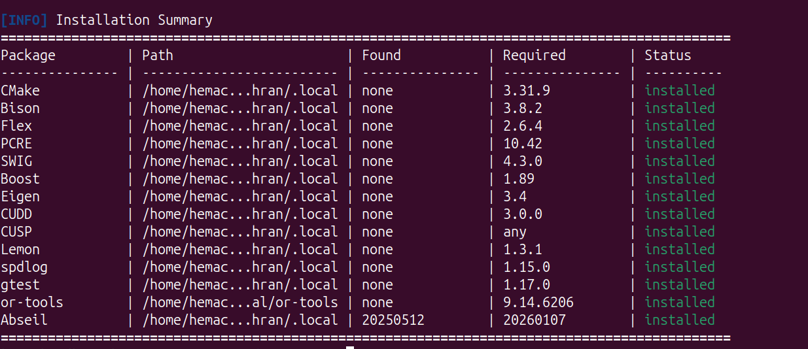

### Observation

The scripts automatically installed:

* CMake
* Bison
* Flex
* SWIG
* Boost
* Eigen
* OR-Tools
* Abseil
* Additional build libraries

This stage demonstrated how modern EDA tools depend on a large ecosystem of supporting libraries.

---

# Initial Build Failure Investigation

The first build attempt did not complete successfully.


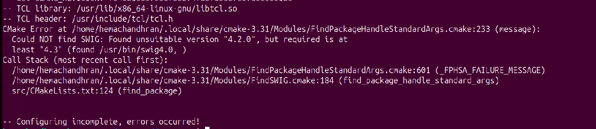

### Observation

The build process reported:

```text
Could NOT find SWIG:
Found unsuitable version "4.2.0"
Required version is at least "4.3"
```

Although SWIG had been installed by the dependency installer, the system continued detecting an older version from the operating system.

This introduced an important debugging exercise involving environment variables and executable search paths.

---

# Resolving the SWIG Version Conflict

The SWIG installation was investigated and corrected.

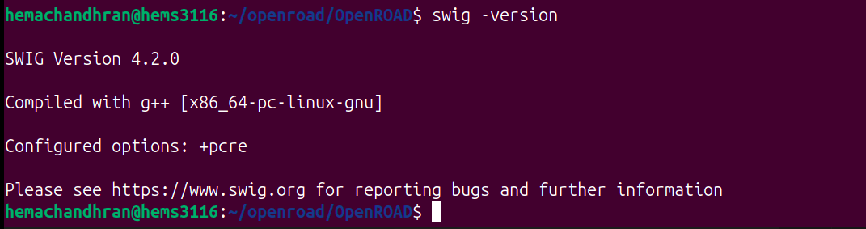

### Observation

After updating the environment path configuration:

```text
SWIG Version 4.3.0
```

became the active version detected by the build system.

This demonstrated how build systems rely on the executable discovered through the system PATH rather than simply checking whether a package exists.

---

# Successful OpenROAD Compilation

After resolving dependency and path issues, the OpenROAD build process was restarted.

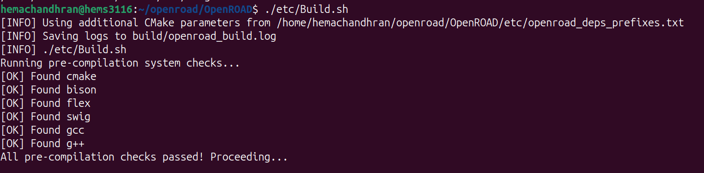
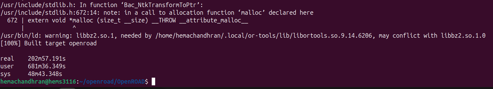

### Observation

The build passed all pre-compilation checks and completed successfully.

The final output reported:

```text
[100%] Built target openroad
```

Build statistics:

```text
Real Time : 202m 57s
≈ 3 hours 23 minutes
```

The long build duration highlighted the scale and complexity of a modern open-source physical design framework.

---

# Verifying the Generated Binary

Once compilation completed, the generated executable was verified.

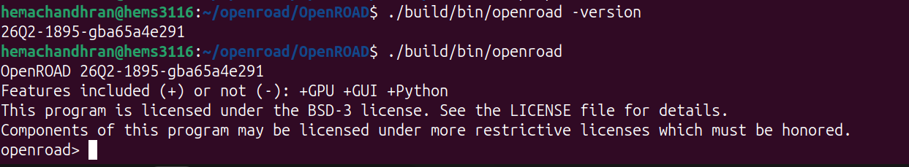

### Observation

The locally compiled binary successfully launched.

Version information:

```text
OpenROAD 26Q2-1895-gba65a4e291
```

Enabled features:

```text
+GPU
+GUI
+Python
```

The appearance of the OpenROAD interactive shell confirmed that the build had completed successfully and produced a fully functional executable.

---

# Build Challenges Encountered

During the setup process, several issues were identified and resolved:

| Issue                                       | Resolution                               |
| ------------------------------------------- | ---------------------------------------- |
| Missing shared libraries during VSD install | Switched to native source build          |
| Missing Git submodules                      | Initialized and updated submodules       |
| Missing CMake                               | Installed required package               |
| Missing SWIG                                | Installed SWIG 4.3                       |
| Incorrect SWIG version detected             | Updated PATH configuration               |
| Dependency package errors                   | Executed DependencyInstaller scripts     |
| Build configuration failures                | Resolved through dependency verification |

### Observation

These debugging activities provided practical exposure to Linux-based software development and dependency management, which are essential skills when working with EDA toolchains.


---

# Final Thoughts

This phase provided valuable exposure to the internal structure of the OpenROAD ecosystem.

Rather than using a preconfigured environment, building OpenROAD from source required understanding dependency management, Linux package installation, environment variables, Git submodules, and software compilation workflows.

The experience demonstrated that modern EDA tools are large software systems whose successful deployment depends as much on system configuration as on design knowledge.

---

## Biggest Takeaway

Using OpenROAD through Docker is sufficient for running designs.

Building OpenROAD from source reveals how the tool itself is assembled, how dependencies interact, and how Linux development environments are configured.

Successfully compiling OpenROAD from source transformed the tool from a black-box application into a software system whose structure and dependencies became much easier to understand.

---

# Tools Used

* **OpenROAD** – Open-Source Physical Design Platform
* **OpenROAD Flow Scripts (ORFS)** – Flow Automation Framework
* **Yosys** – Logic Synthesis Framework
* **Git** – Source Code Management
* **GNU Make** – Build Automation
* **CMake** – Build Configuration System
* **SWIG** – Interface Generation Tool
* **Boost** – C++ Library Collection
* **Eigen** – Mathematical Library
* **OR-Tools** – Optimization Framework
* **Abseil** – Utility Libraries
* **Ubuntu 24.04** – Development Platform
* **Docker** – Containerized Execution Environment
* **GitHub** – Source Repository Hosting
