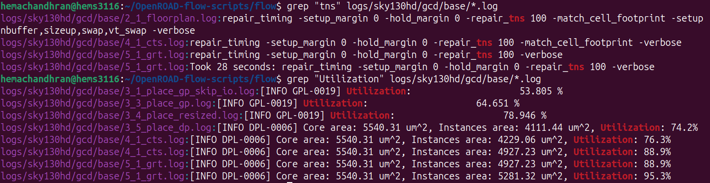

# Exploring ORFS Reports, Logs and Flow Artifacts

---

# Overview

In this phase, the focus shifted from executing the RTL-to-GDSII flow to understanding the artifacts generated by OpenROAD Flow Scripts (ORFS). The generated reports, logs, flow files, and configuration files were explored to understand how ORFS organizes data and how different stages of the ASIC design flow can be analyzed after execution.

The objectives of this phase were to:

* Explore ORFS report directories
* Understand generated reports and logs
* Examine synthesis statistics
* Investigate Makefiles used for flow orchestration
* Analyze timing and utilization information
* Understand environment-variable based tool management

---

# Exploring Generated Reports

The report directory generated during the RTL-to-GDSII flow was explored.


The reports folder contains outputs generated throughout the implementation flow, including:

* Floorplanning reports
* Placement reports
* Clock Tree Synthesis (CTS) reports
* Routing reports
* Signoff reports
* Congestion and IR-drop visualizations
* Layout screenshots and metrics

These files provide insight into every major stage of the physical design flow.

---

# Examining Synthesis Statistics

The synthesis statistics report was inspected to understand the information produced after logic synthesis.


### Commands Used

```bash
find -name "*.log"
```

The `find` command is used to search recursively through directories. Here it searches for all files ending with the `.log` extension, making it useful for locating log files generated during the design flow.

```bash
cat synth_stat.txt
```

The `cat` command displays the contents of a file directly in the terminal. It is commonly used for quickly viewing reports, configuration files, and logs without opening a text editor.

### Understanding the Report

The synthesis statistics file contains information about the synthesized design such as:

* Wire count
* Port count
* Wire-bit count
* Design hierarchy information
* Logic statistics generated by synthesis tools

These statistics help evaluate the complexity and structure of the synthesized design before physical implementation begins.

---

# Exploring Flow Configuration Files

The ORFS flow directory and Makefile were examined.


### Commands Used

```bash
ls
```

The `ls` command lists files and directories in the current location. It is one of the most frequently used Linux commands for navigating project structures.

```bash
less README.md
```

The `less` command opens a file in a scrollable viewer, allowing large documents to be inspected page by page without loading the entire file into memory.

```bash
cat Makefile
```

This command displays the contents of the Makefile, which defines how the automated design flow is executed.

### Understanding the Makefile

The Makefile acts as the central coordinator of ORFS. It defines:

* Which stages must execute
* The order of execution
* Dependencies between stages
* Tool invocation rules
* Output generation paths

By using GNU Make, ORFS can automate the entire RTL-to-GDSII flow with a single command.

---

# Investigating Timing and Utilization Information

Generated log files were searched for timing and utilization-related information.



### Commands Used

```bash
grep "tns" logs/sky130hd/gcd/base/*.log
```

The `grep` command searches text files for matching patterns. In this case, it searches all log files for occurrences of **TNS (Total Negative Slack)** related information.

```bash
grep "Utilization" logs/sky130hd/gcd/base/*.log
```

This command searches all log files for utilization data, allowing quick extraction of area-usage information from different implementation stages.

### Understanding the Results

The extracted logs showed how utilization changed throughout the implementation flow:

| Stage              | Utilization |
| ------------------ | ----------- |
| Initial Placement  | 53.8%       |
| Global Placement   | 64.7%       |
| Resized Placement  | 78.9%       |
| Detailed Placement | 74.2%       |
| CTS                | 88.9%       |
| Final Routing      | 95.3%       |

The logs also revealed timing-repair operations being performed during:

* Floorplanning
* Placement optimization
* Clock Tree Synthesis
* Routing

This demonstrates how timing optimization is continuously performed throughout the design flow.

---

# Understanding Environment Variables

The OpenROAD executable path was verified using a Linux environment variable.


### Commands Used

```bash
export OPENROAD_EXE=$HOME/openroad/OpenROAD/build/bin/openroad
```

The `export` command creates an environment variable and makes it available to the current shell session and child processes. Environment variables are commonly used to store executable paths and configuration settings.

```bash
echo $OPENROAD_EXE
```

The `echo` command prints the value stored in a variable. This is useful for verifying that environment variables have been configured correctly.

### Understanding Environment Variables

Environment variables allow scripts and tools to locate executables without requiring the full path to be typed repeatedly.

Benefits include:

* Easier tool management
* Improved script portability
* Reduced command complexity
* Centralized configuration

ORFS uses environment variables extensively to manage tool paths and flow settings.

---

# Key Learnings

During this phase, the following ORFS components were explored:

* Reports generated after each implementation stage
* Log files used for debugging and analysis
* Synthesis statistics reports
* Makefile-based flow orchestration
* Timing and utilization extraction from logs
* Environment-variable based tool management

This provided a deeper understanding of how ORFS stores information, automates execution, and supports design analysis.

---

# Final Thoughts

This phase focused on understanding the infrastructure surrounding the RTL-to-GDSII flow rather than executing the flow itself. By exploring reports, logs, configuration files, and environment variables, it became clear how ORFS organizes and automates complex ASIC implementation tasks.

---

## Biggest Takeaway

A successful ASIC flow is not only about generating a final GDSII file. Understanding the reports, logs, automation scripts, and configuration files is equally important for debugging, optimization, and design signoff. ORFS provides a structured framework that makes every stage of the implementation process traceable and analyzable.

---

# Tools Used

* **OpenROAD Flow Scripts (ORFS)** – Flow Automation Framework
* **GNU Make** – Flow Orchestration
* **OpenROAD** – Physical Design Engine
* **Yosys** – Logic Synthesis
* **OpenSTA** – Static Timing Analysis
* **Linux Shell Utilities** (`ls`, `cat`, `less`, `find`, `grep`)
* **Bash Environment Variables** – Tool Path Management
