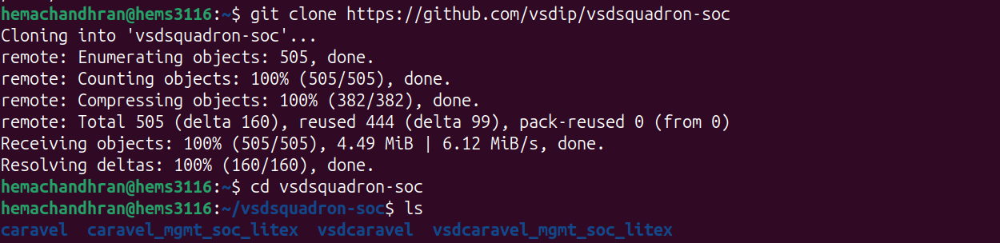
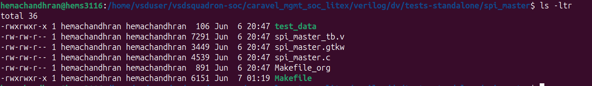
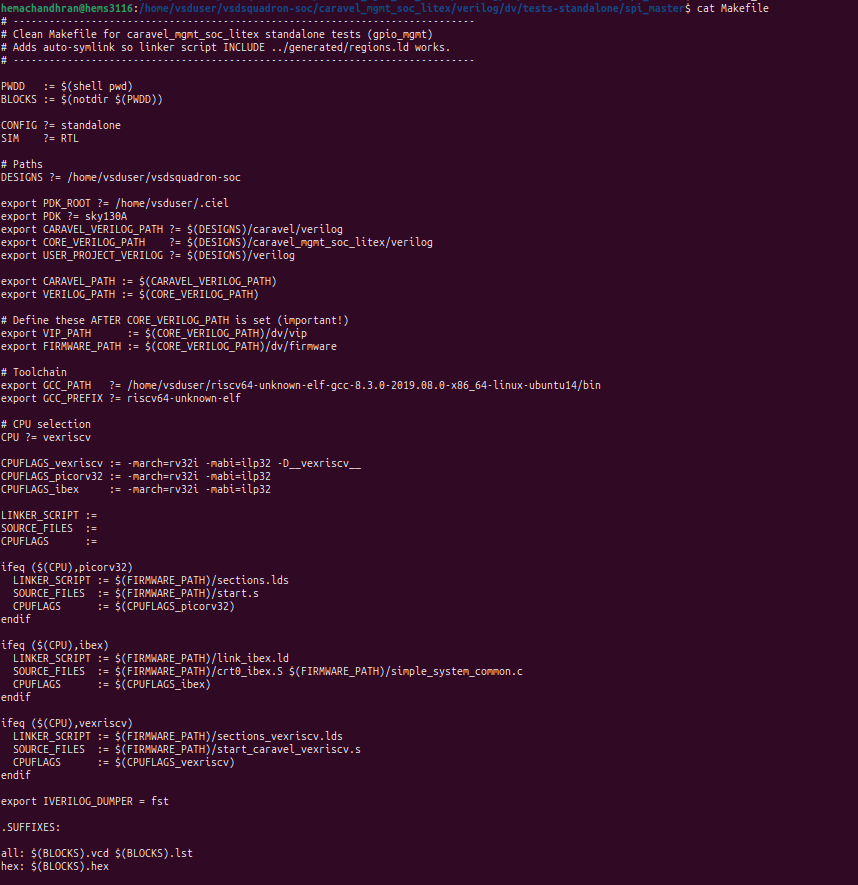
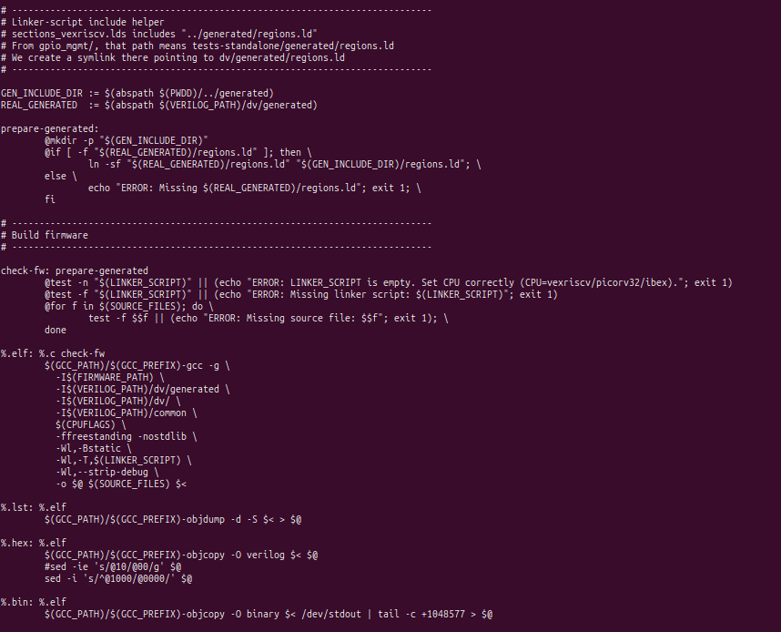
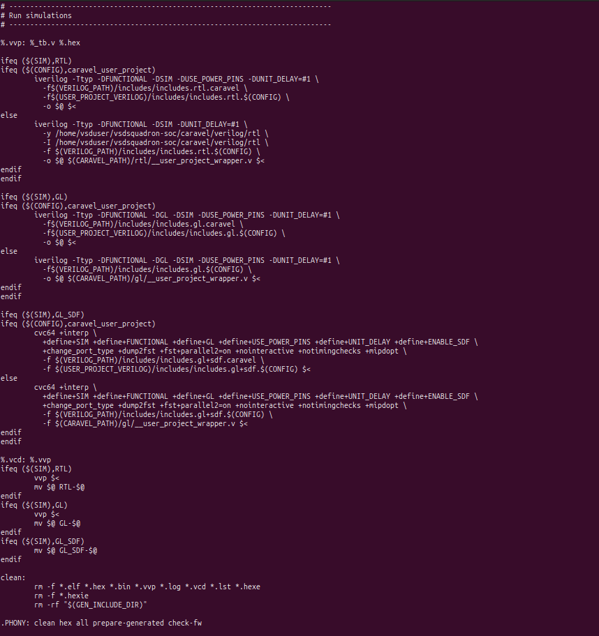
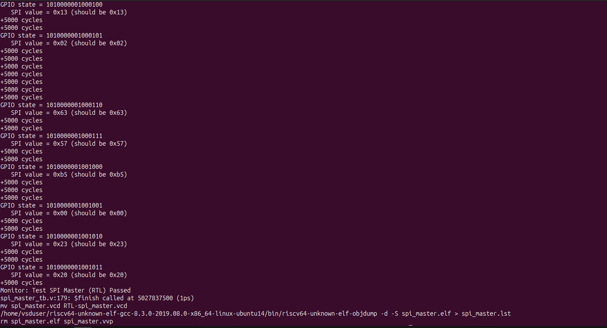
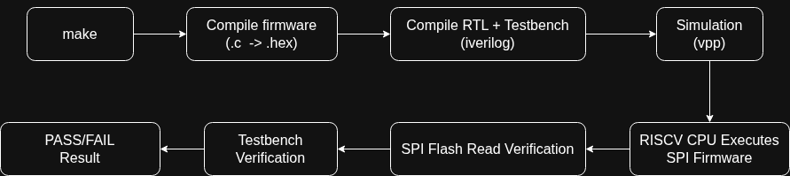
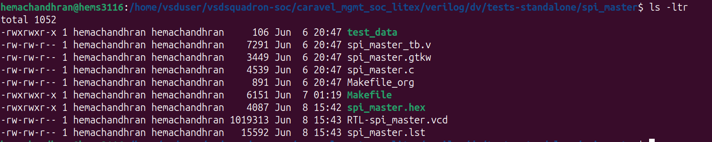
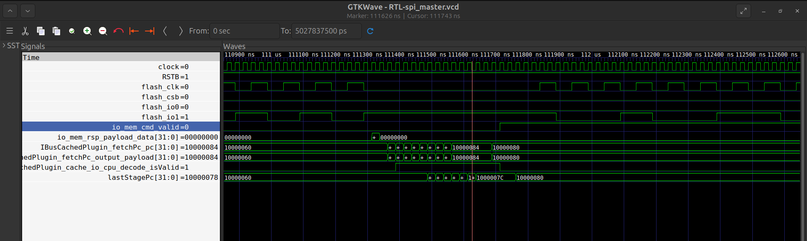

# Standalone SPI Master Verification

## Overview

The objective of this phase was to understand the standalone verification flow used in the VSDSquadron SoC environment by running and analyzing the SPI Master verification test.

This phase involved:

* Cloning and exploring the repository
* Understanding the SPI Master test structure
* Studying the Makefile flow
* Running the verification test
* Analyzing generated simulation artifacts
* Examining waveform activity using GTKWave
* Understanding the PASS/FAIL mechanism

---

## Cloning the Repository

The VSDSquadron SoC repository was cloned and the project structure was explored.



The repository contains the Caravel infrastructure, management SoC RTL, verification environment, firmware, and standalone verification test suites.

---

## Exploring the SPI Master Test Directory

The SPI Master standalone verification test is located at:

```bash
caravel_mgmt_soc_litex/verilog/dv/tests-standalone/spi_master
```

Before running the simulation, the contents of the directory were examined.

### Screenshot



### Files Present Before Execution

| File            | Description                                    |
| --------------- | ---------------------------------------------- |
| spi_master.c    | Firmware to be executed by the embedded VexRiscv CPU |
| spi_master_tb.v | Verilog testbench                              |
| Makefile        | Automation script for build and simulation     |
| spi_master.gtkw | GTKWave configuration                          |
| test_data       | Data used by the SPI Flash model               |

At this stage only the source files required for simulation were available. No compiled firmware or simulation outputs had been generated yet.

---

## Understanding the Makefile

Before running the simulation, the Makefile was studied to understand the verification flow.







The Makefile automates the complete verification process using a single command:

```bash
make
```

Internally, the flow performs the following operations:

The spi_master.c firmware was compiled using the RISC-V GCC compiler to generate a HEX file (spi_master.hex), which is loaded into the simulated memory. 

The RTL design, testbench, and firmware were then compiled using Icarus Verilog to create a simulation executable. 

Running the simulation allowed the embedded VexRiscv processor to execute the firmware and communicate with the SPI Flash model through the SPI Master peripheral. 

During execution, the testbench verified the received SPI data and generated a waveform file (RTL-spi_master.vcd) for analysis in GTKWave.

### Generated Files

| File               | Purpose                                   |
| ------------------ | ----------------------------------------- |
| spi_master.elf     | Compiled firmware executable              |
| spi_master.hex     | Memory initialization file                |
| spi_master.vvp     | Compiled simulation executable            |
| RTL-spi_master.vcd | Waveform dump generated during simulation |
| spi_master.lst     | Firmware disassembly listing              |

The Makefile compiles both the firmware and the hardware design. The generated HEX file is later loaded into the simulated memory and executed by the embedded CPU during verification.

---

## RISC-V Compiler Setup

The firmware is compiled using the RISC-V GCC toolchain.

The Makefile uses:

```text
riscv64-unknown-elf-gcc
```

to compile:

```text
spi_master.c
```

into:

```text
spi_master.hex
```

which is later loaded into the simulated memory before simulation begins.

---

## Running the SPI Master Verification Test

The simulation was executed using:

```bash
make clean
make
```




During execution:

* Firmware was compiled successfully
* HEX memory image was generated
* RTL and testbench were compiled using Icarus Verilog
* Simulation was executed using VVP
* Waveform dump was generated
* SPI transactions were verified

The simulation completed successfully with the message:

```text
Monitor: Test SPI Master (RTL) Passed
```

indicating that all verification checks passed.

---

## Makefile Verification Flow

The CPU executes the SPI firmware, communicates with the SPI Flash model through the SPI Master peripheral, and the testbench compares the returned values against expected reference values to determine PASS or FAIL.




---

## Generated Files After Simulation

After the simulation completed, the contents of the directory were examined again.

### Screenshot



### Newly Generated Files

| File               | Description           |
| ------------------ | --------------------- |
| spi_master.hex     | Firmware memory image |
| RTL-spi_master.vcd | Waveform dump         |
| spi_master.lst     | Firmware disassembly  |

These files were automatically generated by the Makefile during simulation.

---

## Waveform Analysis

The generated waveform file was opened using GTKWave.

### Screenshot



### Signals Analyzed

| Signal           | Description             |
| ---------------- | ----------------------- |
| clock            | System clock            |
| RSTB             | Reset signal            |
| flash_clk        | SPI clock               |
| flash_csb        | Flash chip select       |
| flash_io0        | SPI MOSI                |
| flash_io1        | SPI MISO                |
| io_mem_cmd_valid | CPU memory request      |
| fetchPc_pc       | Program counter         |
| lastStagePc      | Final pipeline stage PC |

The waveform confirms:

* Clock generation is functioning correctly.
* Reset is released successfully.
* Flash chip select becomes active during transactions.
* SPI clock toggles during communication.
* Data transfer is visible on flash_io0 and flash_io1.
* Program counter advances continuously.
* CPU executes firmware instructions correctly.
* Memory requests and responses are generated successfully.

The waveform demonstrates successful interaction between:

```text
CPU
 ↓
SPI Master
 ↓
SPI Flash
 ↓
Verification Environment
```

---

## PASS/FAIL Mechanism

The firmware writes checkpoint values to logic-analyzer registers throughout execution.

The testbench monitors these checkpoints and compares the received SPI data against the expected values.

For every SPI transaction:

```text
Expected Value
        ↓
Received Value
        ↓
Comparison
```

If any mismatch is detected:

```text
Monitor: Test SPI Master Failed
```

is printed.

If all values match:

```text
Monitor: Test SPI Master (RTL) Passed
```

is printed and the simulation terminates successfully.

---

## Conclusion

This phase provided a complete understanding of the standalone verification flow, firmware execution process, Makefile automation, waveform analysis, and SPI Master verification methodology used within the VSDSquadron SoC environment.

