# Standalone Block Verification

## Introduction

Standalone tests are used to verify individual peripherals and functional blocks independently before integrating them into the complete SoC. Each test executes dedicated firmware on the embedded VexRiscv CPU, stimulates the target peripheral, and verifies the expected behavior through a dedicated testbench.

The standalone verification environment helps isolate issues, simplify debugging, and validate the functionality of each hardware block before system-level integration.

---

## Standalone Test Blocks

The `tests-standalone` directory contains the following verification tests:

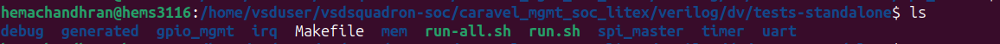

---

## Problem faced

The run-all makefile couldn't run because of file path issues, so I had to run individual tests by doing some corrections in the makefile dependency paths.

---

# GPIO Management Test

This test verifies GPIO management functionality by checking GPIO state changes and output behavior generated by firmware execution.

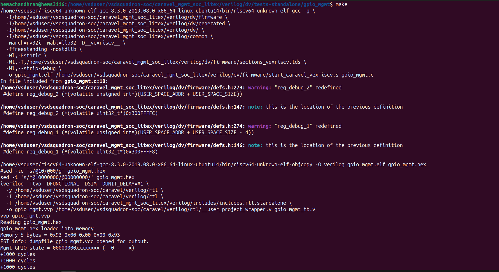

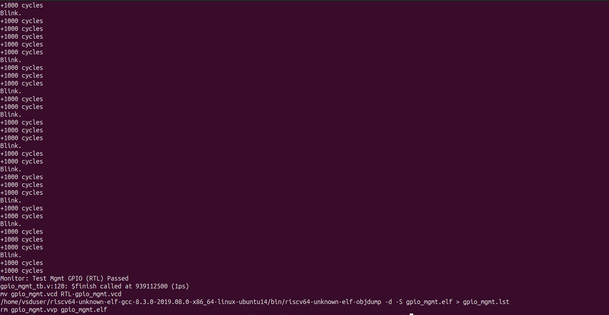

The simulation completed successfully and the GPIO management test passed.

---

# Memory Test

This test verifies memory read and write operations. The firmware performs different memory access patterns and the testbench validates the returned data.

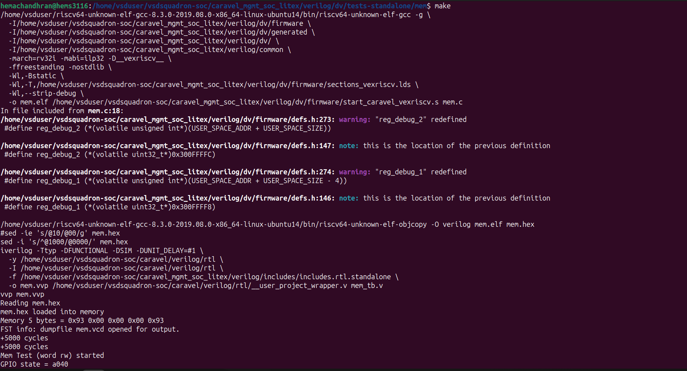
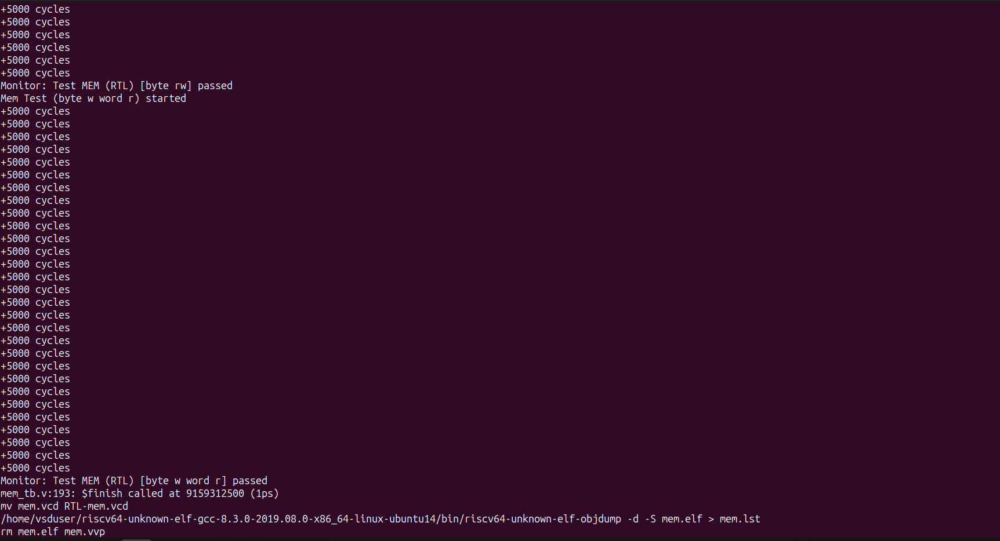

The simulation successfully completed both memory access scenarios and reported PASS.

---

# UART Test

This test verifies UART transmit and receive functionality. Firmware transmits UART data while the testbench monitors and validates the communication.

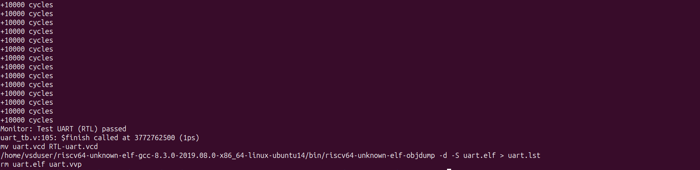
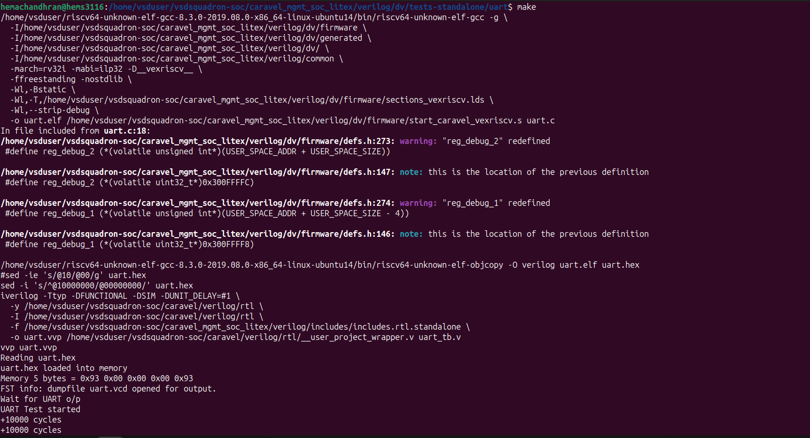

The UART test completed successfully and the expected UART behavior was observed.

---

# Timer Test

This test verifies timer operation, counting behavior, and timeout functionality generated by the timer peripheral.

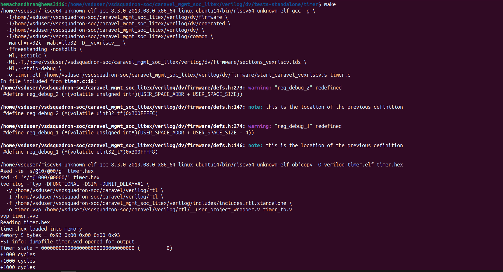
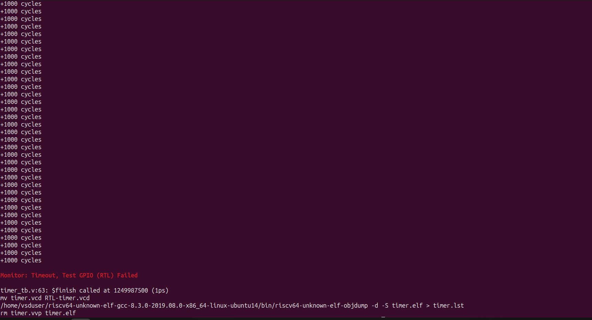

The simulation executed correctly but the timer test reached a timeout condition during verification.

---

# Interrupt Request Test

This test verifies interrupt generation and handling by checking whether the processor correctly responds to interrupt events.

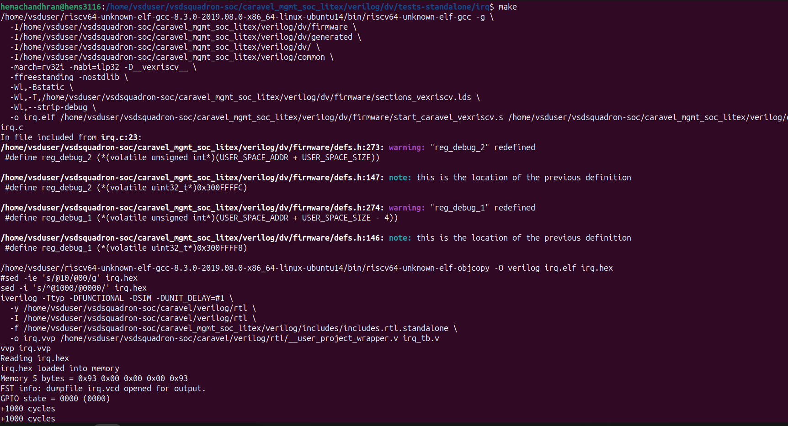
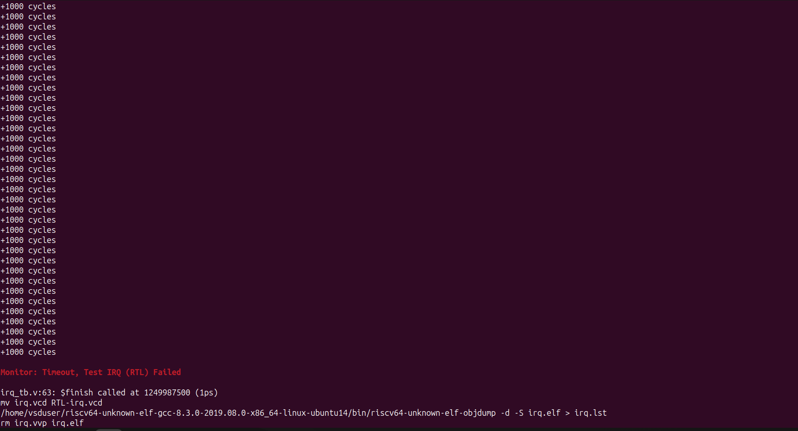

The simulation executed successfully but the IRQ verification timed out before completion.

---

# Debug Test

This test verifies debug interface functionality and communication between firmware and the debug hardware registers.

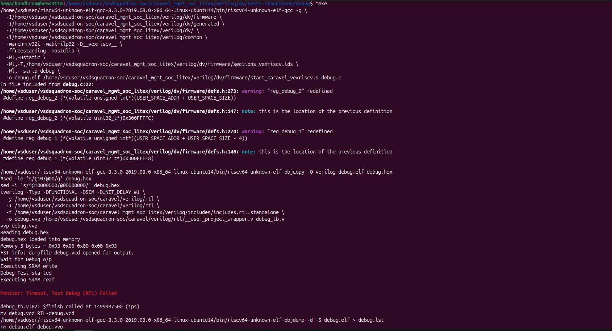

The simulation executed the debug sequence but the verification timed out before the expected completion condition was reached.

---

# SPI Master Test

This test verifies SPI Master communication with the SPI Flash model. Firmware performs SPI read operations and the returned values are checked against expected data.

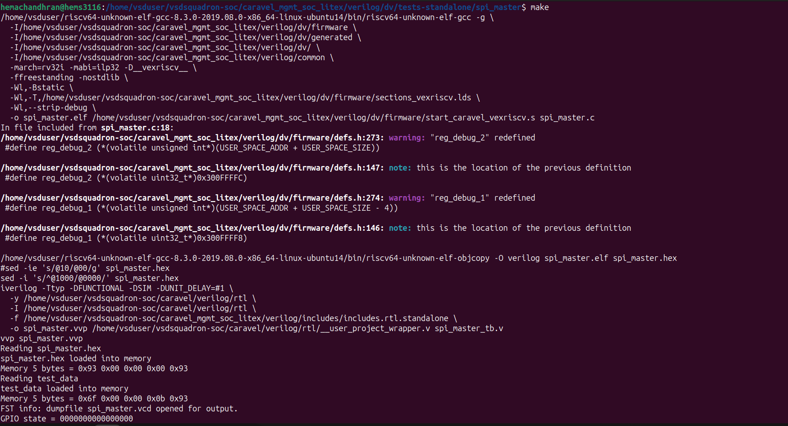

The SPI Master test completed successfully and all received values matched the expected reference values.

---

# Final Summary

| Test | Status |
|--------|--------|
| GPIO Mgmt | PASS |
| Memory | PASS |
| UART | PASS |
| SPI Master | PASS |
| Timer | FAIL (Timeout) |
| IRQ | FAIL (Timeout) |
| Debug | FAIL (Timeout) |

---

## Conclusion

The standalone verification environment was used to validate the functionality of multiple SoC peripherals independently. GPIO Management, Memory, UART, and SPI Master tests completed successfully and produced the expected results. Timer, IRQ, and Debug tests executed correctly but reached timeout conditions during verification. These standalone tests provide confidence in individual block functionality before progressing to higher levels of integration and system verification.
