# Verification Flow Understanding

### 1. What happens when `make` is executed?

When the `make` command is executed, the Makefile automatically performs all steps required for verification. It compiles the firmware, generates the HEX memory image, compiles the RTL design and testbench, runs the simulation, and generates the final output files such as waveforms and reports.

---

### 2. How does the Makefile invoke the simulator?

The Makefile uses **Icarus Verilog (`iverilog`)** to compile the RTL design and testbench into a simulation executable (`.vvp` file). The generated executable is then run using **`vvp`**, which starts the simulation and executes the verification test.

---

### 3. What files are compiled?

The following files are compiled during verification:

* Firmware source file (`.c`)
* Startup assembly file (`.s`)
* Linker script (`.lds`)
* RTL design files (`.v`)
* Testbench files (`_tb.v`)

Generated files include:

* `.elf` (firmware executable)
* `.hex` (memory image)
* `.vvp` (simulation executable)
* `.vcd` (waveform file)
* `.lst` (disassembly listing)

---

### 4. How does the testbench interact with the design?

The testbench instantiates the DUT (Design Under Test), provides clock and reset signals, loads the firmware into memory, applies test stimuli, monitors DUT outputs, and checks whether the design behaves as expected during simulation.

---

### 5. How is PASS/FAIL determined?

The testbench continuously monitors DUT outputs and verification checkpoints during simulation. The observed results are compared against the expected values defined in the test. If all checks pass successfully, a **PASS** message is displayed. If any mismatch or unexpected behavior is detected, the simulation reports a **FAIL** result.

---

# Verification Methodology

All verification tests follow a similar workflow. When `make` is executed, the firmware source code is first compiled into a HEX file using the RISC-V GCC compiler. The RTL design and testbench are then compiled using Icarus Verilog (`iverilog`). The simulation executable is run using `vvp`, which loads the firmware into memory and executes the test.

During simulation, the testbench interacts with the Design Under Test (DUT) by applying inputs, monitoring outputs, and checking expected behavior. Based on the verification conditions defined in the testbench, the simulation reports either a PASS or FAIL result.

## Debug Verification Flow

The debug test verifies the functionality of the debug interface and ensures that debug-related checkpoints are correctly detected by the verification environment.

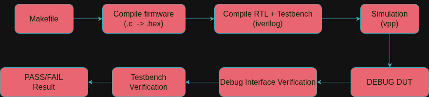

---

## GPIO Verification Flow

The GPIO test verifies that GPIO pins can be configured and toggled correctly, and that the expected output states are observed during simulation.

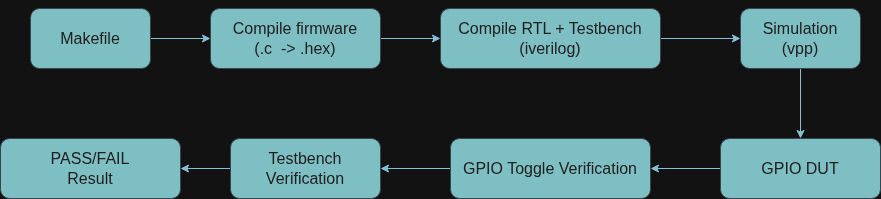

---

## Housekeeping SPI (HKSPI) Verification Flow

The HKSPI test verifies access to housekeeping SPI registers and ensures proper communication through the housekeeping SPI interface.

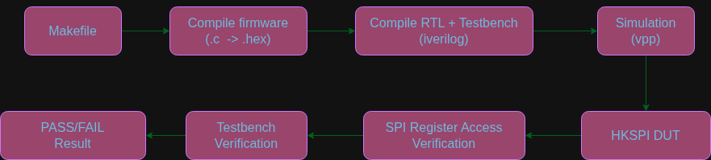

---

## Housekeeping SPI Power Verification Flow

The HKSPI Power test verifies power-management related operations controlled through the housekeeping SPI interface.

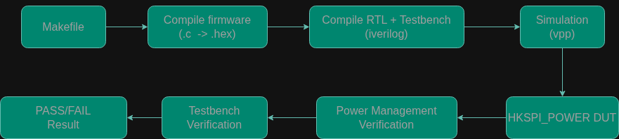

---

## IRQ Verification Flow

The IRQ test verifies interrupt generation, interrupt detection, and correct interrupt handling by the processor.

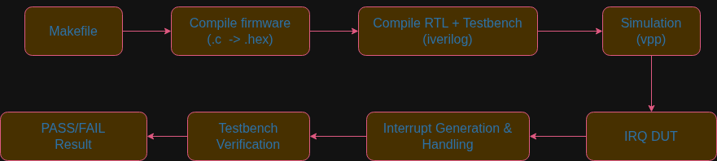

---

## Memory Verification Flow

The memory test verifies memory write and read operations and confirms that stored data can be retrieved correctly.

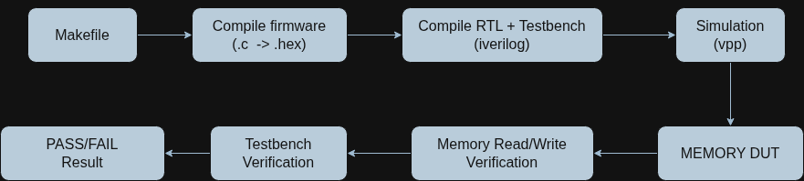

---

## Pass-Through Verification Flow

The pass-through test verifies that signals are correctly routed through the pass-through logic without corruption or modification.

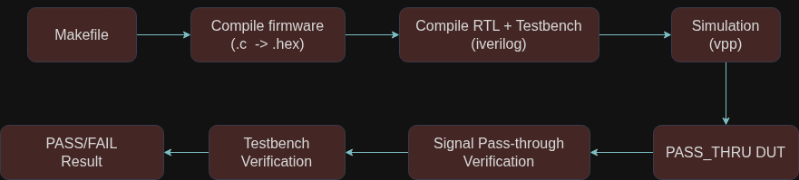

---

## PLL Verification Flow

The PLL test verifies clock generation and confirms that the PLL produces the expected clock behavior during simulation.

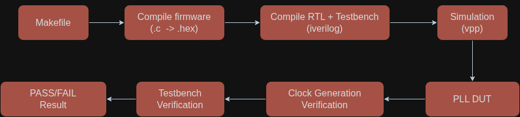

---

## SPI Master Verification Flow

The SPI Master test verifies communication between the SPI Master peripheral and the SPI Flash model by performing SPI read transactions.

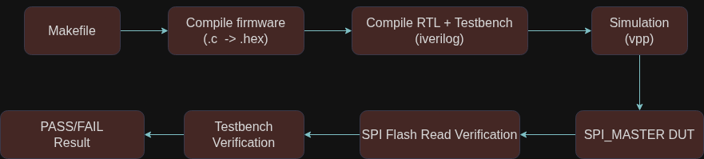

---

## SRAM Execution Verification Flow

The SRAM execution test verifies that program code can be executed directly from SRAM and that execution proceeds correctly.

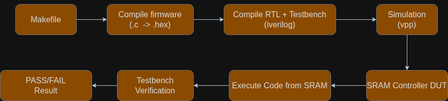

---

## System Controller Verification Flow

The System Controller test verifies system control functionality and ensures correct operation of system management features.

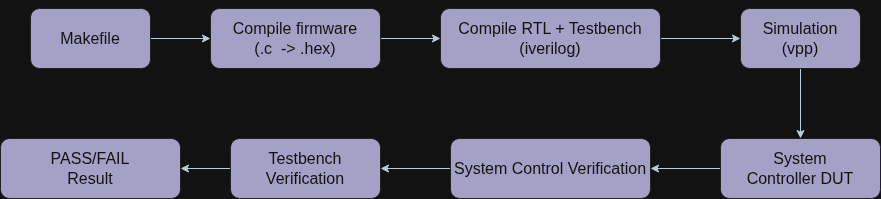

---

## Timer Verification Flow

The timer test verifies timer operation, timer expiry events, and proper timing behavior during simulation.

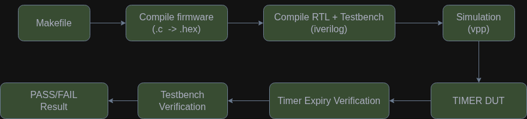

---

## UART Verification Flow

The UART test verifies UART transmit and receive operations and confirms successful serial communication.

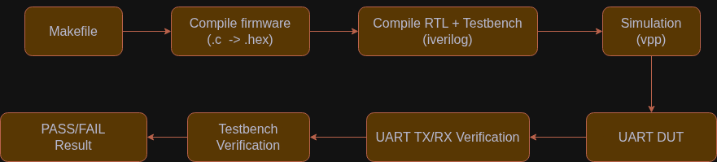

---

## Pull-Up / Pull-Down Verification Flow

The pull-up/pull-down test verifies GPIO pull configuration behavior and ensures that pull-up and pull-down settings operate correctly.

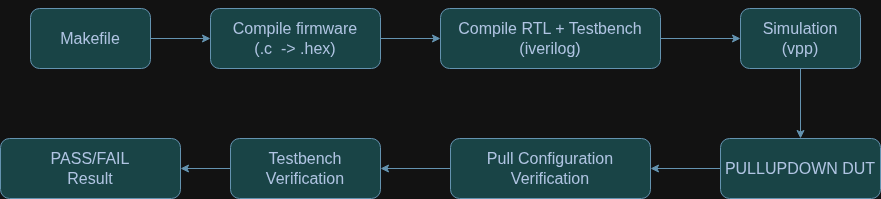

---
