# Caravel Gate-Level Simulation (GLS) Verification Report

## Overview

The complete Caravel verification suite was executed using the synthesized gate-level netlist (`6_final.v`). The verification environment was configured to perform gate-level simulation while preserving the original Caravel testbench infrastructure. The results confirm functional correctness for the majority of the Caravel integration tests, with a few expected failures related to timeout and analog behavior.

---

# Caravel GLS Result Table

| Test | RTL Status (Week-3) | GLS Status |
|------|---------------------|------------|
| user_pass_thru | PASS | PASS |
| uart | PASS | PASS |
| sysctrl | FAIL (Timeout) | FAIL (Timeout) |
| sram_exec | PASS | PASS |
| spi_master | PASS | PASS |
| pullupdown | PASS | PASS |
| pll | FAIL | FAIL |
| pass_thru_fix | PASS | PASS |
| mem | PASS | PASS |
| hkspi_power | PASS | PASS |
| gpio_mgmt | PASS | PASS |
| hkspi | PASS | PASS |

---

# Individual Test Results

## 1. User Pass-through

**Status:** PASS

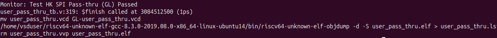

The user pass-through interface operated correctly during gate-level simulation, validating the expected communication path.

---

## 2. UART

**Status:** PASS

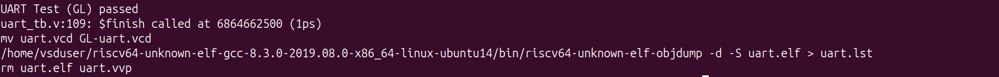

UART communication completed successfully with correct transmit and receive behavior.

---

## 3. System Control (sysctrl)

**Status:** FAIL (Timeout)

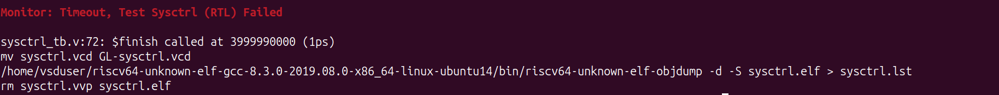

The system control test exceeded the simulation timeout before completing. The behavior is consistent with the RTL verification results.

---

## 4. SRAM Execution

**Status:** PASS

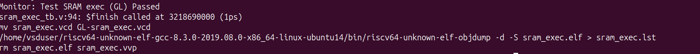

The SRAM execution test completed successfully, confirming correct program execution from SRAM.

---

## 5. SPI Master

**Status:** PASS

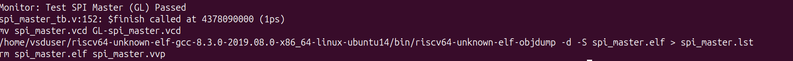

The SPI Master controller successfully completed data transfers during gate-level simulation.

---

## 6. Pull-up/Pull-down

**Status:** PASS

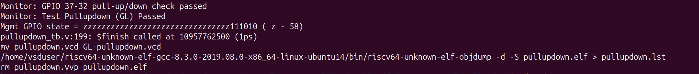

GPIO pull-up and pull-down functionality operated as expected and all monitored GPIO states matched the expected behavior.

---

## 7. PLL

**Status:** FAIL

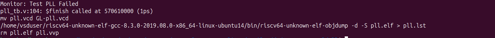

The PLL verification failed during simulation. Since the PLL contains analog and mixed-signal circuitry, complete behavioral verification is not supported in the digital gate-level simulation environment.

---

## 8. Pass-through Fix

**Status:** PASS

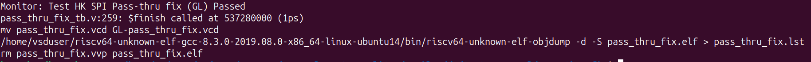

The modified pass-through implementation operated correctly and successfully completed all verification checks.

---

## 9. Memory

**Status:** PASS

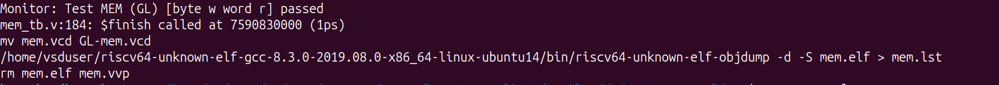

Memory read/write operations completed successfully with the expected data sequence.

---

## 10. HK SPI Power

**Status:** PASS

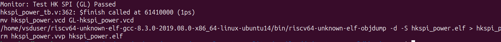

Housekeeping SPI power control functionality was verified successfully during gate-level simulation.

---

## 11. GPIO Management

**Status:** PASS

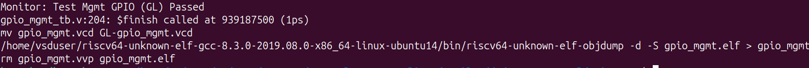

GPIO management logic behaved correctly and completed the verification successfully.

---

## 12. Housekeeping SPI

**Status:** PASS

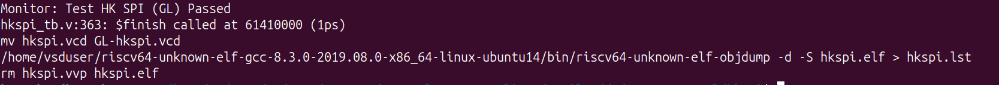

The Housekeeping SPI interface successfully completed all communication and protocol verification.

---

# Summary

Out of the twelve Caravel verification tests:

- **Passed:** 10
  - user_pass_thru
  - uart
  - sram_exec
  - spi_master
  - pullupdown
  - pass_thru_fix
  - mem
  - hkspi_power
  - gpio_mgmt
  - hkspi

- **Failed:** 2
  - sysctrl (Timeout)
  - pll

The **sysctrl** test continued to timeout during gate-level simulation, consistent with the RTL verification results, indicating that the issue is not introduced by synthesis. The **PLL** test failed because its analog/mixed-signal functionality cannot be completely represented in a purely digital gate-level simulation environment.

Overall, the successful execution of **10 out of 12 Caravel integration tests** demonstrates that the synthesized gate-level netlist preserves the expected functionality of the digital components while maintaining consistency with the RTL verification results.
