# Waveform Analysis

This document presents the important waveforms captured during both **Standalone Gate-Level Simulation (GLS)** and **Caravel Gate-Level Simulation (GLS)**. The waveforms were analyzed to verify the functionality of different modules after physical implementation.

---

# 1. Standalone Gate-Level Simulation Waveforms

## UART

The UART waveform confirms successful serial data transmission during gate-level simulation.

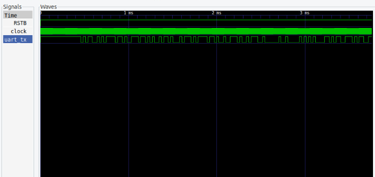

---

## GPIO Management

The GPIO waveform shows the expected GPIO transitions generated during simulation.

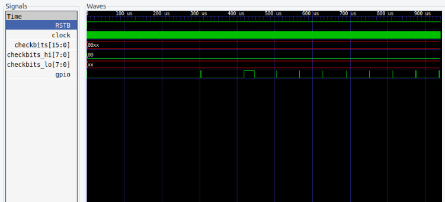

---

## Memory

The memory waveform verifies successful read and write operations with the expected checkbit values.

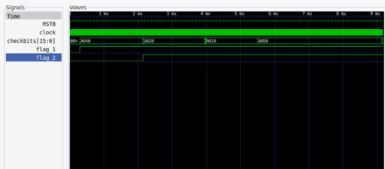

---

## SPI Master

The SPI waveform shows correct SPI clock generation and data transfer.

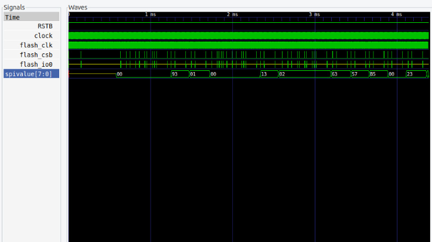

---

## Timer

The timer waveform was captured before the simulation reached the timeout condition.

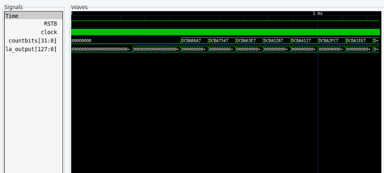

---

## IRQ

The interrupt status waveform captured during gate-level simulation.

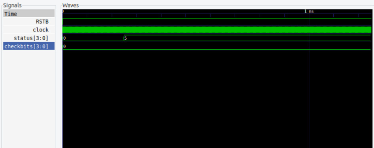

---

## Debug

The debug waveform captured before the timeout occurred.

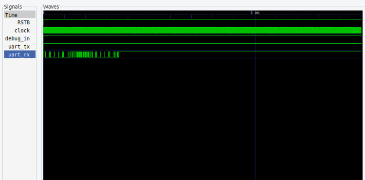

---

## Standalone GLS Result Summary

The overall standalone verification results are shown below.

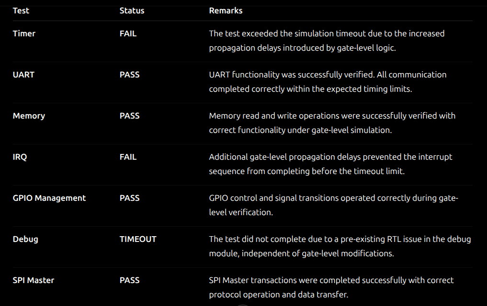
 

---

# 2. Caravel Gate-Level Simulation Waveforms

## User Pass Through

The waveform verifies the pass-through interface during Caravel gate-level simulation.

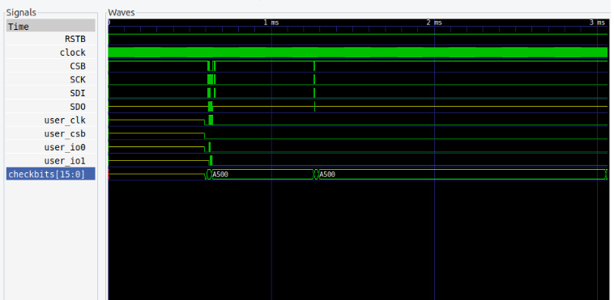

---

## UART

UART communication waveform captured during Caravel GLS.

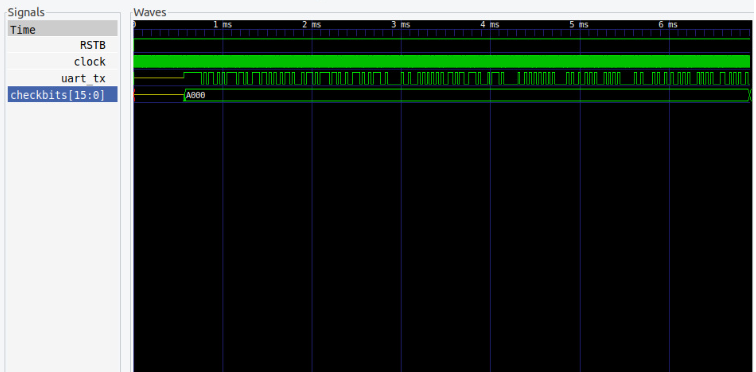

---

## System Controller

System controller waveform observed during the timeout-limited simulation.

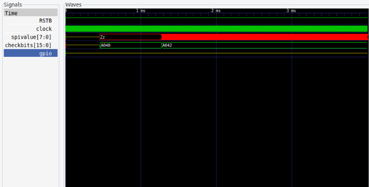

---

## SRAM Execution

Waveform showing SRAM execution status transitions.

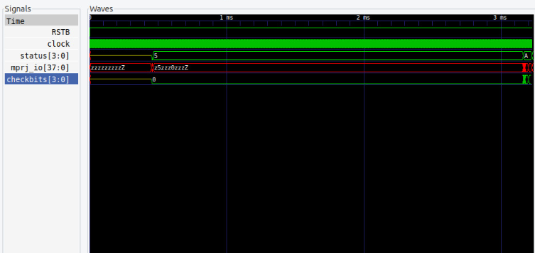

---

## SPI Master

SPI Master communication waveform.

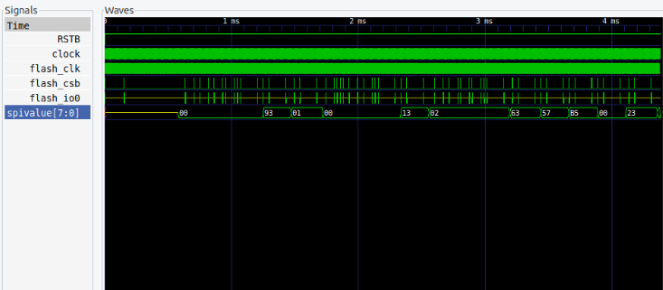

---

## Pull-up/Pull-down

GPIO pull-up and pull-down verification waveform.

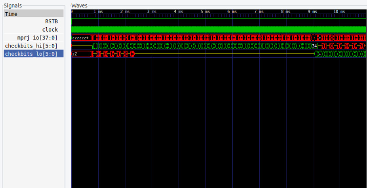

---

## PLL

PLL waveform captured during gate-level simulation.

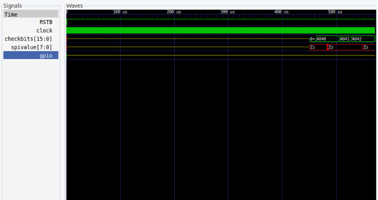

---

## Pass-through Fix

Waveform showing the corrected pass-through implementation.

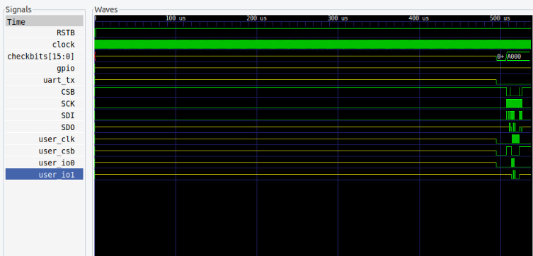

---

## Memory

Memory read/write verification waveform.

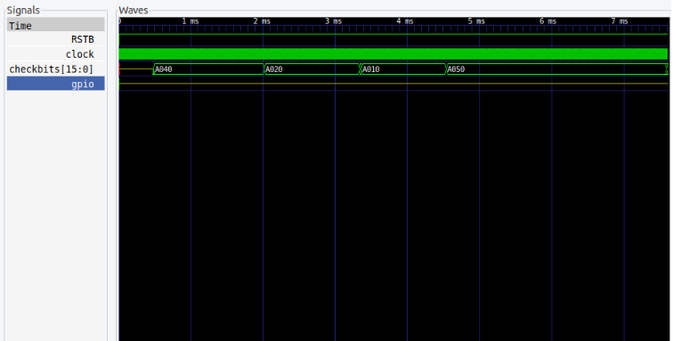

---

## HKSPI Power

HKSPI power-control waveform.

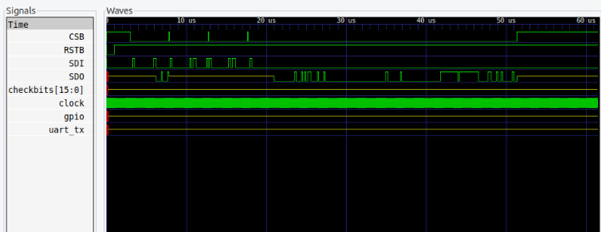

---

## GPIO Management

GPIO management waveform captured during Caravel verification.

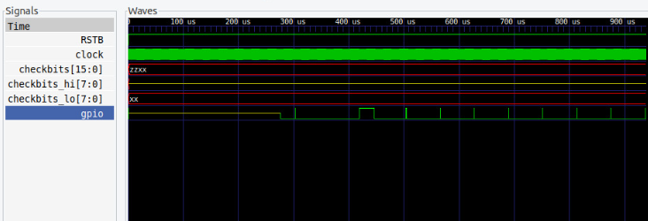

---

## HKSPI

HKSPI communication waveform.

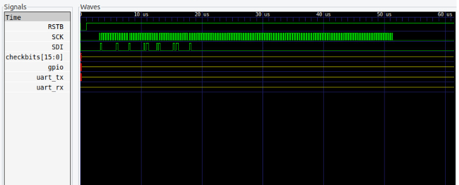

---

## Caravel GLS Result Summary

The overall Caravel verification results are shown below.

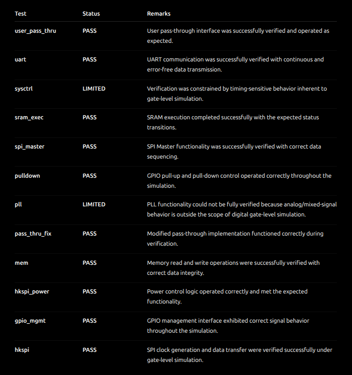

---

# Summary

The collected waveforms confirm the functionality of the synthesized design during both standalone and Caravel gate-level simulations. The captured traces were used to verify communication interfaces, memory operations, GPIO behavior, interrupt handling, and peripheral functionality after physical implementation.
