# Phase 1 – Block Selection and RTL Analysis

## Block Selection

For Week 6, I selected the **`housekeeping_spi`** block from the Caravel RTL repository. This module implements the SPI controller used for communication between an external SPI master and the internal housekeeping registers of the Caravel SoC. It also supports pass-through communication to both the management and user SPI flash interfaces.

I chose this block because it contains both combinational and sequential logic, making it a good candidate for studying the complete RTL-to-GDS implementation flow. The design also includes an FSM, shift registers, command decoding, address generation, and multiple control signals, providing a realistic block for implementation and verification.

<p align="center">
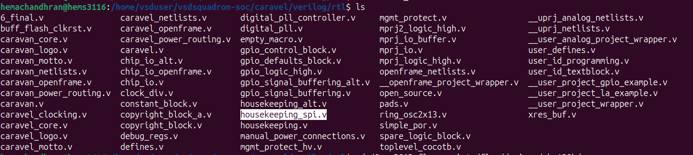
</p>

---

## Understanding the RTL

The top-level module of the selected block is:

```verilog
module housekeeping_spi(...)
```

The module communicates using the standard SPI interface.

### Inputs

| Signal | Description |
|---------|-------------|
| `reset` | Active-high reset signal |
| `SCK` | SPI clock |
| `SDI` | Serial data input |
| `CSB` | Active-low chip select |
| `idata[7:0]` | Parallel data input used during read operations |

### Outputs

| Signal | Description |
|---------|-------------|
| `SDO` | Serial data output |
| `sdoenb` | Output enable for SDO |
| `odata[7:0]` | Parallel data received from SPI |
| `oaddr[7:0]` | Decoded register address |
| `rdstb` | Read strobe |
| `wrstb` | Write strobe |
| `pass_thru_mgmt` | Management flash pass-through enable |
| `pass_thru_mgmt_delay` | Delayed management pass-through signal |
| `pass_thru_user` | User flash pass-through enable |
| `pass_thru_user_delay` | Delayed user pass-through signal |
| `pass_thru_mgmt_reset` | Reset for management pass-through |
| `pass_thru_user_reset` | Reset for user pass-through |

<p align="center">
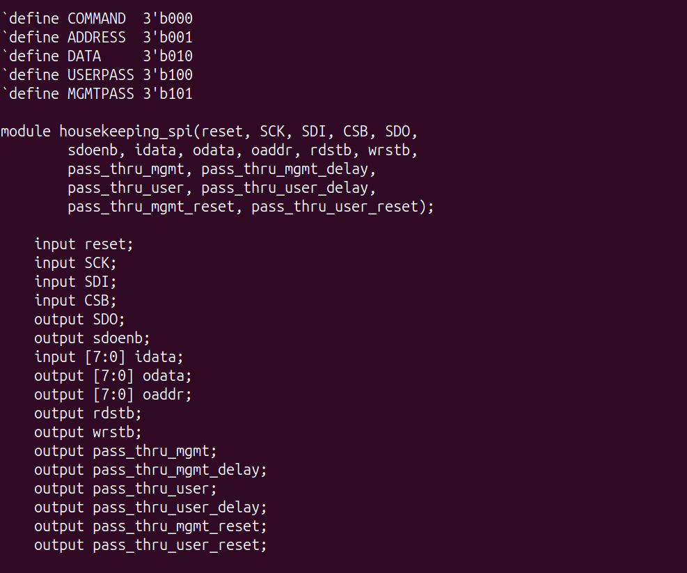
</p>

---

## Internal Architecture

After studying the RTL, I found that the controller operates as a finite state machine (FSM). The SPI transaction is divided into different stages, allowing the controller to decode commands and perform the required operation.

The FSM consists of five major states:

- **COMMAND** – Receives the SPI command byte and determines the operation.
- **ADDRESS** – Captures the target register address.
- **DATA** – Performs read or write data transfers.
- **MGMTPASS** – Enables pass-through communication to the management SPI flash.
- **USERPASS** – Enables pass-through communication to the user SPI flash.

The controller samples incoming data on the positive edge of the SPI clock while output data is shifted on the negative edge. This ensures correct SPI timing during read and write operations.

---

## RTL Dependencies

Although the SPI controller is implemented in a single RTL file, it depends on additional files required by the Caravel project.

The RTL files used for implementation are:

| RTL File | Purpose |
|----------|---------|
| `housekeeping_spi.v` | Main SPI controller |
| `defines.v` | Global macro definitions used across the design |
| `debug_regs.v` | Debug register definitions required by the housekeeping subsystem |

These files were copied into the OpenROAD design directory before starting the implementation flow.

<p align="center">
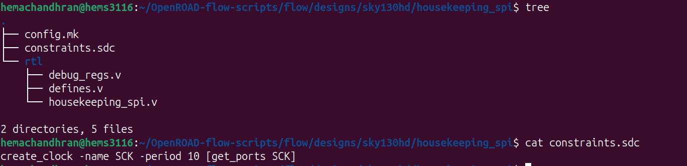
</p>

---

## Clock Constraint

The SPI controller operates using the `SCK` input as its clock. A timing constraint was created in the `constraints.sdc` file to define the operating frequency for synthesis and timing analysis.

```tcl
create_clock -name SCK -period 10 [get_ports SCK]
```

A clock period of **10 ns** corresponds to an operating frequency of **100 MHz**, which satisfies the Week 6 implementation requirement.

<p align="center">
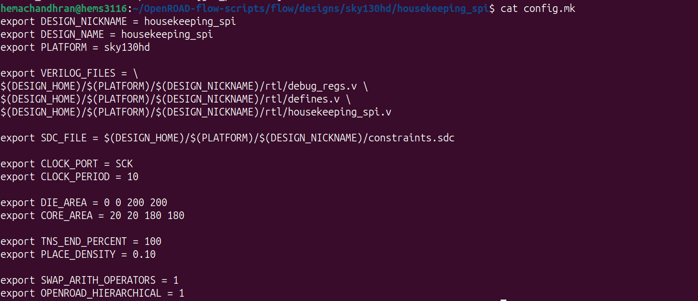
</p>

---

## OpenROAD Configuration

A dedicated OpenROAD design directory was created for the selected block. The implementation was configured using a custom `config.mk` file, which specifies:

- Design name
- Platform (`sky130hd`)
- RTL source files
- Timing constraint file
- Clock port and clock period
- Floorplan dimensions
- Core area
- Placement density

The configuration ensures that OpenROAD can locate all RTL dependencies and execute the complete RTL-to-GDS implementation flow successfully.

<p align="center">
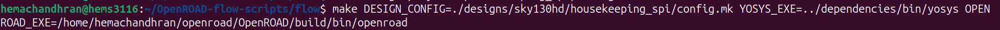
</p>

---

# Phase 2 – RTL-to-GDS Implementation

After preparing the RTL files, OpenROAD configuration, and timing constraints, the complete RTL-to-GDS implementation flow was executed using OpenROAD Flow Scripts (ORFS). The implementation was performed using the following command:

```bash
make DESIGN_CONFIG=./designs/sky130hd/housekeeping_spi/config.mk \
YOSYS_EXE=../dependencies/bin/yosys \
OPENROAD_EXE=/home/hemachandhran/openroad/OpenROAD/build/bin/openroad
```

The flow successfully completed all major implementation stages, including synthesis, floorplanning, placement, clock tree synthesis (CTS), routing, filler cell insertion, and final database generation.

<p align="center">
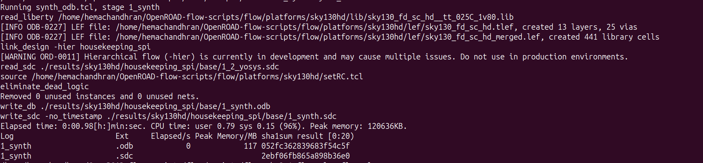
</p>

---

## RTL Synthesis

The first stage of the implementation flow performs RTL synthesis using **Yosys** together with the **Sky130 HD standard cell library**. During this stage, the Verilog RTL is translated into a technology-mapped gate-level netlist that can be used by the downstream physical design tools.

The synthesis completed successfully without any errors, indicating that all RTL dependencies were correctly identified and the design was successfully mapped to Sky130 standard cells.

<p align="center">
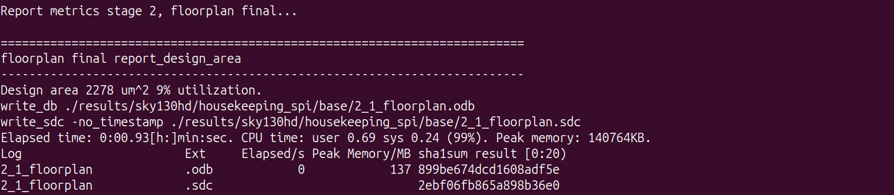
</p>

---

## Floorplanning

After synthesis, the floorplanning stage generated the initial physical layout of the design by defining the die area, core area, and placement region according to the values specified in the `config.mk` file.

The generated floorplan reported:

- **Design Area:** 2278 µm²
- **Core Utilization:** 9%

The relatively low utilization provides sufficient routing resources for the later stages of implementation.

<p align="center">
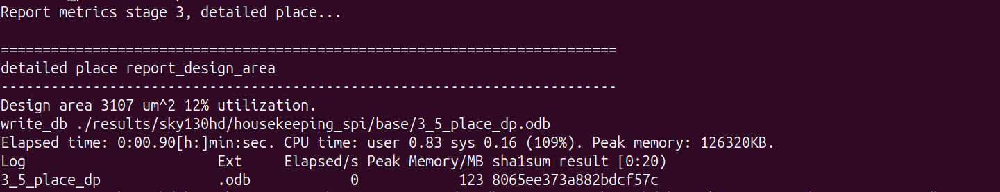
</p>

---

## Placement

The placement stage positioned all synthesized standard cells within the core area while satisfying placement constraints and minimizing wire length.

After placement, OpenROAD reported:

- **Design Area:** 3107 µm²
- **Core Utilization:** 12%

The increase in design area compared to the synthesis stage is expected as additional optimization and legalization are performed during placement.

<p align="center">
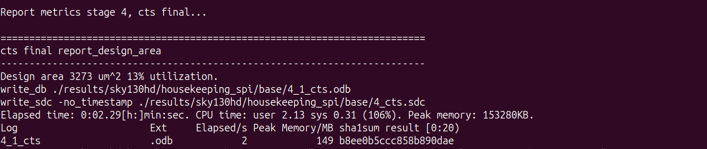
</p>

---

## Clock Tree Synthesis (CTS)

Clock Tree Synthesis was then performed to distribute the SPI clock (`SCK`) across all sequential elements in the design. During this stage, clock buffers are inserted to reduce clock skew and improve timing consistency throughout the circuit.

The CTS stage completed successfully with the following results:

- **Design Area:** 3273 µm²
- **Core Utilization:** 13%

The slight increase in area is due to the insertion of additional clock buffer cells.

<p align="center">
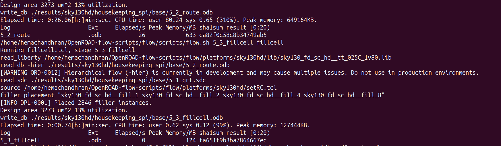
</p>

---

## Routing

Following CTS, OpenROAD executed both global routing and detailed routing to establish all required interconnections between the placed standard cells.

The routing stage completed successfully without any critical routing errors, producing a fully connected physical implementation of the design.

---

## Filler Cell Insertion

Once routing was completed, filler cells were inserted automatically to satisfy fabrication requirements and maintain proper well continuity within the layout.

OpenROAD inserted a total of **2846 filler cells**, completing the physical implementation required before final signoff.

<p align="center">
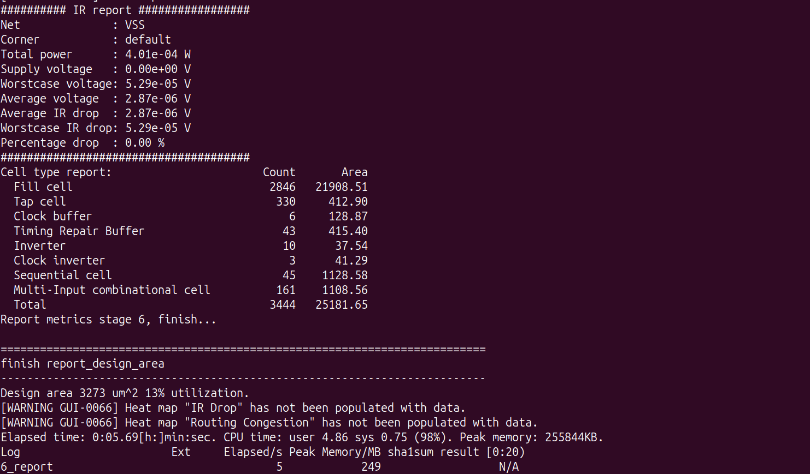
</p>

---

At the end of Phase 2, the `housekeeping_spi` block had successfully progressed from RTL to a fully routed physical implementation, making it ready for report generation, timing analysis, GDS generation, and gate-level validation in the subsequent phases.

---

# Phase 3 – Generated Implementation Outputs

After the RTL-to-GDS flow completed successfully, OpenROAD generated all the required implementation outputs for the `housekeeping_spi` block.

The generated files include:

- Synthesized gate-level netlist
- Physical design database (DEF/ODB)
- Routed database
- Filled database
- Final GDSII layout
- Timing reports

The generated implementation files are shown below.

<p align="center">
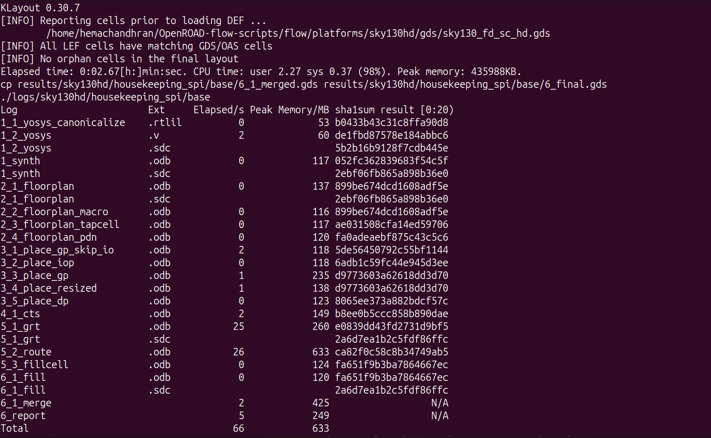
</p>

---

## Timing Report

The final timing report generated by OpenROAD is shown below.

| Parameter | Value |
|-----------|-------|
| TNS | **0.00 ns** |
| WNS | **0.00 ns** |
| Worst Slack | **+3.11 ns** |
| Minimum Clock Period | **2.08 ns** |
| Maximum Frequency | **481.25 MHz** |

The timing report shows that both **TNS** and **WNS** are zero, indicating that the design meets the required timing constraints successfully.

<p align="center">
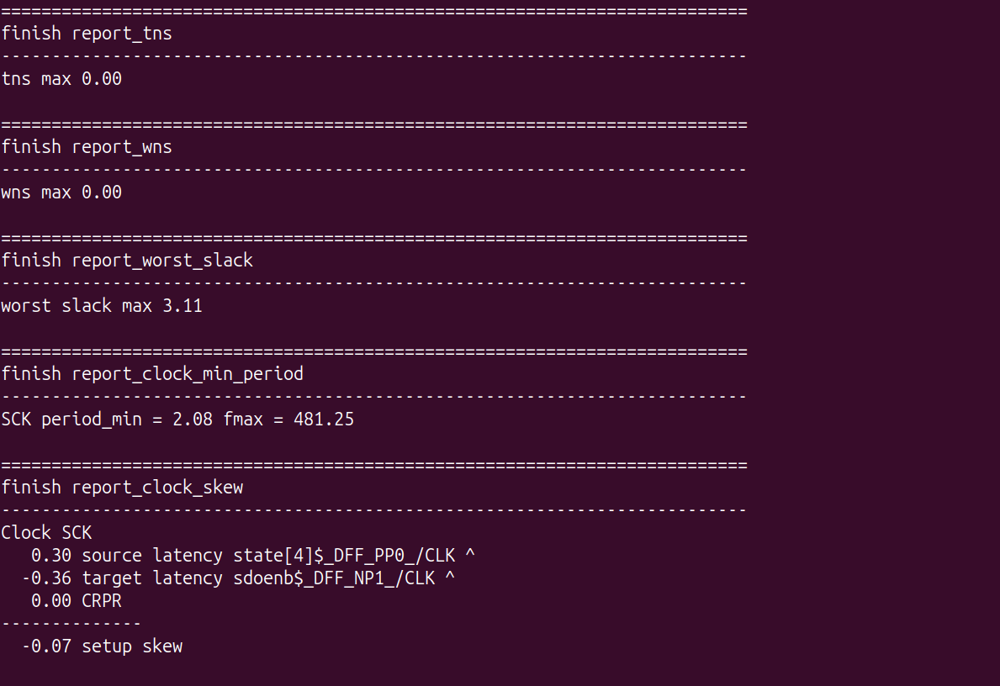
</p>

---

## Final GDS Layout

The final GDSII layout generated after completing the implementation flow is shown below. This represents the physical implementation of the `housekeeping_spi` block using the Sky130 HD standard cell library.

<p align="center">
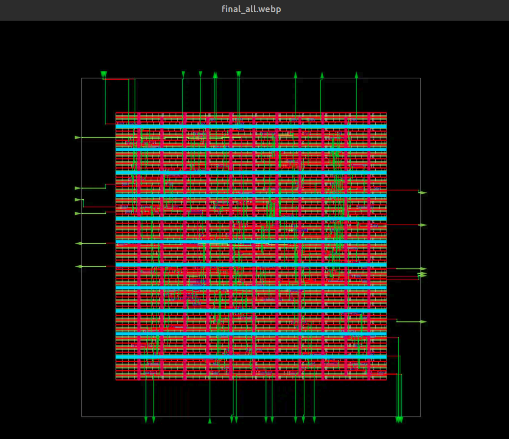
</p>

---

# Phase 4 – Gate-Level Simulation (GLS)

After generating the gate-level netlist, I created a simple verification environment to validate the functionality of the `housekeeping_spi` block.

The verification environment consists of:

- A simple Verilog testbench (`housekeeping_spi_tb.v`)
- A Makefile to automate simulation
- Separate RTL and Gate-Level simulation modes
- GTKWave support for waveform generation and analysis

The testbench performs basic SPI transactions to verify the functionality of the design, including:

- Write operation
- Read operation
- Management pass-through mode
- User pass-through mode

The Makefile allows switching between RTL simulation and Gate-Level Simulation by changing a single variable.

<p align="center">
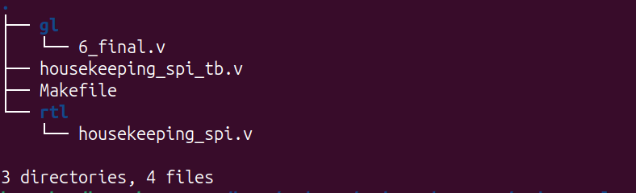
</p>

<p align="center">
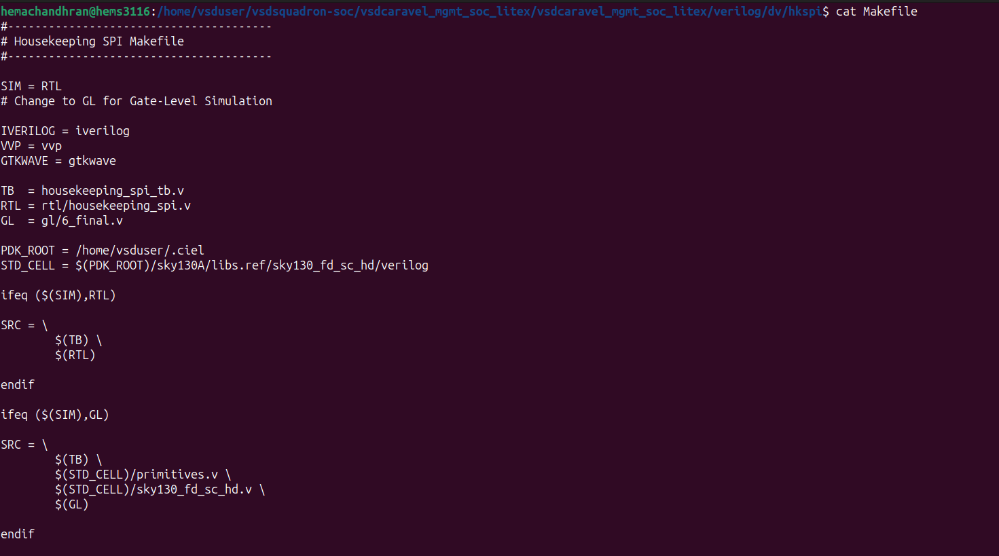
</p>

---

## RTL Simulation

The RTL version of the `housekeeping_spi` block was simulated first to verify the expected functionality. The simulation completed successfully, and all the test cases executed without any errors.

<p align="center">
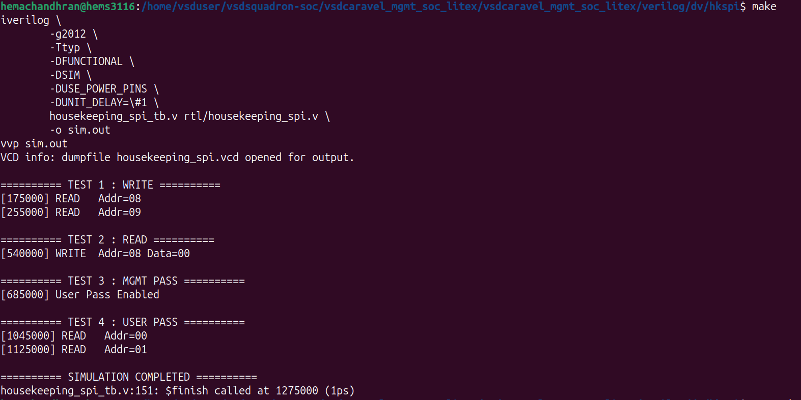
</p>

---

## Gate-Level Simulation

The synthesized gate-level netlist generated by OpenROAD was then integrated into the same verification environment.

The simulation completed successfully using the generated netlist along with the SKY130 standard cell libraries. The observed behavior matched the RTL simulation, confirming that the functionality was preserved after synthesis and physical implementation.

<p align="center">

</p>

---

# Phase 5 – Waveform Validation

The Gate-Level Simulation generated a VCD file, which was analyzed using GTKWave to verify the signal activity.

The waveform confirms that the SPI transactions execute correctly and that the gate-level implementation behaves as expected.

<p align="center">
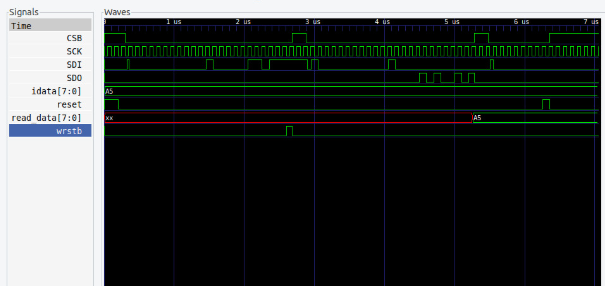
</p>

---

## Signal Analysis

### CSB (Chip Select Bar)

**Purpose:** Indicates the beginning and end of an SPI transaction and is active LOW.

**Observation:** Regular CSB pulses can be observed for every SPI transaction. The waveform matches the expected SPI transaction timing, confirming correct transaction control.


### SCK (SPI Clock)

**Purpose:** Provides the clock for SPI communication.

**Observation:** Each SPI transaction contains the expected clock pulses used for transmitting the command, address, and data bytes. The clock waveform is consistent throughout the simulation.


### SDI (Serial Data Input)

**Purpose:** Transfers SPI command, address, and data bits into the controller.

**Observation:** The serial input data follows the expected MSB-first format. The command, address, and data values are correctly shifted into the design during each transaction.


From the waveform, the behavior of the gate-level netlist matches the expected SPI protocol, confirming that the design functions correctly after physical implementation.

---

# Phase 6 – RTL vs Gate-Level Validation

After completing the physical design flow, I verified the generated gate-level netlist by comparing its behavior with the original RTL design.

I first generated the gate-level netlist (`6_final.v`) using the OpenROAD flow. Then I reused the same testbench that I had already written for RTL simulation. Instead of creating a new verification setup, I only modified the Makefile so that I could switch between RTL and Gate-Level Simulation by changing the simulation mode.

For Gate-Level Simulation, I also included the required SKY130 standard cell library files (`primitives.v` and `sky130_fd_sc_hd.v`) because the synthesized netlist depends on these cells.

I performed the same tests in both RTL and GLS:

- SPI Write operation
- SPI Read operation
- Management Pass-through
- User Pass-through

After running both simulations, I compared the waveforms. The SPI signals such as **CSB**, **SCK**, **SDI**, and **SDO** behaved as expected in both cases. The transaction sequence, address transfer, and data transfer matched correctly.

The GLS waveform showed small timing differences compared to RTL because the synthesized design includes actual gate delays. This is expected after synthesis and routing, and it did not affect the functionality of the design.

Overall, the Gate-Level Simulation completed successfully, and the generated netlist produced the same functional behavior as the RTL design.

---

# Phase 7 – Challenges Faced and Insights

While doing Gate-Level Simulation, I faced a few issues before getting the simulation to run correctly.

The first problem was that the generated netlist could not be compiled directly. I later understood that the synthesized netlist contains SKY130 standard cells, so I had to include the library files `primitives.v` and `sky130_fd_sc_hd.v` in the compilation command. After adding them, the compilation completed successfully.

Another issue was setting up the simulation environment. My Makefile initially supported only RTL simulation, so I modified it to support both RTL and Gate-Level Simulation. This made it easy to switch between the two by changing a single variable.

Before running GLS, I also checked the generated `6_final.v` netlist to make sure the correct top-level module (`housekeeping_spi`) was present and that all the ports matched the RTL module. This helped avoid connection errors while integrating the netlist with the testbench.

While checking the waveform, I noticed that many internal signals looked different from the RTL version because the synthesized netlist is built using standard cells instead of RTL registers. At first this was confusing, but after focusing on the external SPI signals like **CSB**, **SCK**, **SDI**, and **SDO**, I could see that the design was working correctly.

One thing I learned from this phase is that most GLS problems are not caused by the RTL design itself. They are usually due to missing library files, incorrect simulation setup, or netlist integration. Once everything was configured properly, both RTL and Gate-Level Simulation produced the expected results.

---

# Conclusion

In this week's task, I independently selected the `housekeeping_spi` block from the VSDSquadron SoC and completed the entire RTL-to-GDS implementation flow using OpenROAD Flow Scripts. After generating the final implementation outputs, I performed Gate-Level Simulation using the synthesized netlist and verified its functionality using the same testbench developed for RTL simulation.

The RTL and GLS results matched functionally, confirming that the synthesis and physical implementation stages preserved the original design behavior. This task helped me understand the complete ASIC design flow, starting from RTL analysis and ending with post-layout verification.

Overall, I was able to successfully complete all the required phases of the Week 6 assignment and gained confidence in independently implementing and validating a digital design block.

---

# Learning Experience

This week gave me hands-on experience with the complete RTL-to-GDS flow without following a step-by-step guide. I learned how to study an RTL module, identify its dependencies, prepare the OpenROAD setup, and successfully generate the final physical implementation.

While working on Gate-Level Simulation, I understood that a synthesized netlist cannot be simulated like normal RTL. It requires the correct standard cell libraries and proper simulation setup. I also learned how to reuse an existing testbench for GLS by modifying the Makefile instead of creating a completely new verification environment.

Another important takeaway was understanding the difference between RTL and GLS waveforms. Although GLS includes gate delays, the functional behavior should remain the same. Comparing both simulations helped me understand how physical implementation affects timing while preserving logic.

Overall, this assignment improved my understanding of RTL analysis, physical design, gate-level verification, debugging simulation issues, and integrating different stages of the ASIC design flow. It was a valuable experience in performing an implementation flow independently, similar to what is expected in an actual VLSI design environment.
