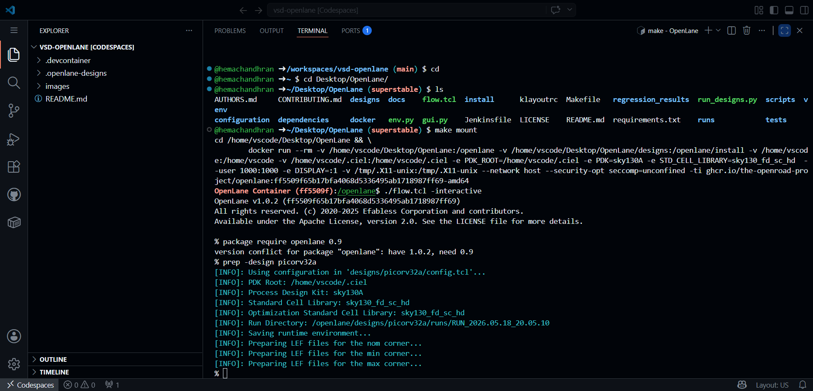
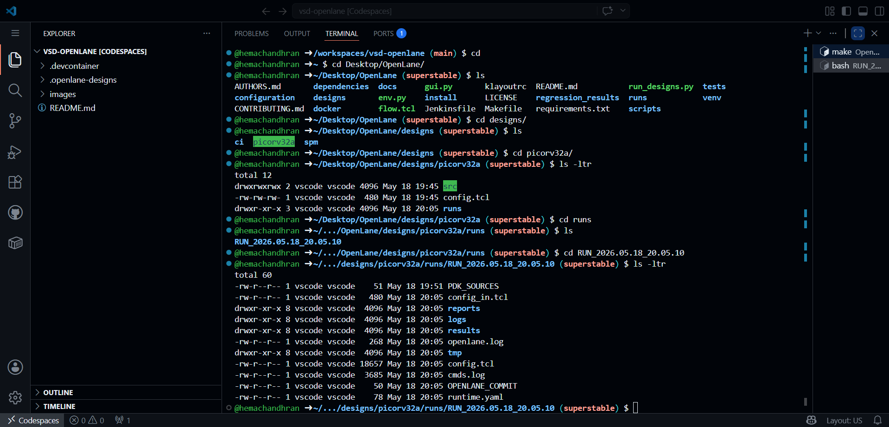
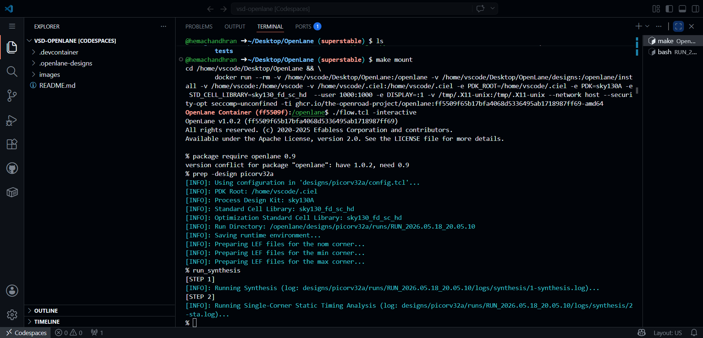
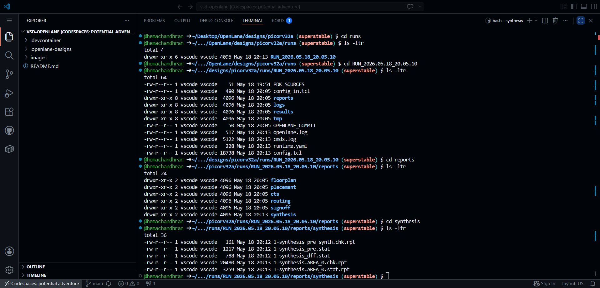
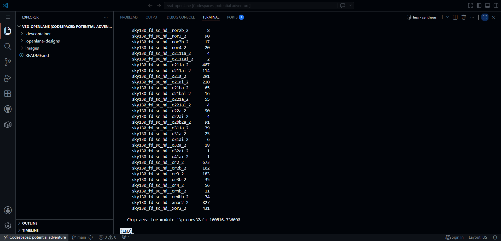
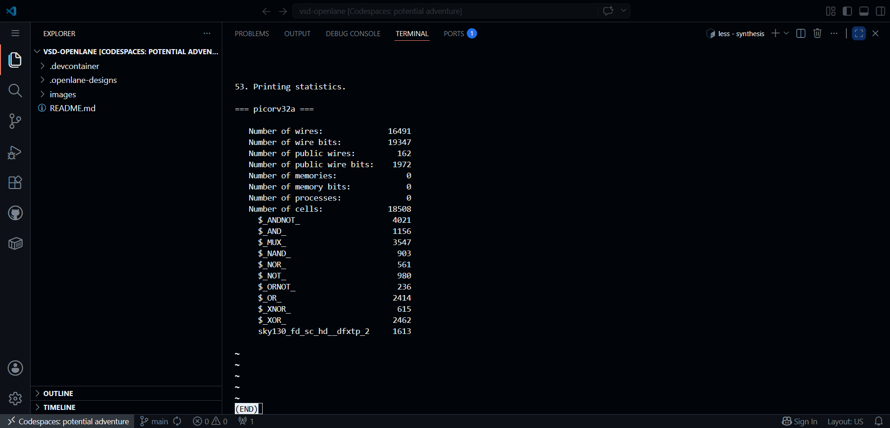
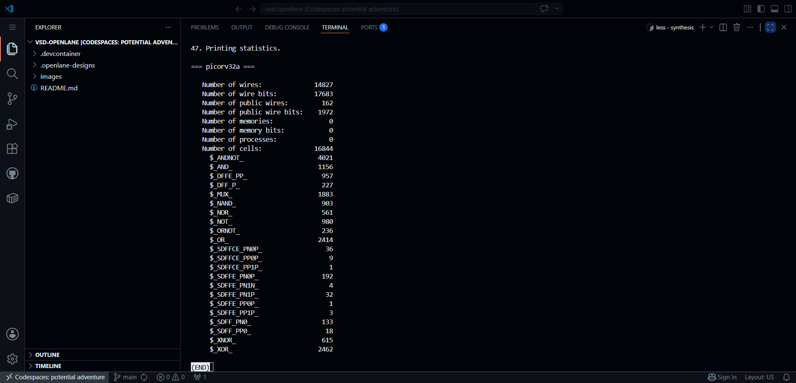
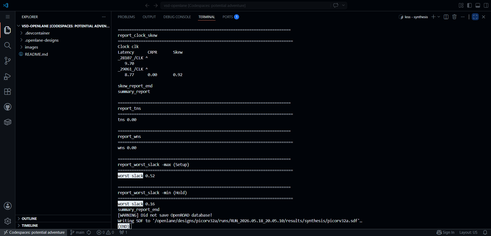
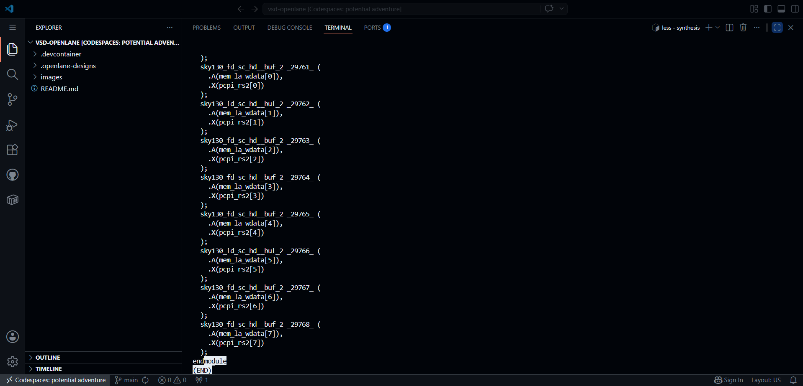

# PicoRV32A Synthesis using OpenLANE (Sky130)

---

# Overview

This phase focused on understanding how RTL is transformed into a gate-level hardware implementation using the OpenLANE ASIC flow and the SKY130A Process Design Kit (PDK).

Rather than treating synthesis as a single command, the objective was to investigate:

* how OpenLANE prepares a design run
* how synthesis converts RTL into hardware
* how reports are generated automatically
* how timing and area are evaluated
* how the final gate-level netlist is produced

One important realization during this phase was that synthesis is much more than compilation. It is the stage where behavioral Verilog begins transforming into actual silicon-ready hardware.

---

# Preparing the Design Environment

Before synthesis could begin, the design environment was prepared inside the OpenLANE container.

During initialization, OpenLANE loaded:

* the PicoRV32A design configuration
* the SKY130A PDK
* the SKY130 standard cell library
* the required synthesis environment



### Observation

A timestamped run directory was automatically created.

### Learning

OpenLANE creates an independent run directory for every execution, making experiments reproducible and preventing previous results from being overwritten.

This immediately highlighted the importance of maintaining traceable design iterations throughout an ASIC project.

---

# Investigating the Run Directory Structure

After initialization completed, the generated run directory was examined.



### Observation

The run directory contained several organized subdirectories:

* logs/
* reports/
* results/
* tmp/

### Investigation

Since synthesis generates large amounts of data, understanding where OpenLANE stores information became important.

### Finding

Each directory serves a different purpose:

* **logs/** stores execution details
* **reports/** stores analysis reports
* **results/** stores generated design files
* **tmp/** stores intermediate artifacts

### Learning

The OpenLANE run structure separates implementation data from analysis data, making debugging and design exploration significantly easier.

---

# Running Synthesis

With the environment prepared, synthesis was executed.

```tcl
run_synthesis
```



### Observation

The RTL description was transformed into a gate-level implementation composed of standard cells.

During execution OpenLANE also performed:

* logic optimization
* technology mapping
* single-corner static timing analysis
* synthesis verification

### Learning

This was the first stage where the design stopped looking like software and started looking like hardware.

The Verilog description was no longer interpreted as behavioral logic but as interconnected physical cells available in the SKY130 library.

---

# Exploring Generated Reports

After synthesis completed successfully, the generated reports were inspected.



### Observation

Multiple reports were automatically generated.

These included:

* area reports
* DFF statistics
* synthesis statistics
* timing reports

### Investigation

The large number of generated reports raised an important question:

How does a designer determine whether synthesis was successful?

### Finding

Each report evaluates a different aspect of the implementation.

Some focus on area, others on timing, while others summarize hardware composition.

### Learning

Synthesis is not considered complete simply because a netlist was generated.

The generated reports provide the evidence needed to evaluate implementation quality.

---

# Investigating Cell Count

The synthesized cell statistics were examined to understand the physical complexity of the processor.


### Observation

The synthesized design contained:

```text
Total Cell Count = 15762
```

### Investigation

The PicoRV32A processor appears relatively compact at the RTL level, so understanding how many hardware elements were actually generated became interesting.

### Finding

Thousands of standard cells were automatically inserted by synthesis.

These included:

* logic gates
* buffers
* multiplexers
* arithmetic cells
* optimization cells

### Learning

Even relatively small RTL modules expand into thousands of physical hardware components after technology mapping and optimization.

This provided a better appreciation for the true scale of hardware implementation.

---

# Investigating Area Estimation

The area report was examined to understand the physical size of the synthesized design.



### Observation

The reported synthesized area was:

```text
160816.736000
```

### Investigation

Area is one of the most important optimization metrics in ASIC design because silicon cost is directly related to physical area.

### Finding

The area report estimates the amount of silicon required to implement the synthesized logic using the selected standard-cell library.

### Learning

Synthesis optimization is not limited to functional correctness.

The synthesis engine continuously balances:

* area
* timing
* power
* implementation feasibility

This was one of the first indications that ASIC design is fundamentally a multi-objective optimization problem.

---

# Investigating Sequential Logic

To understand how much of the processor consisted of state-holding elements, the DFF report was analyzed.



### Observation

The design contained:

```text
DFF Count = 1613
```

Flip-Flop Ratio:

```text
1613 / 18508 = 0.0871
```

Approximately:

```text
8.7%
```

of the cells were sequential elements.

### Investigation

Processors require storage elements for state retention, control logic, and sequential execution.

### Finding

Only a small portion of the total implementation consisted of flip-flops, while the majority was combinational logic.

### Learning

Most of the processor hardware is dedicated to logic computation, while sequential elements provide state storage and synchronization.

---

# Examining Pre-Mapping Statistics

The pre-synthesis statistics were investigated to understand how the design existed before technology mapping.



### Observation

Before technology mapping, the design was represented using generic logic structures.

### Investigation

Technology mapping converts generic logic into cells available inside the SKY130 standard-cell library.

### Finding

The synthesis engine restructures, optimizes, and remaps logic before producing the final implementation.

### Learning

The synthesized hardware is not a direct one-to-one translation of RTL.

Instead, the synthesis tool continuously transforms logic to improve implementation quality.

---

# Investigating Timing Performance

One of the most important questions after synthesis is whether the generated hardware can meet timing requirements.

The timing summary report was therefore examined carefully.



### Observed Results

```text
TNS = 0.00
WNS = 0.00
Worst Setup Slack = 0.52
Worst Hold Slack = 0.16
```

### Investigation

Timing violations indicate that signals may arrive too late or too early relative to clock requirements.

### Finding

The design successfully met timing requirements.

Observed:

* No setup violations
* No hold violations
* Positive setup slack
* Positive hold slack

### Learning

Positive slack indicates that signals arrive within the required timing constraints.

This was the strongest indication that the synthesized implementation was functionally and temporally valid.

For the first time in the flow, the processor was not only logically correct but also capable of operating within the specified clock requirements.

---

# Exploring the Generated Netlist

After timing verification, the generated gate-level netlist was examined.



### Observation

The original RTL description had been transformed into standard-cell instances such as:

```text
sky130_fd_sc_hd__buf_2
```

### Investigation

The goal was to understand what the synthesis tool ultimately produces for later physical design stages.

### Finding

The generated netlist contained actual SKY130 standard cells connected according to the optimized logic implementation.

### Learning

At this stage, the design is no longer represented as behavioral RTL.

Instead, it becomes a manufacturable gate-level hardware description that can proceed to floorplanning, placement, routing, and physical implementation.

Seeing thousands of standard cells replace the original Verilog code was the clearest demonstration of what synthesis truly accomplishes.

---

# Final Thoughts

This phase provided practical insight into:

* OpenLANE workflow
* Run directory organization
* RTL-to-gates transformation
* Area estimation
* Sequential logic analysis
* Timing verification
* Technology mapping
* Gate-level netlist generation

## Biggest Takeaway

Writing Verilog describes functionality.

Synthesis determines how that functionality is physically implemented using real hardware cells.

The RTL may describe the processor, but synthesis reveals what the processor actually becomes.

---

# Tools Used

* **OpenLANE** – RTL-to-GDSII ASIC Flow
* **OpenROAD** – Physical Design Engine
* **Yosys** – Logic Synthesis
* **OpenSTA** – Static Timing Analysis
* **SKY130A PDK** – Process Design Kit
* **PicoRV32A** – RISC-V Processor Core
* **GitHub Codespaces** – Linux Development Environment
* **Visual Studio Code** – Editing and Analysis
* **Docker** – Containerized OpenLANE Environment
