# PicoRV32A Floorplanning and Placement using OpenLANE (Sky130)

---

## Overview

This phase focuses on understanding how a synthesized RTL design begins its transformation into a physical integrated circuit using the OpenLANE ASIC flow and SKY130A PDK.

The main objectives were:

* Generate the initial floorplan of the PicoRV32A processor
* Understand how utilization affects die dimensions
* Explore configuration hierarchy inside OpenLANE
* Visualize floorplan data using Magic
* Investigate standard cells, macros, decaps, and power planning
* Study the impact of utilization changes on die area
* Perform placement and analyze cell distribution
* Verify how synthesized logic becomes physically organized hardware

One interesting realization during this phase was that physical design involves much more than simply placing logic. Before a single standard cell is placed, OpenLANE already begins preparing routing resources, power infrastructure, and placement regions.

---

# Generating the Initial Floorplan

After synthesis completed successfully, floorplanning was executed to generate the first physical representation of the design.

```tcl
run_floorplan
```

During execution OpenLANE reported:

```text
Floorplanned with width = 1267.76 µm
Floorplanned with height = 1267.52 µm
```

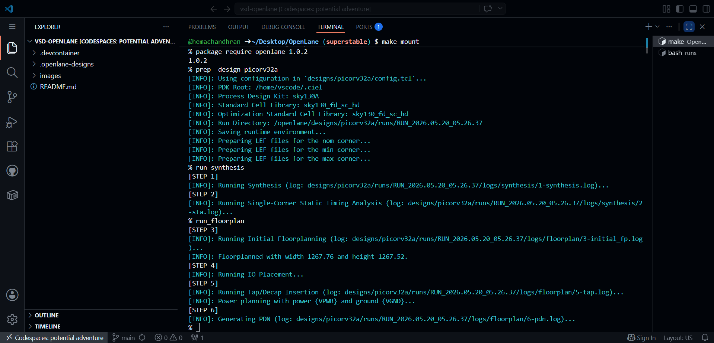

### Observation

The generated floorplan appeared nearly square.

### Aspect Ratio

```text
Aspect Ratio = Width / Height
```

```text
Aspect Ratio = 1267.76 / 1267.52 ≈ 1
```

### Learning

A balanced aspect ratio generally improves routing distribution and reduces congestion compared to highly elongated layouts.

This was the first indication that floorplanning is not arbitrary; physical dimensions directly influence the quality of later implementation stages.

---

# Investigating Core Utilization

While examining the generated floorplan, I wanted to understand why the design occupied such a large area.

The design configuration file was inspected.

```text
designs/picorv32a/config.tcl
```

Observed:

```tcl
set ::env(FP_CORE_UTIL) "10"
```

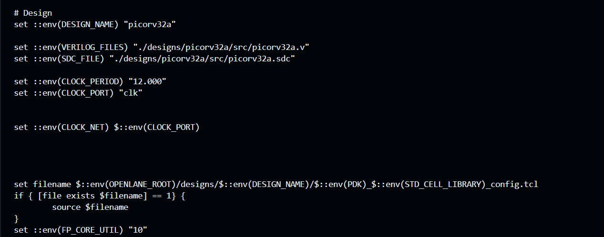

### Observation

Only 10% of the available core area was intended to be occupied.

### Utilization Formula

```text
Utilization (%) = (Cell Area / Core Area) × 100
```

### Learning

Lower utilization reserves more whitespace inside the design.

This makes placement and routing easier but increases the overall silicon area required for implementation.

---

# Investigating Configuration Application

An important question arose while modifying floorplan parameters:

Does OpenLANE directly use the design configuration file, or does it generate its own runtime configuration?

To answer this, the generated run configuration was inspected.

```text
runs/RUN_xxx/config.tcl
```

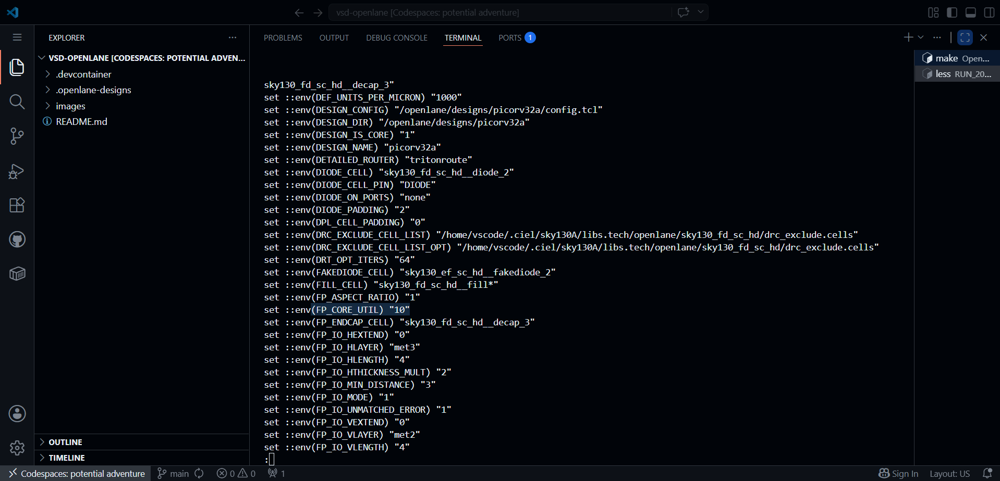

### Observation

The utilization value appeared inside the generated run configuration.

### Configuration Hierarchy Observed

```text
SKY130 PDK Configuration
        ↓
Design Configuration
        ↓
OpenLANE Defaults
        ↓
Final Run Configuration
```

### Learning

The generated run configuration acts as a snapshot of the actual settings used during execution and is the most reliable source when verifying configuration values.

---

# Examining Die Dimensions

Since utilization directly affects physical area, the generated DEF file was examined.

```text
results/floorplan/picorv32a.def
```

Observed:

```text
UNITS DISTANCE MICRONS 1000 ;
DIEAREA ( 0 0 ) ( 1279175 1289895 ) ;
```

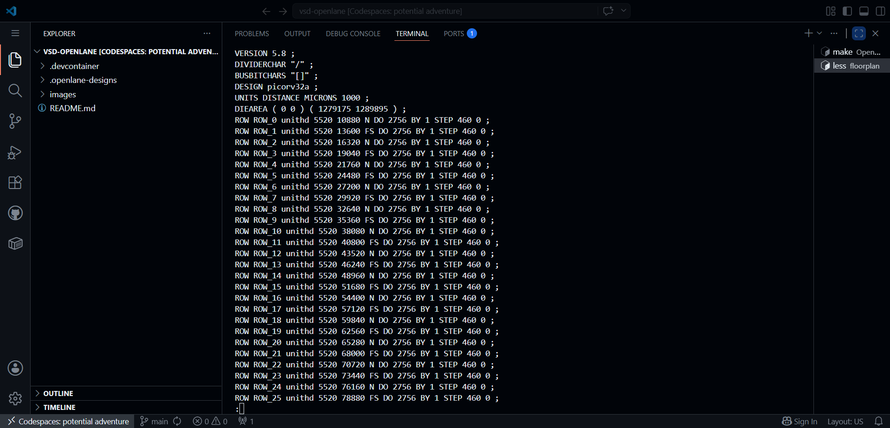

### Observation

The dimensions stored in the DEF file appeared much larger than the dimensions reported during floorplanning.

### Investigation

The DEF file stores values in Database Units (DBU).

```text
1000 DBU = 1 µm
```

Converted dimensions:

```text
Width  = 1279.175 µm
Height = 1289.895 µm
```

### Die Area Calculation

```text
Die Area = Width × Height

= 1279.175 × 1289.895

≈ 1,650,898 µm²
```

### Learning

The DEF file serves as the physical blueprint of the design and contains the dimensions that later placement and routing stages rely upon.

---

# Visualizing the Floorplan in Magic

To better understand the generated layout, the floorplan was loaded into Magic.

```bash
magic -T sky130A.tech \
lef read ../../../tmp/merged.nom.lef \
def read picorv32a.def &
```

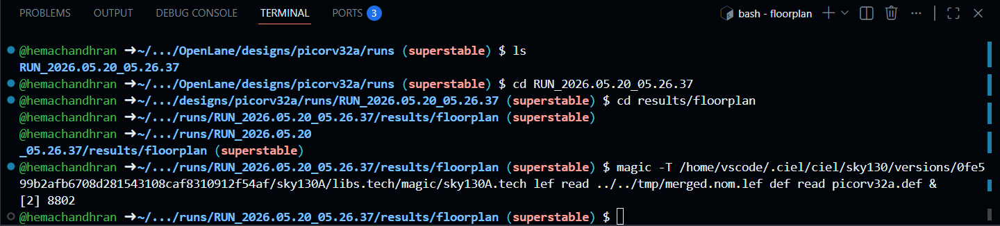

### Observation

The abstract floorplan data became visible as a physical layout.

Magic revealed:

* placement rows
* routing regions
* layout boundaries
* physical structures

### Learning

Visual inspection made it significantly easier to understand how OpenLANE converts textual design data into actual geometric structures.

---

# Exploring the Generated Floorplan

The complete floorplan layout was inspected.

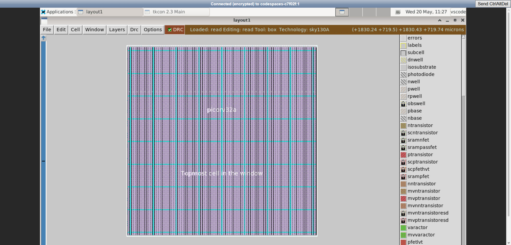

### Observation

The layout already contained placement rows and power infrastructure, but no standard cells had been placed yet.

The design resembled an empty city where roads and utilities existed before any buildings were constructed.

### Learning

Floorplanning establishes the physical framework that later stages depend upon.

Placement cannot begin until this infrastructure exists.

---

# Understanding Standard Cells and Macros

While exploring the layout, standard-cell structures became visible.

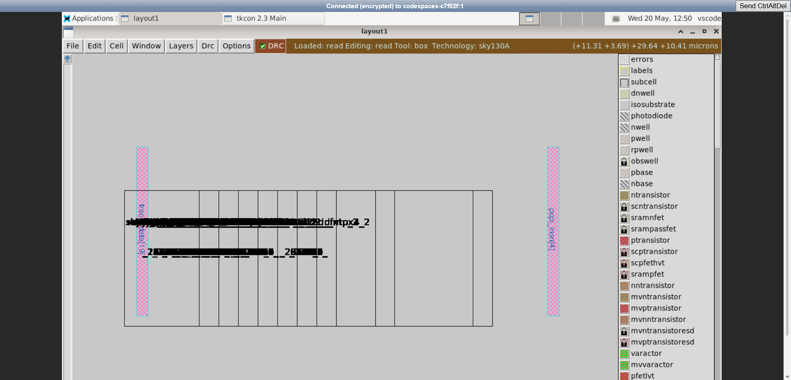

### Observation

The cells appeared highly regular and shared identical heights.

Examples included:

* NAND gates
* NOR gates
* Flip-Flops

### Investigation

This raised an important question:

Why are SRAM blocks treated differently from standard cells?

### Finding

Standard cells:

* have fixed height
* are automatically placed
* are optimized by placement tools

Macros such as SRAM:

* have fixed dimensions
* cannot be reshaped
* occupy dedicated regions

### Learning

Macros strongly influence floorplanning because their fixed dimensions restrict available placement area and routing resources.

---

# Investigating Power Infrastructure

While exploring the layout, pin structures and power networks became visible.

The selected layer was inspected using:

```bash
what
```

Observed:

```text
metal3
```

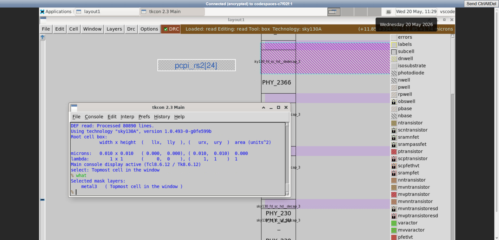

### Observation

Metal structures were responsible for providing physical connectivity throughout the design.

Decap cells were also present.

### Decaps

Decap cells act as local charge reservoirs that:

* stabilize voltage
* reduce switching noise
* improve power integrity

---

Further inspection revealed the generated Power Distribution Network (PDN).

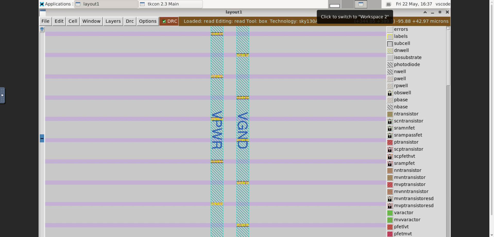

Observed labels:

* VPWR
* VGND

### Observation

Power infrastructure already existed before placement.

### Learning

One of the most important realizations during this phase was that floorplanning is not only about geometry.

Before logic placement begins, OpenLANE already prepares the electrical infrastructure required for reliable power delivery.

The PDN helps:

* reduce IR drop
* improve voltage stability
* distribute current throughout the design

---

# Exploring Utilization Changes

To understand how utilization affects physical dimensions, the utilization factor was modified.

Changed from:

```text
FP_CORE_UTIL = 10
```

to:

```text
FP_CORE_UTIL = 30
```

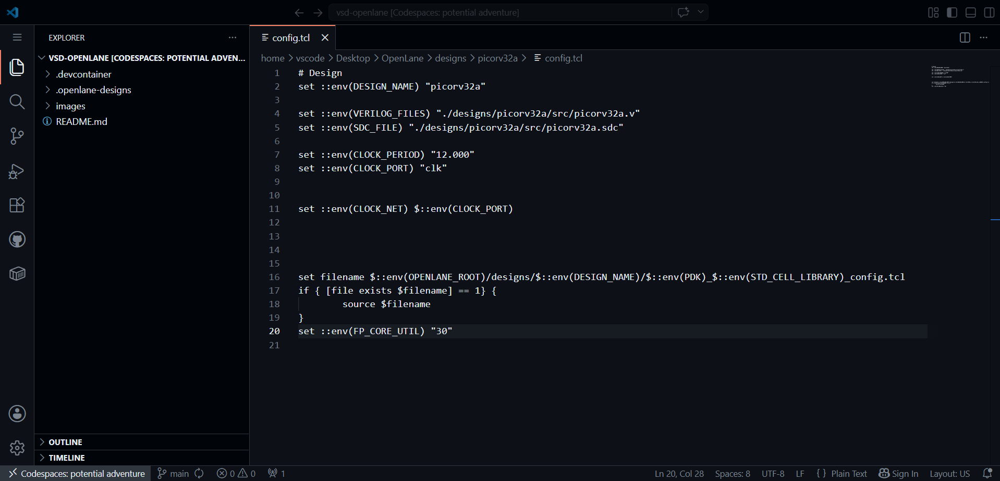

### Observation

The design configuration was successfully updated.

The generated run configuration was inspected again.

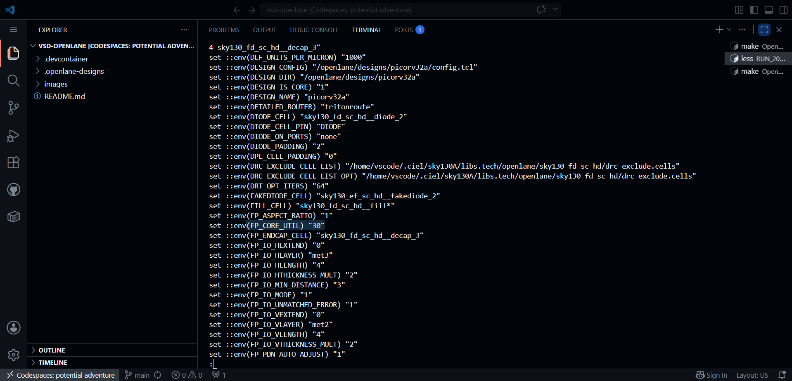

Observed:

```text
FP_CORE_UTIL = 30
```

### Learning

Verifying the generated run configuration confirmed that the modification had been successfully applied.

---

The updated DEF file was then examined.

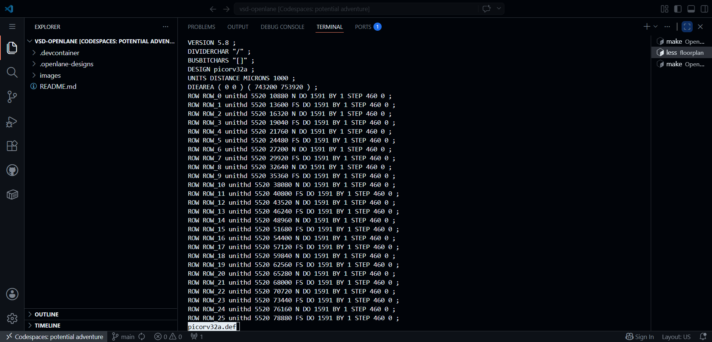

Observed:

```text
DIEAREA ( 0 0 ) ( 743200 753920 )
```

Converted dimensions:

```text
Width  = 743.2 µm
Height = 753.92 µm
```

### Die Area Calculation

```text
Die Area = Width × Height

= 743.2 × 753.92

≈ 560,915 µm²
```

### Observation

The die dimensions reduced significantly.

### Learning

A clear relationship became visible:

```text
Higher Utilization
        ↓
Less Whitespace
        ↓
Smaller Die Area
        ↓
Higher Density
```

This experiment demonstrated how floorplanning parameters directly influence physical chip dimensions.

---

# Running Placement

After floorplanning completed successfully, placement was executed.

```tcl
run_placement
```

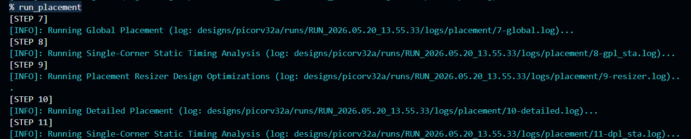

### Observation

Placement transformed the synthesized netlist into a physical arrangement of standard cells.

The process consisted of:

### Global Placement

Determines approximate cell locations while minimizing wirelength and congestion.

### Detailed Placement

Refines positions, removes overlaps, and aligns cells to legal placement rows.

### Learning

Placement is essentially an optimization problem that balances connectivity, routing complexity, timing requirements, and congestion.

---

# Physical Verification Using Magic

To inspect the placement results, the generated DEF file was loaded into Magic.

```bash
magic -T sky130A.tech \
lef read ../../../tmp/merged.nom.lef \
def read picorv32a.def &
```

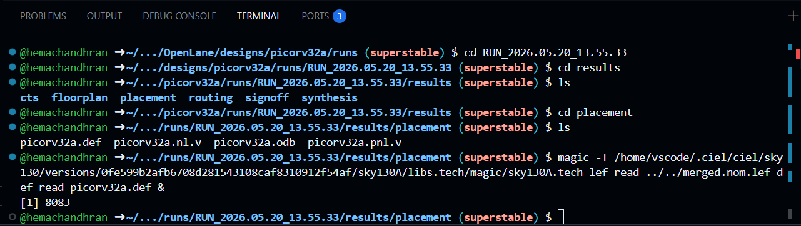

### Observation

The previously empty floorplan now contained thousands of placed standard cells.

The complete placement layout was then examined.

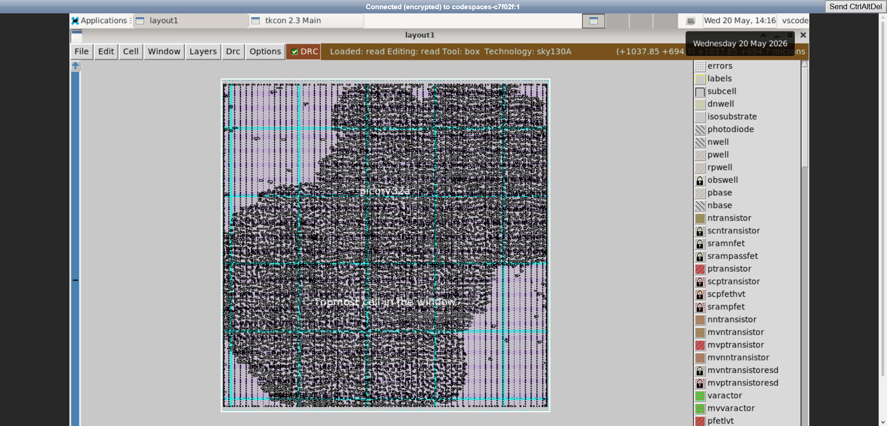

### Observation

The design now resembled a real integrated circuit rather than a floorplan template.

Rows that were previously empty had become populated with logic cells.

---

To better understand placement behavior, the layout was inspected at a higher zoom level.

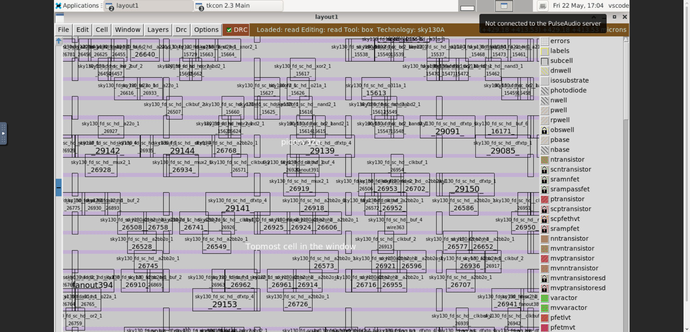

### Observation

Individual standard cells became visible.

Examples included:

* multiplexers
* buffers
* clock buffers
* flip-flops
* logic gates

### Learning

Placement is not random.

Cell locations are influenced by:

* connectivity
* timing requirements
* routing feasibility
* congestion reduction

This image provided the clearest evidence that placement converts a logical netlist into a physically optimized silicon implementation.

---

# Final Thoughts

This phase helped in understanding:

* Floorplanning
* Aspect Ratio
* Utilization Factor
* DEF File Interpretation
* Standard Cells and Macros
* Power Distribution Networks
* Decoupling Capacitors
* Placement
* Congestion Awareness
* Physical Layout Visualization

## Biggest Takeaway

Writing RTL creates functionality.

Floorplanning decides where that functionality can exist.

Placement determines how that functionality is physically organized inside silicon.

---

## Tools Used

* **OpenLANE** – RTL-to-GDSII ASIC Design Flow
* **OpenROAD** – Physical Design Engine
* **Magic VLSI** – Layout Visualization
* **SKY130A PDK** – Process Design Kit
* **GitHub Codespaces** – Linux Development Environment
* **Visual Studio Code** – Editing and Analysis
* **Docker** – Containerized OpenLANE Environment
