# PicoRV32A Custom Standard Cell Integration and Multi-Corner Timing Analysis using OpenLANE (Sky130)

---

## Overview

This phase focuses on integrating a custom inverter standard cell into the PicoRV32A RISC-V core using the OpenLANE ASIC flow and SKY130A PDK.

The main objectives were:

* Integrate a custom standard cell into the design flow
* Include custom Liberty and LEF files inside OpenLANE
* Verify whether synthesis actually uses the custom cell
* Compare OpenLane STA results with manual OpenSTA analysis
* Analyze timing behavior across multiple process corners
* Improve timing using synthesis settings and SDC constraints
* Verify physical placement of the custom cell in Magic

One interesting observation during this phase was that the design initially appeared timing-clean inside OpenLane, but manual OpenSTA analysis revealed significant timing violations under certain corners.

---

# Integrating the Custom Standard Cell

## Preparing Design Resources

The following files were added to the design source directory:

* `sky130_fd_sc_hd__fast.lib`
* `sky130_fd_sc_hd__typical.lib`
* `sky130_fd_sc_hd__slow.lib`
* `my_base.sdc`
* Custom inverter LEF file

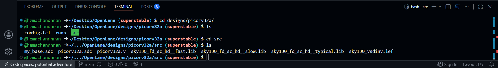

### Observation

The custom inverter required both physical and timing descriptions.

* `.lef` → physical abstraction
* `.lib` → timing characterization
* `.sdc` → timing constraints

These files allow the cell to participate in synthesis and timing analysis.

---

## Configuring OpenLane

The design configuration file was modified to include the custom timing libraries.

The following variables were updated:

```tcl
LIB_SYNTH
LIB_FASTEST
LIB_SLOWEST
LIB_TYPICAL
EXTRA_LEFS
```

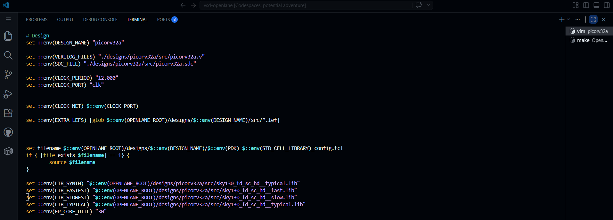

### Observation

This step ensures that OpenLane is aware of the custom inverter and its timing information.

Without these additions, the custom cell would not be available during technology mapping.

---

# Running Synthesis

## Loading the Custom LEF

The custom LEF was merged along with the SKY130 standard-cell library before synthesis.

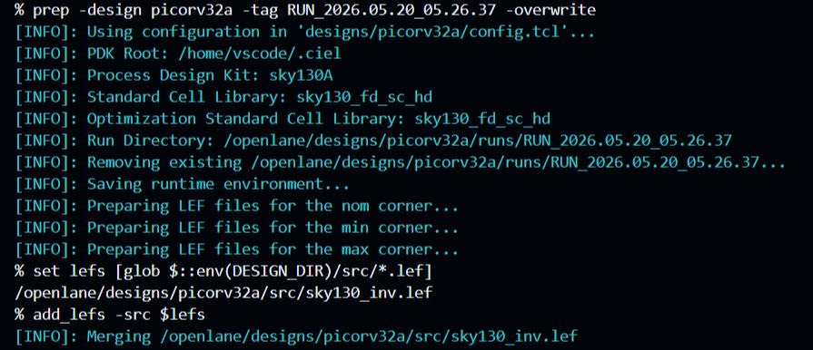

### Observation

The LEF merged successfully without any errors.

This confirmed that the custom inverter followed the same physical conventions as the SKY130 standard-cell library.

---

## Synthesis Execution

Synthesis was executed after integrating the custom cell.

During synthesis:

* RTL Verilog was read
* Logic was mapped to standard cells
* Optimization was performed
* Gate-level netlist was generated
* Built-in STA was executed

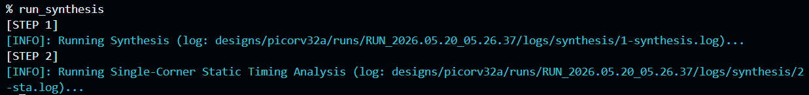

### Observation

The synthesis flow completed successfully after including the custom inverter.

No integration issues were reported.

---

## Verifying Cell Usage

The synthesis report was inspected to verify whether the custom inverter was actually used.

Observed:

* Total Cells = 15762
* `sky130_vsdinv` Instances = 187

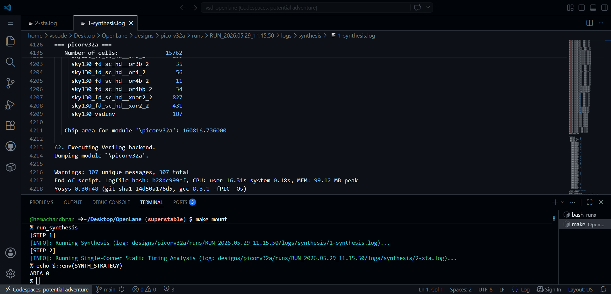

### Observation

This was the first confirmation that the custom inverter had been successfully integrated.

Instead of being ignored, the cell was selected during technology mapping and became part of the synthesized processor.

---

## Synthesis Strategy Investigation

The synthesis configuration was inspected.

Observed:

```text
SYNTH_STRATEGY = AREA 0
```

### Observation

`AREA 0` generates an area-optimized netlist.

Initially I expected timing violations because of the custom inverter, but the synthesis STA report still showed positive slack.

This prompted a deeper investigation into the timing environment being used.

---

# Initial Timing Analysis

## OpenLane STA Results

After synthesis, OpenLane automatically executed STA.

Reported:

| Metric            | Value   |
| ----------------- | ------- |
| TNS               | 0.00    |
| WNS               | 0.00    |
| Worst Setup Slack | 0.52 ns |
| Worst Hold Slack  | 0.17 ns |

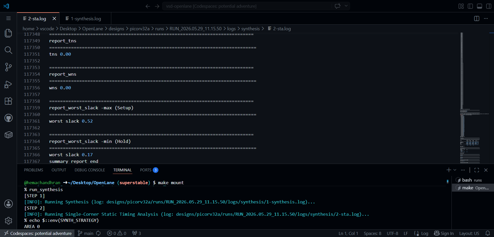

### Observation

The design met timing successfully.

No setup or hold violations were reported.

At this point the custom inverter did not appear to create any timing issues.

---

# Investigating the Timing Discrepancy

## Checking the Timing Environment

The OpenLane timing environment was examined.

Observed libraries:

```text
LIB_SYNTH
LIB_FASTEST
LIB_SLOWEST
LIB_TYPICAL
```
### Observation

Although custom liberty files had been added, the synthesis STA results still appeared unchanged.

Further investigation showed that OpenLane synthesis STA was using:

```text
trimmed.lib
Default SKY130 corner libraries
Generated constraints
```

rather than the exact custom timing environment used later in OpenSTA.

This explained why the reported timing results differed.

---

# Multi-Corner Timing Analysis using OpenSTA

## Creating pre_sta.conf

To perform timing analysis using the custom libraries, a standalone OpenSTA configuration file was created.

The script loaded:

```tcl
define_corners slow typ fast

read_liberty -corner slow ...
read_liberty -corner typ ...
read_liberty -corner fast ...

read_verilog picorv32a.v

read_sdc my_base.sdc
```

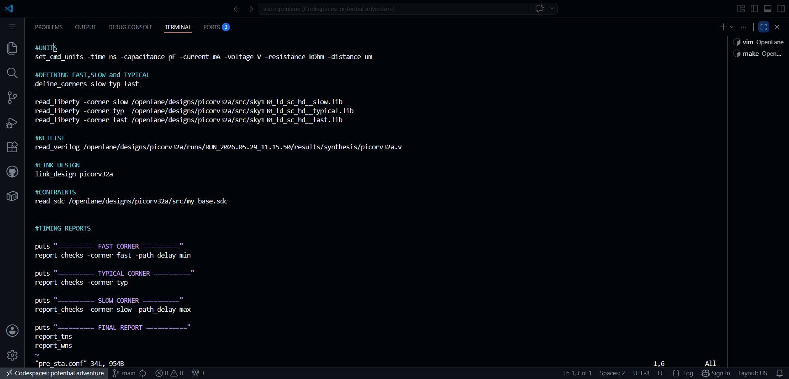

### Observation

Unlike the default OpenLane flow, OpenSTA allowed complete control over:

* Liberty files
* Corners
* Constraints

This made it possible to analyze the design under custom timing conditions.

---

## Fast Corner Analysis

Result:

```text
Slack = +0.252 ns
```

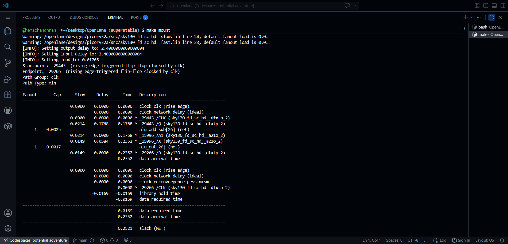

### Observation

The design met timing requirements under the fast process corner.

---

## Typical Corner Analysis

Result:

```text
Slack = +1.32 ns
```

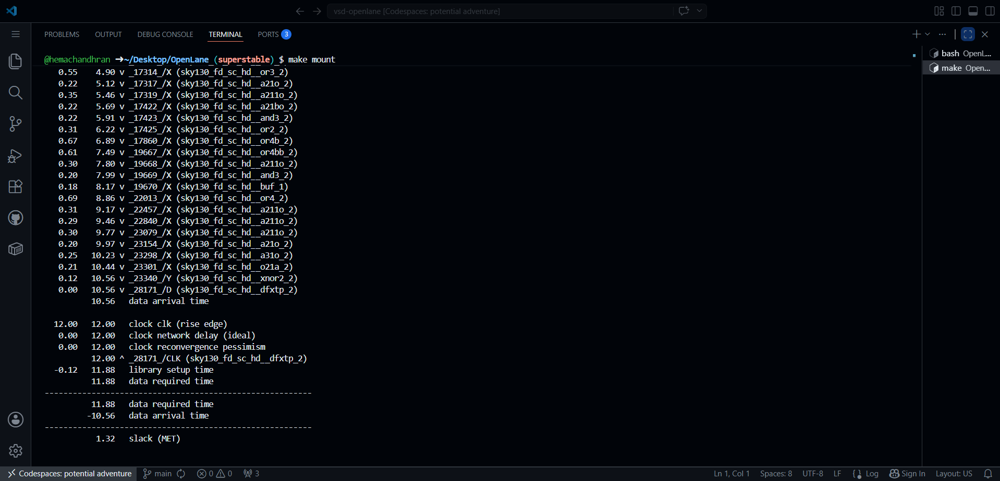

### Observation

The design comfortably met timing requirements under nominal conditions.

---

## Slow Corner Analysis

Result:

```text
Slack = -10.75 ns
```

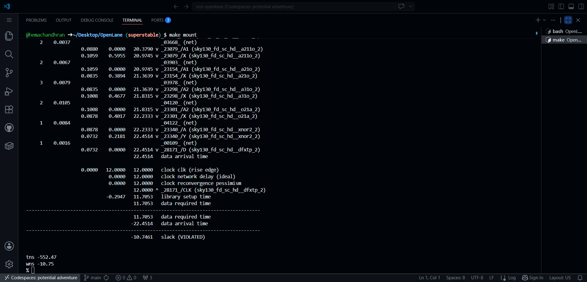

### Observation

This was the first significant timing violation observed.

Although OpenLane synthesis STA reported positive slack, the slow process corner revealed substantial setup violations.

---

## Final OpenSTA Summary

Reported:

```text
WNS = -10.75 ns
TNS = -552.47 ns
```


### Key Observation

```text
Same Netlist
Different Libraries
Different Constraints
Different Results
```

One important lesson from this experiment was that timing closure depends heavily on the analysis environment.

A timing-clean netlist under one corner may fail timing under another corner.

---

# Timing Optimization Experiments

## Modifying Synthesis Parameters

Several synthesis parameters were explored:

```tcl
SYNTH_STRATEGY
SYNTH_SIZING
SYNTH_BUFFERING
```

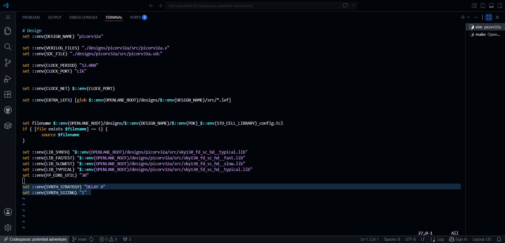

### Observation

These settings produced only small improvements in timing.

The OpenLane synthesis reports improved slightly, but the custom OpenSTA analysis still reported violations.

This suggested that synthesis optimization alone was not sufficient.

---

# Constraint Engineering

## Modifying the SDC File

The following constraints were added to `my_base.sdc`:

```tcl
set_clock_uncertainty -1.25 [get_clocks clk]

set_timing_derate -early 0.95
set_timing_derate -late 1.05

set_clock_transition 0.15 [get_clocks clk]

set_input_transition 0.15 [all_inputs]
```

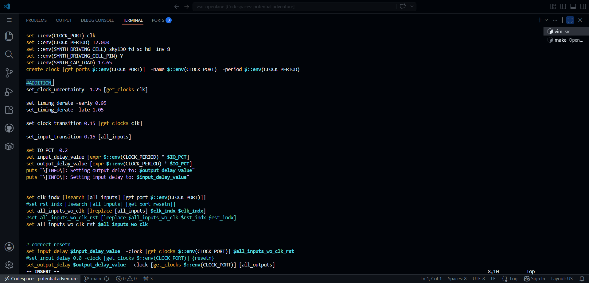

### Observation

These constraints introduce:

* clock uncertainty
* process variation
* realistic slew assumptions

into the timing analysis.

After applying them, the timing violations were reduced significantly.

---

## Updated OpenSTA Results

Reported:

```text
WNS = -2.36 ns
TNS = -31.90 ns
```

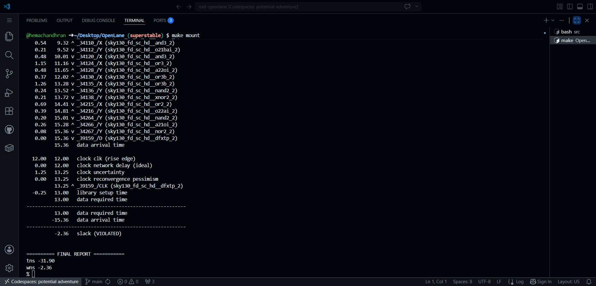

### Observation

| Metric | Before     | After     |
| ------ | ---------- | --------- |
| WNS    | -10.75 ns  | -2.36 ns  |
| TNS    | -552.47 ns | -31.90 ns |

The timing improvement achieved through constraint modifications was significantly larger than the improvement obtained through synthesis parameter tuning.

---

# Physical Verification

## Floorplan and Placement

After timing analysis, floorplanning and placement were executed.

The generated DEF file was loaded into Magic.

### Observation

The goal was to verify whether the custom inverter had been physically instantiated inside the placed design.

---

## Finding the Custom Cell

The placement database was inspected manually inside Magic.

After searching through the placed cells, an instance of:

```text
sky130_vsdinv
```

was successfully located.

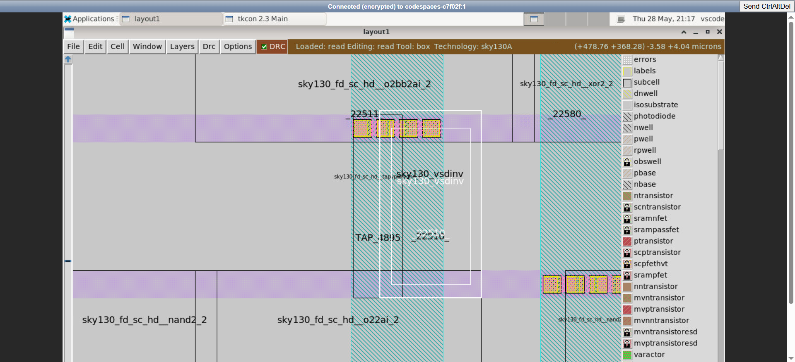

### Observation

This confirmed:

* Successful logical integration
* Successful physical integration
* Successful placement

The custom inverter was no longer just a library cell.

It had become part of the actual physical implementation of the processor.

*Ngl, it took me around 5 minutes to find this tiny minion among thousands of standard cells 😄*

---

# Final Thoughts

This phase helped in understanding:

* Custom standard-cell integration
* Liberty and LEF usage
* OpenLane synthesis behavior
* Multi-corner STA
* OpenSTA workflows
* Timing constraints
* Timing optimization techniques
* Physical verification using Magic

## Biggest Takeaway

A timing-clean synthesis report does not necessarily imply timing closure under all operating conditions.

The same synthesized netlist can produce completely different timing results depending on:

* Liberty files
* Timing corners
* SDC constraints

This phase demonstrated the importance of multi-corner timing analysis and showed how a custom standard cell can be successfully integrated, analyzed and physically verified inside a complete ASIC design flow.

---

## Tools Used

* **OpenLane v1.0.2** - RTL-to-GDSII ASIC Design Flow
* **OpenSTA** - Static Timing Analysis
* **Yosys** - RTL Synthesis
* **Magic VLSI** - Layout Visualization
* **SKY130A PDK** - Process Design Kit
* **GitHub Codespaces** - Linux Development Environment
* **Visual Studio Code** - Editing and Analysis
