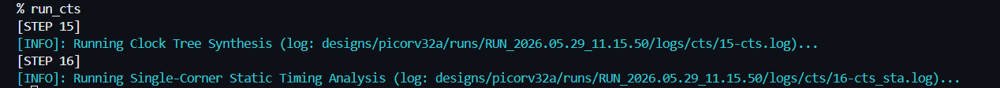
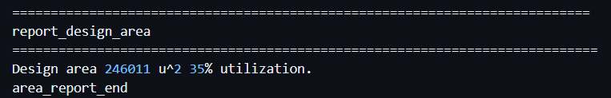
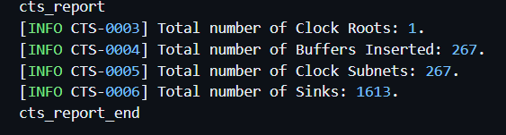
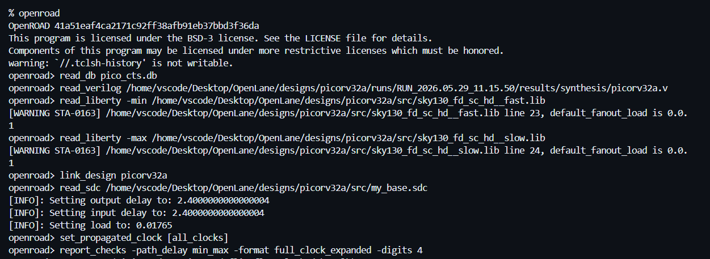
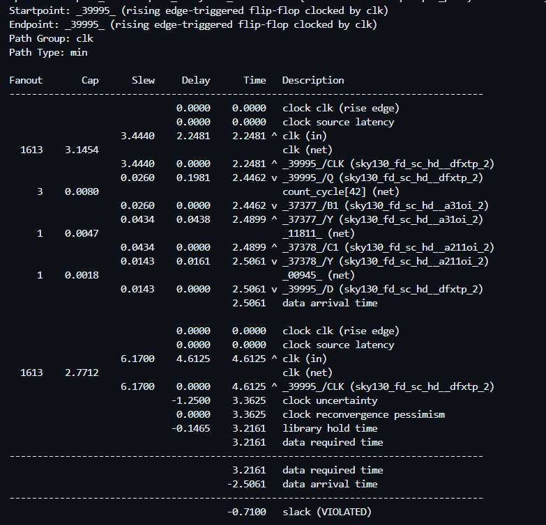
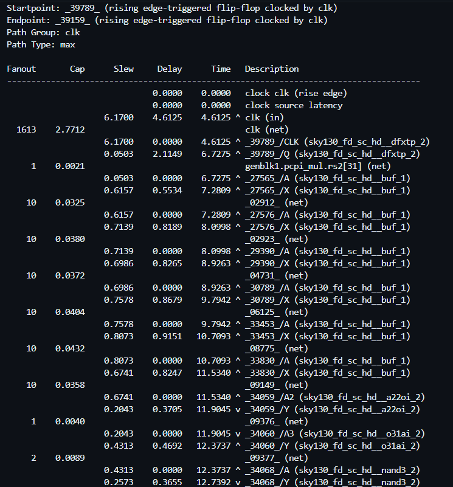
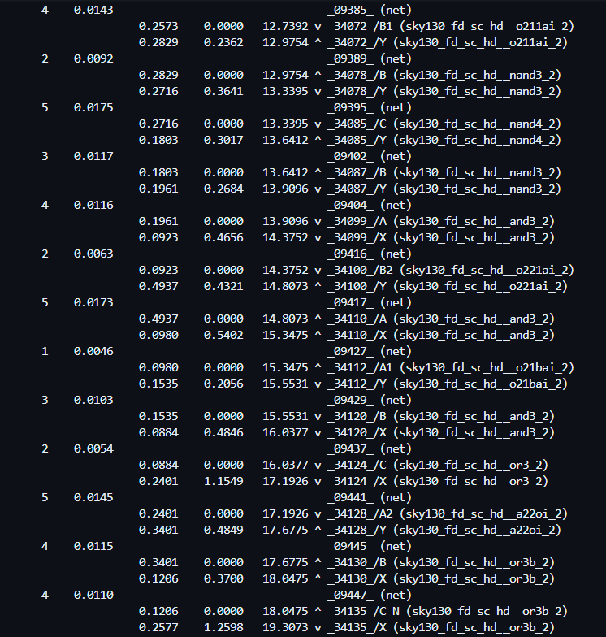
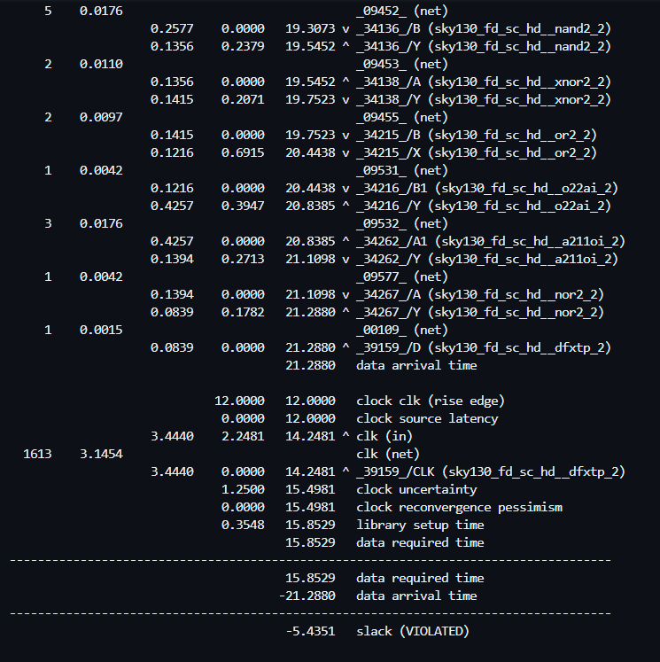
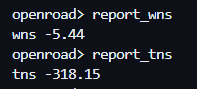
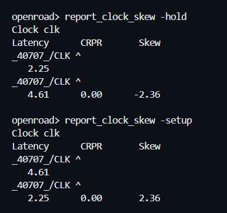

# Post-CTS Timing Analysis using OpenROAD (Sky130)

---

# Overview

After completing Placement and Clock Tree Synthesis (CTS), the next objective was to analyze how the insertion of the physical clock network affected the timing behavior of the design.

Unlike pre-CTS analysis, where clocks are assumed to be ideal, post-CTS timing analysis considers the actual clock buffers and routing delays introduced during Clock Tree Synthesis.

This phase focused on investigating:

* the impact of CTS on area
* clock buffer insertion
* clock fanout distribution
* post-CTS setup and hold timing
* clock skew behavior
* comparison between pre-CTS and post-CTS timing results

---

# Running Clock Tree Synthesis

Clock Tree Synthesis was executed after placement to distribute the clock signal to all sequential elements in the design.



### Observation

The CTS stage completed successfully and was immediately followed by post-CTS Static Timing Analysis.

### Investigation

Before CTS, all flip-flops receive an ideal clock signal with zero network delay.

However, in a real chip, the clock must physically travel through buffers and interconnects to reach thousands of flip-flops.

### Learning

CTS creates a balanced clock distribution network by inserting clock buffers and constructing clock subnets, ensuring that clock arrival times remain as consistent as possible throughout the design.

---

# Investigating Area Growth After CTS

After CTS completion, the design area was examined.



### Observation

The reported design area became:

```text
Design Area = 246011 µm²
Utilization = 35%
```

### Investigation

The area observed after CTS was larger than the area reported during synthesis and placement.

This raised the question:

**What caused the increase in area?**

### Finding

CTS inserted additional clock buffers throughout the design to distribute the clock signal to all flip-flops.

These newly added cells occupy physical silicon area.

### Learning

Improving timing performance often comes at a cost.

In this case:

* Better clock distribution
* Reduced clock uncertainty
* Improved timing quality

were achieved by adding clock buffers, resulting in increased area consumption.

This demonstrates one of the fundamental trade-offs in physical design:

> Better timing generally requires additional hardware resources.

---

# Examining the CTS Report

The CTS report was analyzed to understand how the clock network was constructed.



### Observation

The report showed:

```text
Clock Roots      : 1
Buffers Inserted : 267
Clock Subnets    : 267
Clock Sinks      : 1613
```

### Investigation

A processor contains a large number of sequential elements, all of which require a clock connection.

The goal was to understand how OpenROAD distributes the clock efficiently.

### Finding

The CTS engine inserted 267 clock buffers and created 267 clock subnets to drive 1613 clock sinks.

### Learning

Clock Tree Synthesis does not simply connect one clock source to every flip-flop.

Instead, the clock signal is gradually distributed through multiple buffer stages, reducing excessive fanout and improving signal integrity.

---

# Loading the Post-CTS Database into OpenROAD

To perform detailed timing analysis, the post-CTS design database was loaded into OpenROAD.



### Observation

The following steps were performed:

```tcl
read_db pico_cts.db
read_verilog picorv32a.v

read_liberty -min sky130_fd_sc_hd__fast.lib
read_liberty -max sky130_fd_sc_hd__slow.lib

read_sdc my_base.sdc
```

### Investigation

The timing engine initially assumes ideal clocks unless instructed otherwise.

This would not accurately represent the physical clock network generated during CTS.

### Finding

The critical command used was:

```tcl
set_propagated_clock [all_clocks]
```

### Learning

This command instructs OpenSTA to stop using ideal clock assumptions and instead calculate timing using the actual clock delays introduced by:

* clock buffers
* clock routing
* clock insertion delays

This is what transforms timing analysis from a theoretical estimate into a physically realistic analysis.

---

# Hold Timing Analysis with Real Clocks

The minimum-delay timing path was examined to investigate hold timing behavior after CTS.



### Observation

The timing report showed:

```text
Slack = -0.7100 ns
```

### Investigation

Hold timing violations occur when data arrives too quickly at the destination flip-flop after a clock edge.

The introduction of real clock delays can significantly alter hold behavior.

### Finding

The physical clock network created by CTS introduced clock arrival differences between sequential elements.

These clock arrival differences exposed a hold violation that was not visible under ideal-clock assumptions.

### Learning

This result is expected at this stage.

Hold violations are commonly repaired later in the flow through:

* delay buffer insertion
* routing optimization
* post-CTS timing repair

The purpose of this analysis was not to eliminate violations immediately, but to identify them accurately using the real clock network.

---

# Setup Timing Analysis with Real Clocks

The maximum-delay timing path was analyzed to investigate setup timing performance.







### Observation

The report showed a setup timing violation with:

```text
Slack = -5.4351 ns
```

### Investigation

The objective was to understand how CTS affected long combinational timing paths.

### Finding

Unlike pre-CTS analysis, the timing report now explicitly includes delays through actual clock buffers and clock routing elements.

Several clock-buffer stages contributed to the final clock insertion delay.

The report also showed:

* fanout values
* net capacitances
* transition times
* clock path delays

### Learning

The introduction of real-world clock delays often reveals timing issues that remain hidden during ideal-clock analysis.

At this stage, setup violations are expected and will be targeted during later optimization and routing stages.

This is one of the main reasons why timing must be re-evaluated after CTS.

---

# Comparing Pre-CTS and Post-CTS Timing

To understand the impact of Clock Tree Synthesis, timing results before and after CTS were compared.

### Pre-CTS Results

```text
Hold Slack  = +0.2521 ns

Setup Slack = -10.7461 ns

WNS = -10.75 ns
TNS = -552.47 ns
```

### Post-CTS Results

```text
Hold Slack  = -0.7100 ns

Setup Slack = -5.4351 ns
```



### Observation

The setup violation improved significantly after CTS.

### Investigation

CTS introduces clock insertion delays and redistributes clock arrival times across the design.

### Finding

Comparing the timing reports:

| Metric | Pre-CTS | Post-CTS |
|----------|----------|----------|
| Hold Slack | +0.2521 ns | -0.7100 ns |
| Setup Slack | -10.7461 ns | -5.4351 ns |
| WNS | -10.75 ns | -5.44 ns |
| TNS | -552.47 ns | -318.15 ns |

### Learning

CTS improved setup timing considerably:

* WNS improved by roughly 50%
* TNS improved significantly

However, this improvement came with the introduction of hold violations.

This highlights another important trade-off in physical design:

> Improving setup timing can sometimes worsen hold timing.

Balancing both constraints is one of the key challenges of timing closure.

---

# Analyzing Clock Skew

Clock skew analysis was performed to measure clock arrival differences across the clock network.



### Observation

The reported skew values were:

```text
Setup Skew ≈ +2.36 ns

Hold Skew ≈ -2.36 ns
```

### Investigation

Clock skew directly affects both setup and hold timing.

A perfectly balanced clock tree would ideally have zero skew, but real physical implementations always introduce some variation.

### Finding

The setup and hold skew values had approximately the same magnitude but opposite signs.

This occurs because setup and hold analyses evaluate clock arrival relationships differently.

### Learning

Clock skew is a realistic reflection of the physical clock network created during CTS.

The measured skew confirms that the timing engine is now using actual propagated clocks rather than ideal clock assumptions.

This is one of the strongest indicators that post-CTS timing analysis is accurately modeling the physical implementation.

---

# Fanout Observation

During timing analysis, the clock network exhibited a fanout of approximately:

```text
1613
```

### Observation

The clock signal drives every sequential element in the processor.

### Investigation

Large fanout values can increase:

* clock delay
* power consumption
* clock skew

### Finding

CTS managed this large fanout by inserting multiple clock buffers and creating a hierarchical clock distribution network.

### Learning

Clock Tree Synthesis exists primarily to solve the fanout problem associated with clock distribution.

Without CTS, a single clock source attempting to drive thousands of flip-flops would create severe timing and signal integrity issues.

---

# Final Thoughts

This phase demonstrated how Clock Tree Synthesis transforms timing analysis from an idealized model into a physically realistic one.

The investigation showed:

* area growth due to clock buffer insertion
* clock network construction through CTS
* post-CTS setup and hold analysis
* clock fanout distribution
* timing trade-offs introduced by real clock delays
* clock skew behavior
* improvement of setup timing after CTS

## Biggest Takeaway

Before CTS, timing analysis assumes an ideal clock.

After CTS, the clock becomes a real physical network with buffers, routing delays, fanout effects, and skew.

Understanding these effects is essential because timing closure is no longer determined only by the data path, but also by the behavior of the clock network itself.

---

# Tools Used

* **OpenLane v1.0.2** - RTL-to-GDSII ASIC Design Flow
* **OpenSTA** - Static Timing Analysis
* **OpenROAD** - Physical Design Operations
* **SKY130A PDK** - Process Design Kit
* **GitHub Codespaces** - Linux Development Environment
* **Visual Studio Code** - Editing and Analysis
