# Power Distribution Network, Routing and Signing Off

## Overview

After successfully completing Placement and Clock Tree Synthesis (CTS), the next stage focused on establishing a reliable power delivery network and creating the physical interconnections required for the design to function.

The main objectives of this phase were to investigate:

- Power Distribution Network (PDN) generation
- PDN structure and connectivity
- Standard cell alignment with power rails
- Global routing using FastRoute
- Detailed routing using TritonRoute
- Routing guides and routing methodologies
- Final routed layout inspection
- Physical verification and signoff flow

This phase provided practical exposure to the backend implementation flow and demonstrated how logical connectivity is transformed into a manufacturable physical design ready for timing signoff, DRC, LVS, and final GDSII generation.

---

## Generating the Power Distribution Network (PDN)

After placement and Clock Tree Synthesis (CTS), the next step was generating the Power Distribution Network (PDN).

A design cannot be routed reliably without a proper power network. Every standard cell requires stable VDD and GND connections, and these connections must be established before signal routing begins. Without a PDN, signal routing may complete successfully, but the design would fail to operate correctly due to power delivery issues.

The PDN stage creates dedicated power rails and power straps that distribute power across the entire core.

### Command

```tcl
gen_pdn
```

### Observation

The PDN generation stage completed successfully and OpenLane began creating the power delivery infrastructure for the design.

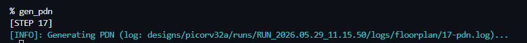

### Learning

Power planning is one of the earliest signoff-oriented activities in physical design because power integrity directly impacts timing, reliability, and manufacturability.

---

## PDN Report Analysis

After generating the PDN, the generated log file was inspected to understand what OpenROAD created internally.

### Observation

The report showed:

- Standard-cell grid insertion
- Creation of power nodes
- Voltage source generation
- VPWR connectivity verification
- VGND connectivity verification

The report confirmed that all power stripes were successfully connected and that the generated power network was electrically complete.

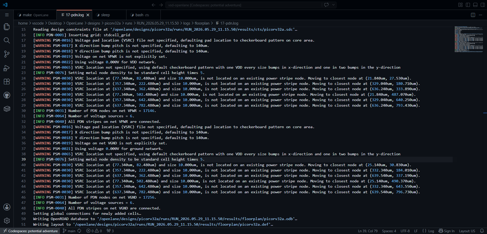

### Learning

A successful PDN report provides confidence that all standard cells will later receive stable power and ground connections.

---

## Understanding the Power Distribution Network Structure

Before inspecting the physical layout, it was useful to understand how a typical ASIC power distribution network is organized.

A PDN is generally composed of:

- Power Rings
- Power Stripes
- Standard Cell Rails
- Power Pads

Power rings distribute power around the design boundary, while power stripes carry power deeper into the core. Standard cell rails then provide local power connections to every standard cell row.

This hierarchical structure helps reduce IR drop and improves power delivery reliability.

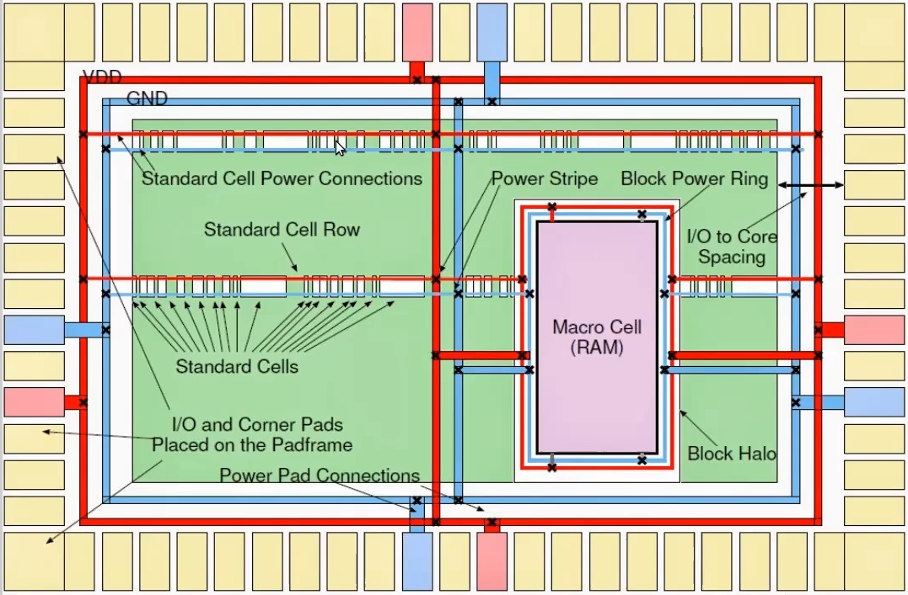

### Learning

The PDN acts as the electrical backbone of the entire chip and must be completed before signal routing begins.

---

## Observing Standard Cell Alignment on Power Rails

After PDN generation, the layout was inspected inside Magic.

### Observation

The standard cells were observed to be perfectly aligned along the generated power rails.

This arrangement is intentional. Standard cells are designed with fixed heights so that their power pins naturally align with the horizontal VDD and GND rails generated during floorplanning and PDN creation.

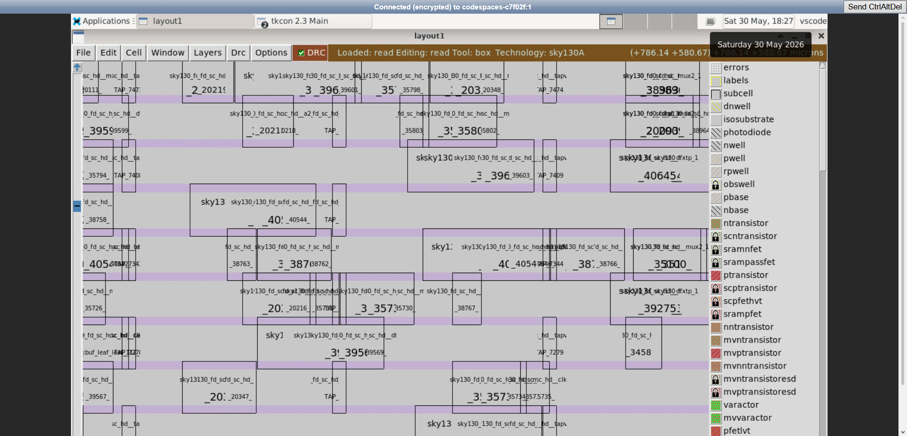

### Learning

The regular row-based arrangement simplifies routing while ensuring consistent power delivery throughout the design.

---

## Beginning the Routing Stage

With power planning completed, routing could begin.

### Observation

Before creating actual signal routes, OpenLane automatically generated additional netlists.

Two important files are produced:

### Pre-route Netlist

Represents the design before signal routing is physically implemented.

### Antenna-Diode Netlist

Generated to prevent antenna violations.

During fabrication, long metal segments can accumulate charge before all layers are connected. This charge can discharge through transistor gates and permanently damage them. Antenna diodes provide a safe discharge path and protect sensitive gates during manufacturing.

Routing behavior can also be influenced through several OpenLane routing parameters such as:

- Routing iterations
- Congestion thresholds
- Timing-driven optimizations
- Overflow limits
- Runtime-performance tradeoffs

Changing these settings can significantly affect congestion, timing closure, runtime, and routing quality.

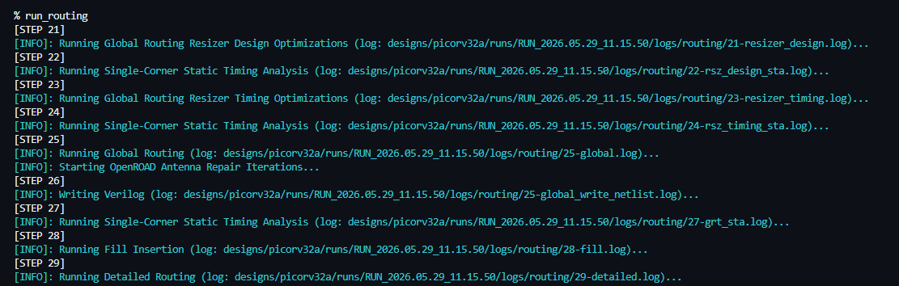

### Learning

Routing is not a fixed process. Different routing strategies can produce different timing, congestion, and area tradeoffs.

---

## Routing Report Analysis

Before routing proceeded further, the routing report was examined.

### Observation

The report contained useful design statistics including:

- Number of routing layers
- Number of macros
- Number of components
- Number of terminals
- Number of nets
- Via information
- Routing resources

These statistics provide an estimate of routing complexity and resource utilization.

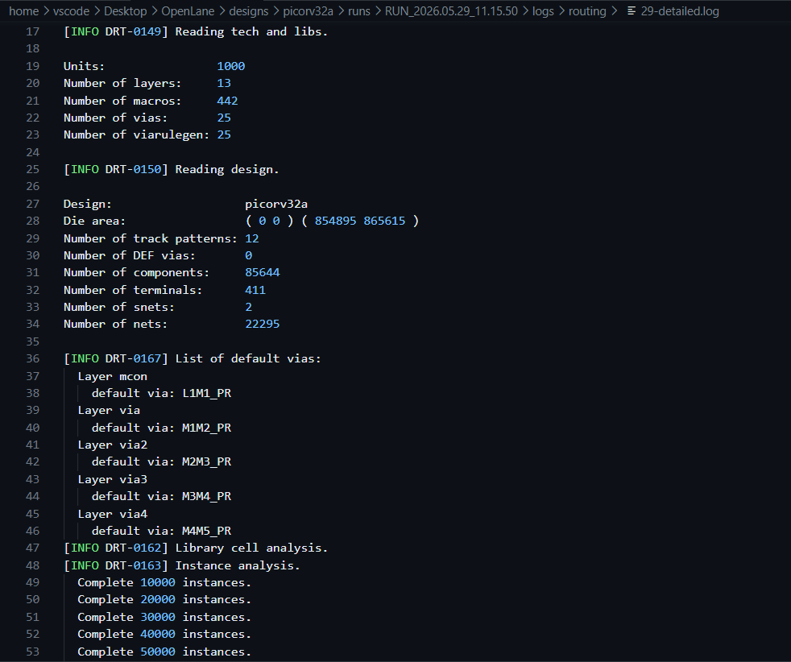

### Learning

As design size increases, routing complexity grows significantly due to the increasing number of nets competing for limited routing resources.

---

## Global Routing and Detailed Routing

Routing is divided into two major stages.

### Global Routing (FastRoute)

Global routing determines approximate paths for each net.

Instead of creating actual wires, it generates routing guides indicating which routing regions and metal layers should be used.

Objectives:

- Minimize congestion
- Estimate routing resources
- Generate route guides

### Detailed Routing (TritonRoute)

Detailed routing converts the route guides into actual wires and vias.

Objectives:

- Achieve full connectivity
- Satisfy design rules
- Minimize violations
- Optimize wire and via usage

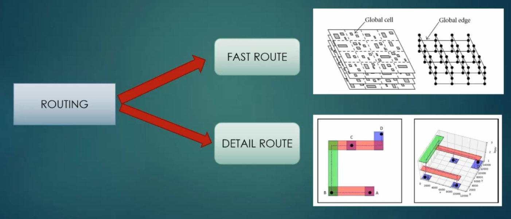

### Learning

Global routing decides where signals should travel, while detailed routing determines exactly how those connections are physically implemented.

---

## Features of TritonRoute

TritonRoute is the detailed router used by OpenROAD.

It performs detailed routing using the routing guides generated during the global routing stage.

Key features include:

- Initial detailed routing
- Route-guide honoring
- Inter-guide connectivity management
- Multi-layer routing optimization
- Parallel routing support
- Via count optimization
- Design-rule-aware routing

The following figures summarize TritonRoute's routing methodology.

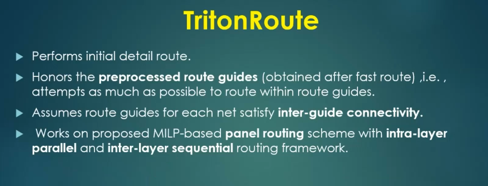

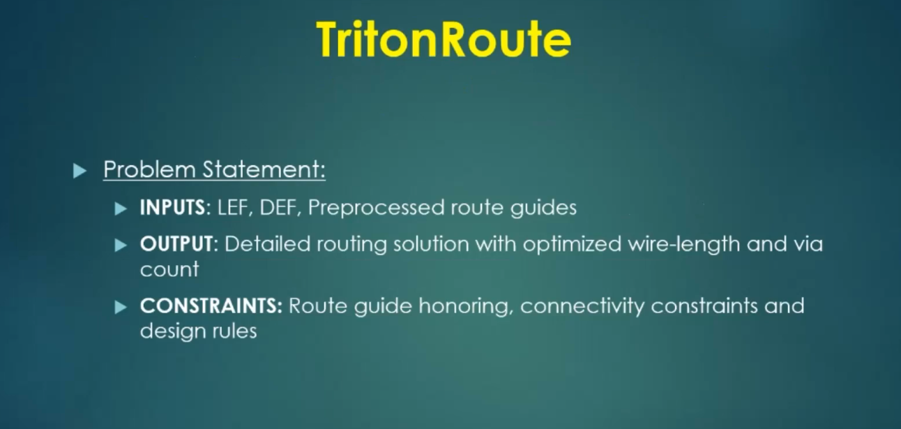

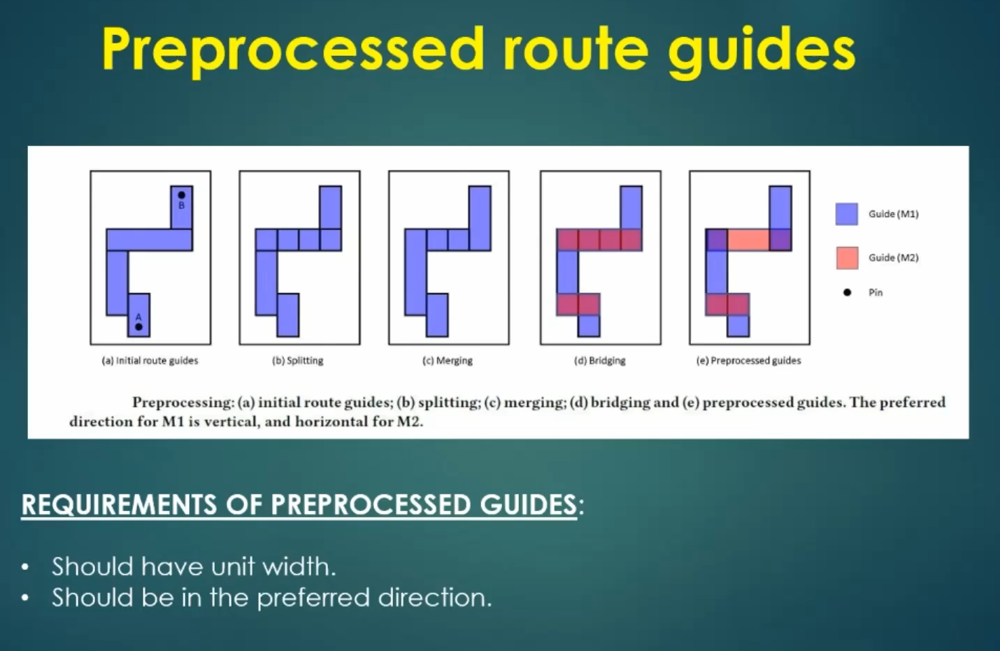

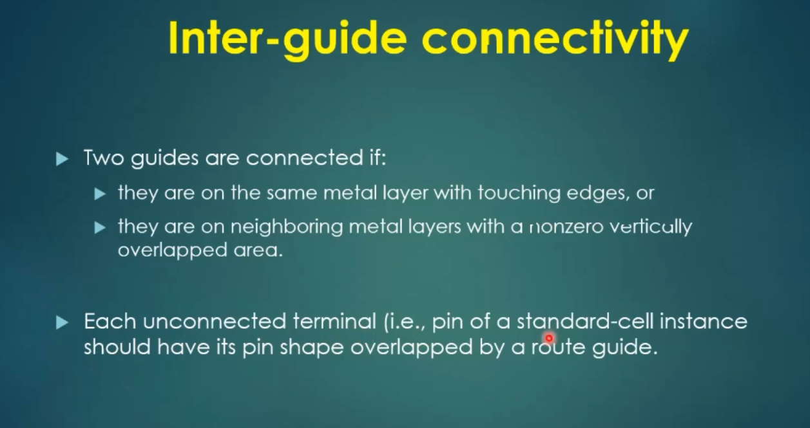

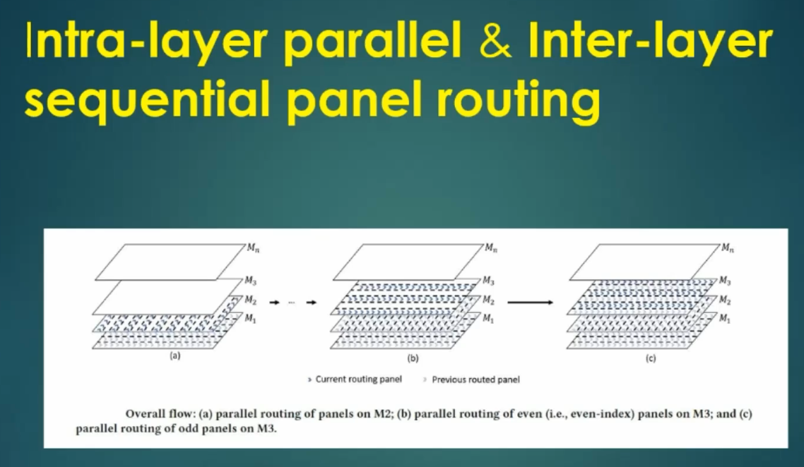

### Learning

TritonRoute transforms abstract routing guides into manufacturable physical connections while satisfying all design-rule constraints.

---

## Routed Layout Inspection

After routing completed successfully, the routed layout was inspected inside Magic.

### Observation

The design now contained actual signal interconnections distributed across multiple metal layers.

Signals were routed across the core using a combination of horizontal and vertical metal layers connected through vias. The routing fabric occupied a significant portion of the design area, indicating the complexity of the PicoRV32A processor.

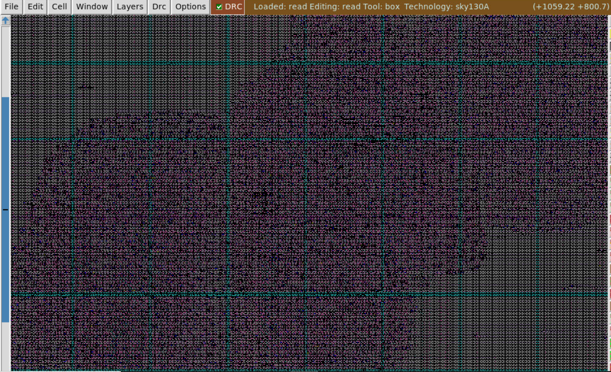

### Learning

Routing converts logical connectivity into physical metal structures that can eventually be fabricated on silicon.

---

## Zoomed Routing View

A closer inspection of the routed layout was performed.

### Observation

At higher magnification, routing tracks, vias, filler cells, decap cells, standard cells, and power structures became visible.

The dense interconnect network demonstrates how multiple metal layers work together to satisfy timing and connectivity requirements while respecting design-rule constraints.

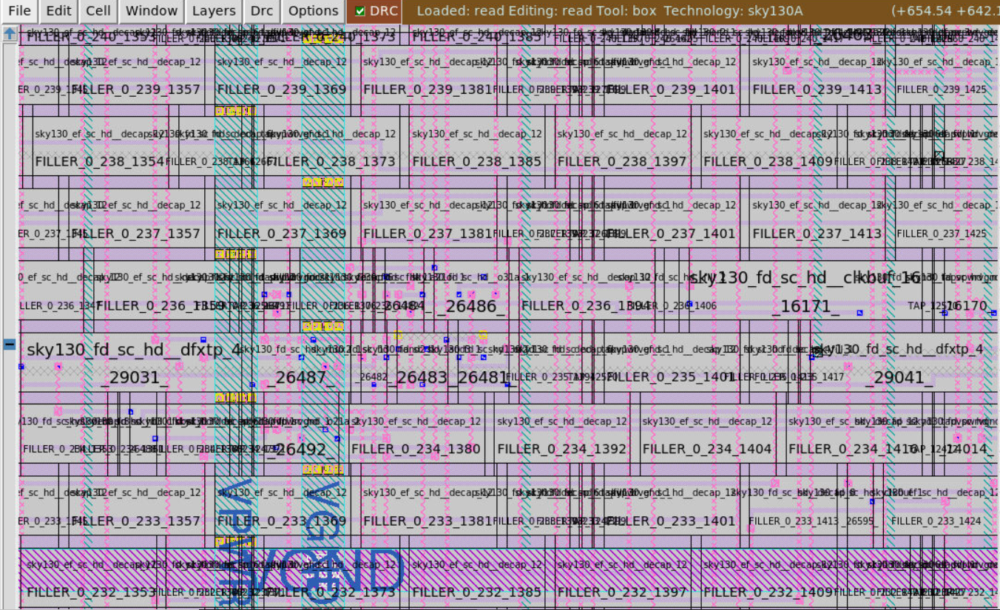

### Learning

Although the routing pattern appears dense and complex, every metal segment exists to satisfy connectivity, timing, congestion, and manufacturability constraints simultaneously.

---

## Preparing for Post-Routing Timing Analysis

After routing, the next important step is extracting parasitic information.

### Why SPEF?

Routing introduces parasitic effects:

- Resistance (R)
- Capacitance (C)

These parasitics directly affect signal delay and therefore influence timing results.

To perform accurate post-routing Static Timing Analysis (STA), these parasitic effects must be extracted and represented in a standard format called:

**SPEF (Standard Parasitic Exchange Format)**

Using SPEF allows STA tools to calculate actual interconnect delays instead of relying on estimated wire models.

### SPEF Extraction

Due to limitations within the current OpenLane flow, SPEF extraction was not performed directly inside the automated flow.

However, SPEF can be extracted externally using:

```bash
cd SPEF_EXTRACTOR

python3 main.py <path_to_merged.lef> <path_to_design.def>
```

### Learning

Pre-routing STA uses estimated wire delays, whereas post-routing STA uses extracted RC parasitics and therefore provides significantly more realistic timing results.

---

## Physical Verification and Signoff

After routing and parasitic extraction, the design moves toward final signoff.

The remaining steps are:

1. Generate GDSII
2. Perform DRC (Design Rule Check)
3. Perform LVS (Layout Versus Schematic)
4. Complete signoff verification
5. Deliver final GDSII to the fabrication facility

The generated GDSII file represents the final manufacturable version of the design.

---

## Conclusion

This phase provided insight into how physical connectivity is established inside an ASIC design.

The Power Distribution Network ensured reliable delivery of power and ground throughout the core, while the routing stages transformed logical connectivity into physical metal interconnections. The study of FastRoute and TritonRoute also provided a deeper understanding of how modern routing engines manage congestion, connectivity, and design-rule constraints.

One important takeaway from this phase was realizing how iterative the physical design flow truly is. A small issue in floorplanning, placement, CTS, or routing can easily force multiple optimization cycles before a design becomes signoff-ready.

Working through the complete PDN and routing flow on PicoRV32A offered valuable exposure to concepts used in industrial backend design tools. OpenLane provides a practical platform for understanding modern physical implementation methodologies and serves as an excellent bridge toward advanced timing closure and signoff verification workflows.

The journey from RTL to silicon is long, but completing this stage provided a much deeper appreciation of how physical structures ultimately become a manufacturable integrated circuit.

---

## Tools Used

- OpenLane
- OpenROAD
- Magic VLSI
- TritonRoute
- FastRoute
- SKY130 PDK
