# Sky130 GCD RTL-to-GDS Flow using ORFS (GitHub Codespaces)

---

# Overview

This phase focused on executing a complete RTL-to-GDS implementation flow using OpenROAD Flow Scripts (ORFS) inside GitHub Codespaces.

Rather than treating ORFS as a single command-line tool, the objective was to observe how different physical design stages work together to transform an RTL design into a manufacturable layout.

The Sky130HD GCD testcase was used throughout this phase to investigate:

* toolchain verification
* RTL-to-GDS flow execution
* floorplanning and power planning
* placement and clock tree synthesis
* routing and timing analysis
* final GDS generation

One important realization during this phase was that modern ASIC implementation flows are highly automated, but understanding the purpose of each stage remains essential for debugging and optimization.

---

# Verifying the Design Environment

Before executing the flow, the development environment was verified inside GitHub Codespaces.

The installed versions of OpenROAD, Yosys, Python, and GNU Make were checked to ensure that the required tools were available.

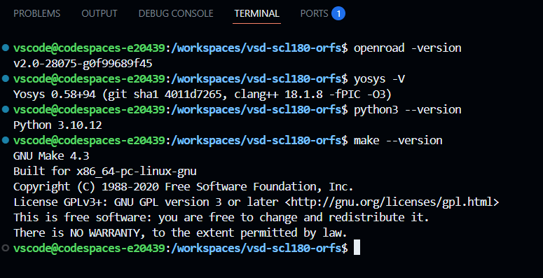

### Observation

All required tools were successfully detected inside the ORFS environment.

It was interesting to observe that multiple tools contribute to a single implementation flow. ORFS acts as the orchestration layer, while synthesis, timing analysis, routing, and reporting are handled by specialized tools working together behind the scenes.

---

# Launching the RTL-to-GDS Flow

After verifying the environment, the complete flow was launched using the GCD design configuration.


### Observation

A single Makefile command triggered the complete implementation flow.

What stood out here was how ORFS automatically managed dependencies between stages. Instead of manually invoking synthesis, placement, routing, and timing commands, the framework coordinated everything in the correct sequence.

---

# Running Synthesis

The synthesis stage was executed first as part of the automated flow.

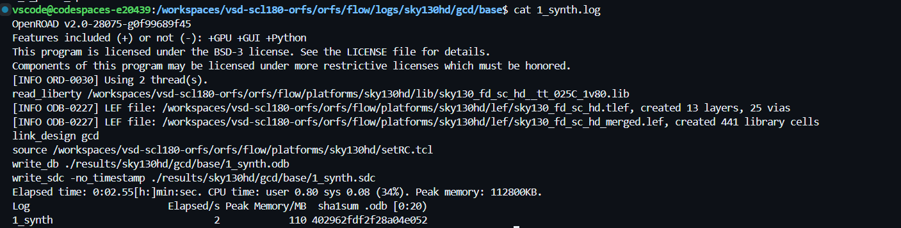

### Observation

The RTL description was successfully transformed into a gate-level implementation using cells from the Sky130 standard-cell library.

This was the first stage where the design stopped looking like behavioral Verilog and began taking the form of actual hardware components that could be physically implemented.

---

# Floorplan Initialization

Once synthesis completed, the flow proceeded to floorplanning.

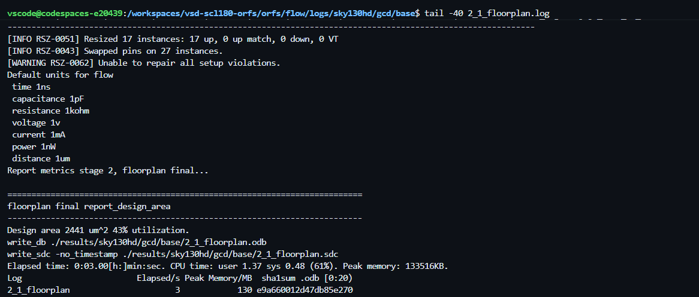

### Observation

The floorplan stage established the initial physical structure of the design.

The reported utilization was approximately 43%, indicating that sufficient whitespace was reserved for future routing and optimization stages. This demonstrated that floorplanning is not simply about defining chip dimensions, but also about preparing the design for successful implementation later in the flow.

---

# Power Distribution Network Generation

After floorplanning, the power delivery network was generated.

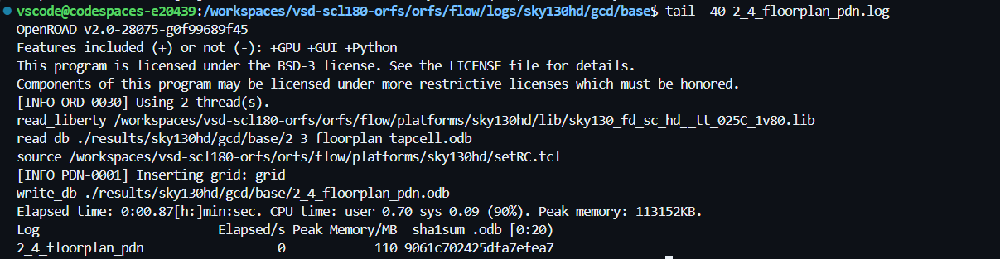

### Observation

The PDN generation stage completed successfully and inserted the power grid required by the design.

Although the stage executed quickly, it highlighted the importance of power planning in ASIC design. Every subsequent implementation stage depends on the existence of a reliable power distribution network.

---

# Standard Cell Placement

The placement stage arranged synthesized cells inside the floorplan.

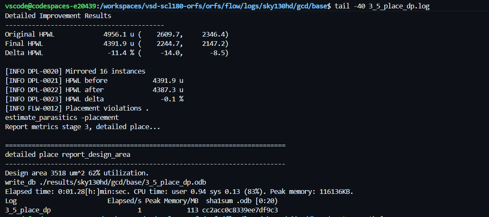

### Observation

The placer successfully positioned standard cells while optimizing wirelength and resource utilization.

The design utilization increased significantly compared to the floorplan stage, showing how available silicon area was gradually being occupied as implementation progressed. This was the first stage where the physical organization of the circuit became clearly visible.

---

# Clock Tree Synthesis

After placement, the clock distribution network was generated.

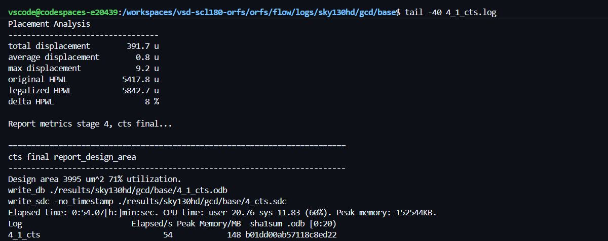

### Observation

Clock Tree Synthesis inserted clock buffers and constructed the clock network required to distribute the clock signal throughout the design.

An interesting observation was that the overall design area increased after CTS due to the insertion of additional clock-tree elements. This highlighted the fact that clock distribution itself consumes a noticeable amount of physical resources.

---

# Routing the Design

Once placement and CTS were completed, routing was performed.

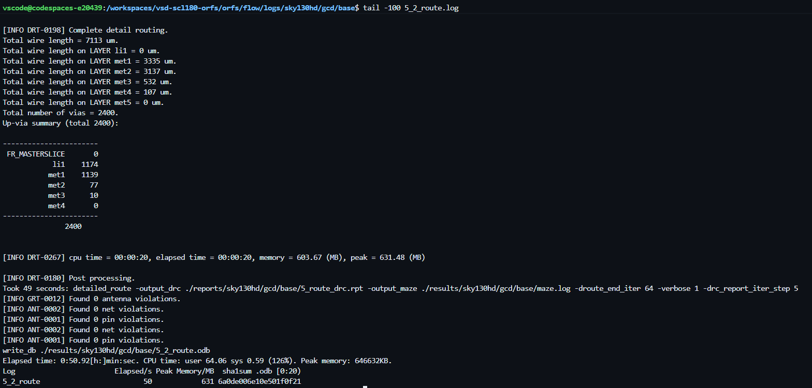

### Observation

The routing stage successfully connected all placed cells using the available routing layers.

The routing reports indicated zero antenna violations, zero net violations, and zero pin violations. This provided confidence that the generated routing solution was clean and suitable for subsequent timing analysis.

---

# Timing Analysis

After routing completed, the final timing reports were generated.

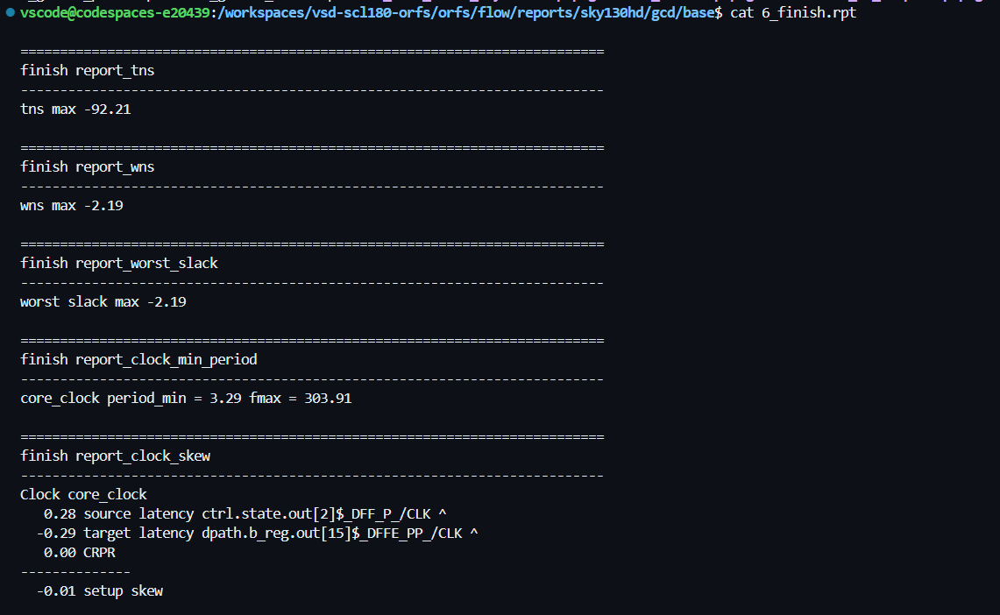

### Observation

The final timing report summarized the performance characteristics of the implemented design.

The reported metrics were:

```text
WNS = -2.19 ns
TNS = -92.21 ns
Worst Slack = -2.19 ns
Minimum Clock Period = 3.29 ns
Maximum Frequency = 303.91 MHz
```

This was one of the most informative reports generated during the flow because it showed how all previous implementation stages ultimately influence the timing performance of the final design.

---

# Final GDSII Layout

After implementation and timing analysis, the generated GDS file was opened in KLayout.

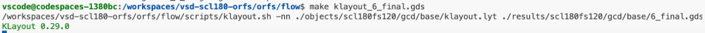
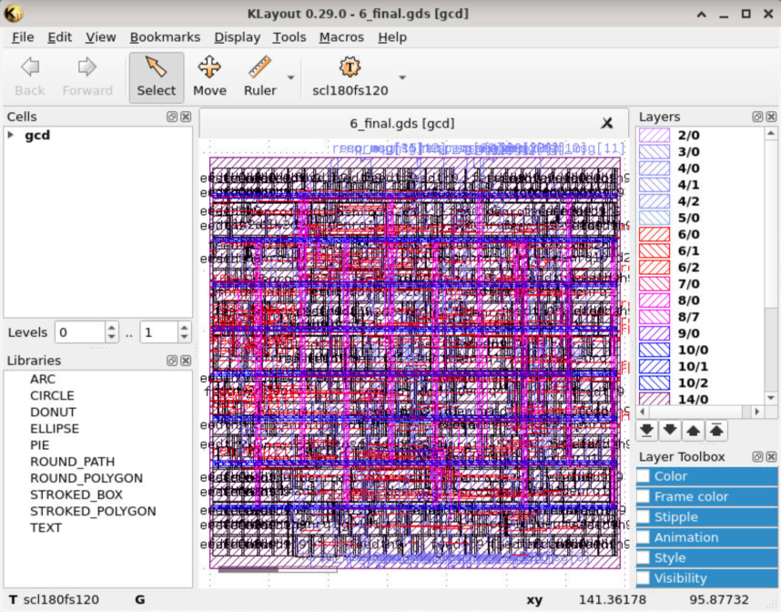

### Observation

The final GDSII layout provided a complete physical representation of the design.

Seeing the routed metal layers, standard-cell placement, and overall chip structure made the entire RTL-to-GDS process feel tangible. The design was no longer represented as RTL code or reports but as an actual physical layout that could proceed toward fabrication.

---

# Runtime Analysis

The generated logs were examined to understand execution time across the flow.

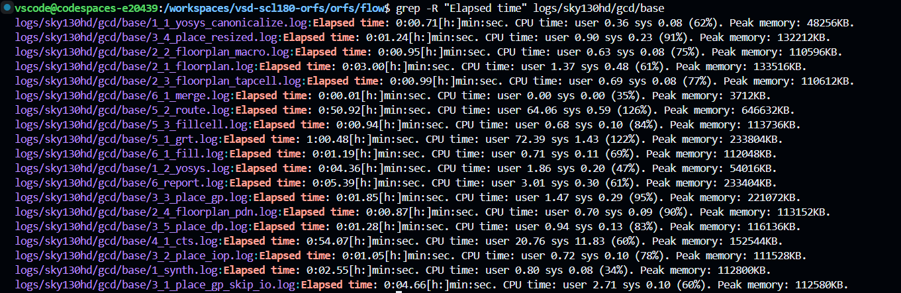

### Observation

The complete ORFS execution reached final reporting in approximately 5 minutes and 39 seconds.

Routing and Clock Tree Synthesis consumed noticeably more runtime than synthesis or floorplanning, demonstrating how physical implementation complexity increases as the design progresses toward signoff.

---
## Auto-Generated Visualization Reports

During the RTL-to-GDS flow execution, ORFS automatically generated several visualization images inside the report directory. These images provide graphical insights into different stages of the physical design flow and can be found in the **Images/** folder of this phase.

### Generated Images

| Image File | Description |
|------------|-------------|
| `final_all.webp.png` | Combined final layout view of the design |
| `final_placement.webp.png` | Standard-cell placement visualization |
| `final_routing.webp.png` | Final routed design visualization |
| `final_clocks.webp.png` | Clock network visualization |
| `cts_core_clock.webp.png` | CTS clock-tree structure view |
| `cts_core_clock_layout.webp.png` | Clock-tree layout after CTS |
| `final_congestion.webp.png` | Routing congestion analysis |
| `final_ir_drop.webp.png` | IR-drop visualization report |
| `final_resizer.webp.png` | Timing optimization (resizer) visualization |
| `final_worst_path.webp.png` | Worst timing path visualization |

### Observation

These images were generated automatically by ORFS/OpenROAD during report generation and provide a graphical representation of the physical implementation process. They complement the log files and timing reports by visually showing placement quality, routing completion, clock distribution, congestion hotspots, IR-drop analysis, and timing-critical paths within the final design.

---

## Final Thoughts

This phase provided practical exposure to the complete RTL-to-GDS implementation process using OpenROAD Flow Scripts.

Observing synthesis, floorplanning, PDN generation, placement, clock tree synthesis, routing, timing analysis, and final layout generation helped connect individual backend concepts into a single implementation pipeline. The generated reports also demonstrated how heavily ASIC design relies on quantitative analysis and iterative optimization.

---

## Biggest Takeaway

Writing RTL describes functionality.

Physical design determines how that functionality is transformed into an actual silicon implementation.

Watching the GCD design progress from RTL through synthesis, placement, routing, timing analysis, and finally into a GDS layout demonstrated how digital logic evolves into real hardware.

---

# Tools Used

* **OpenROAD Flow Scripts (ORFS)** – Complete RTL-to-GDSII Flow
* **OpenROAD** – Physical Design Engine
* **Yosys** – Logic Synthesis
* **OpenSTA** – Static Timing Analysis
* **TritonCTS** – Clock Tree Synthesis
* **FastRoute** – Routing Engine
* **KLayout** – GDSII Visualization
* **Sky130HD PDK** – Process Design Kit
* **GitHub Codespaces** – Cloud Development Environment
* **GNU Make** – Flow Automation
* **Python** – Script Execution Support
