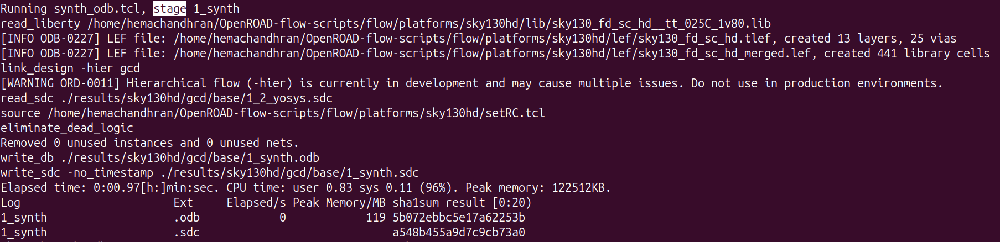
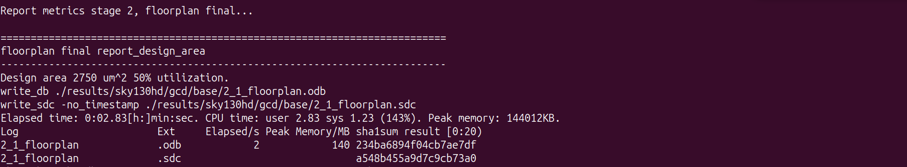
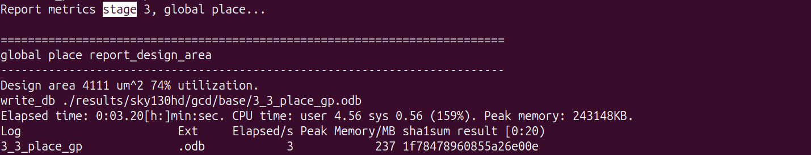
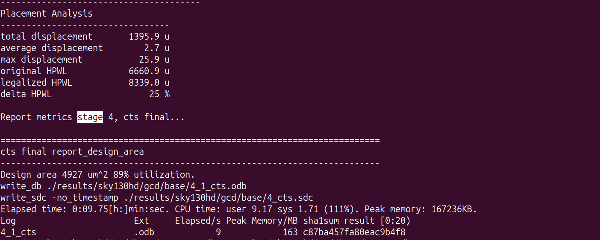
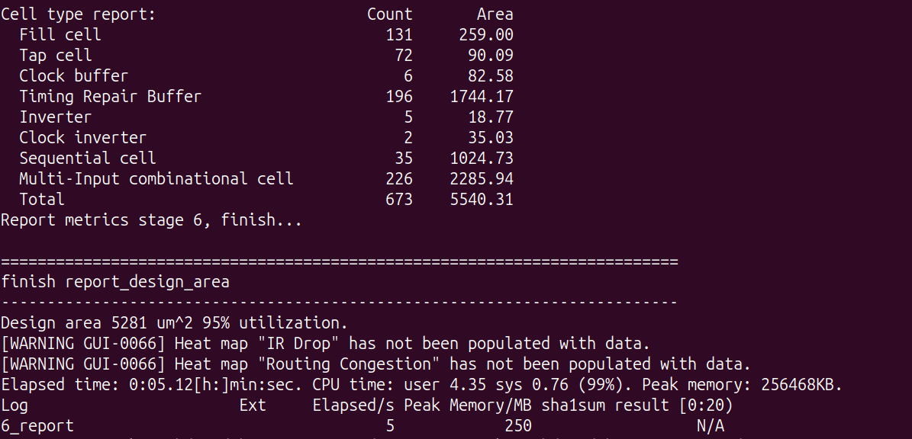
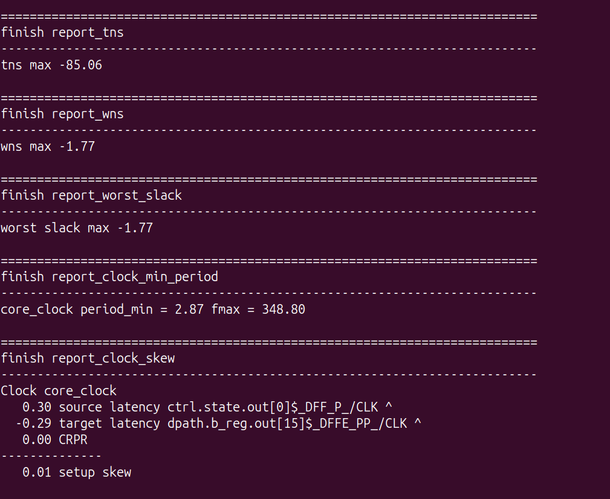
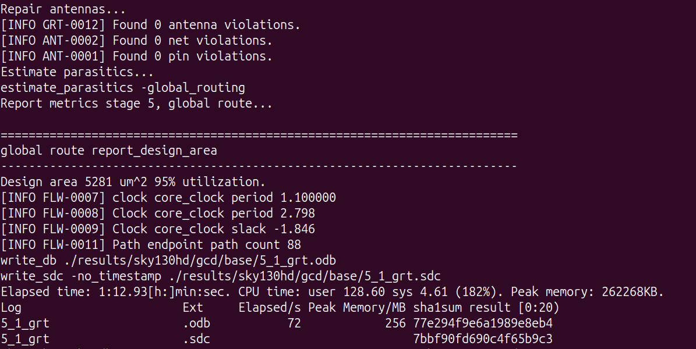
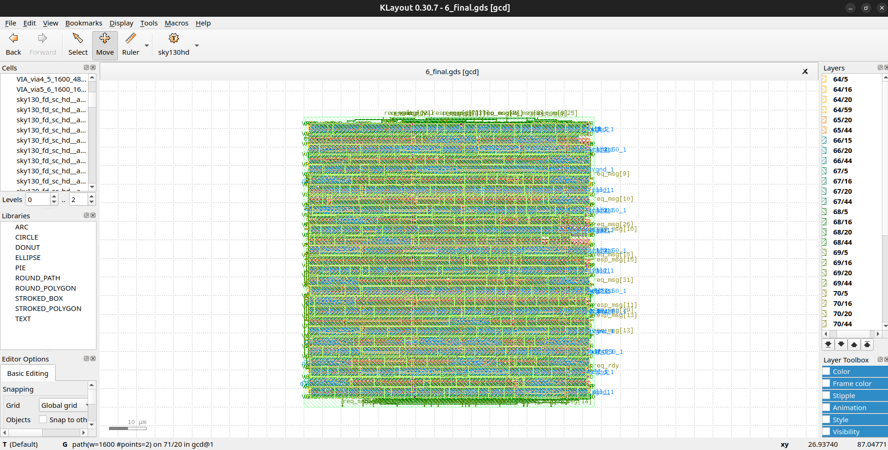
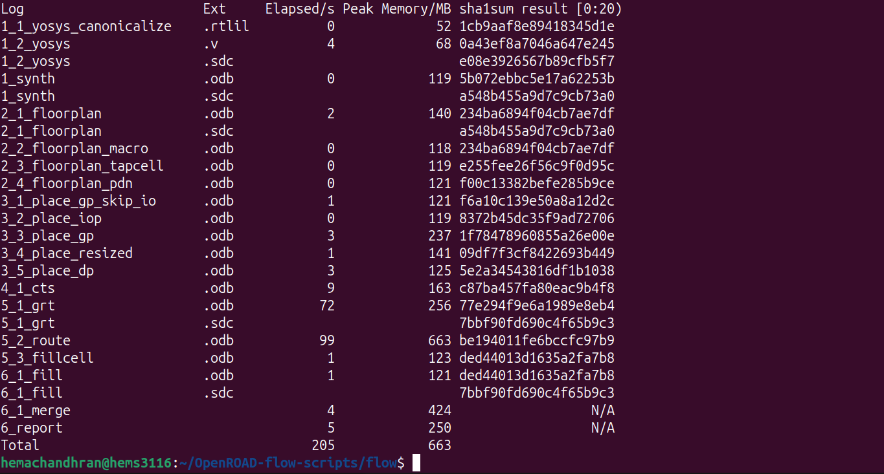

# Re-Running RTL-to-GDS Locally using ORFS

---

# Overview

In this phase, the complete RTL-to-GDSII flow was executed locally using OpenROAD Flow Scripts (ORFS). The same Sky130HD GCD testcase used in Phase 1 was re-run on the local Ubuntu machine to verify that the locally built OpenROAD environment could successfully perform the entire implementation flow.

The objective was to:

- Execute the complete RTL-to-GDS flow locally
- Verify synthesis, floorplanning, placement, CTS, routing, and GDS generation
- Analyze timing reports
- Compare local execution with the cloud-based execution performed earlier

---

# Launching the Local ORFS Flow

The GCD design available under the Sky130HD platform was selected and the flow was launched using the ORFS Makefile.


The make command invokes the makefile which contains all the scripts to run the flow as defined.

---

# Stage 1: Synthesis

The first stage of the flow converted the RTL design into a gate-level netlist using Yosys and the Sky130HD standard-cell library.



### Result

The RTL was successfully synthesized into a gate-level implementation and timing constraints were generated for subsequent stages.

---

# Stage 2: Floorplanning

After synthesis, ORFS automatically generated the floorplan.



### Result

Floorplan metrics:

| Metric | Value |
|----------|----------|
| Design Area | 2750 µm² |
| Utilization | 50% |

The floorplan established the initial physical boundaries and utilization targets for the design.

---

# Stage 3: Placement

The synthesized standard cells were placed within the floorplan region.



### Result

Placement metrics:

| Metric | Value |
|----------|----------|
| Design Area | 4111 µm² |
| Utilization | 74% |

The placement engine optimized cell locations while minimizing wirelength and congestion.

---

# Stage 4: Clock Tree Synthesis (CTS)

Clock Tree Synthesis inserted clock buffers and built the clock distribution network.



### Result

CTS metrics:

| Metric | Value |
|----------|----------|
| Design Area | 4927 µm² |
| Utilization | 89% |

Additional clock buffers increased the overall design area, which is expected during CTS.

---

# Stage 5: Global Routing

After CTS, the design entered routing.



### Result

Routing completed successfully with:

- 0 Antenna Violations
- 0 Net Violations
- 0 Pin Violations

Global routing also generated updated timing information for the routed design.

---

# Stage 6: Final Reporting and Signoff

After routing, ORFS generated final implementation reports.


The final design statistics showed:

| Metric | Value |
|----------|----------|
| Design Area | 5281 µm² |
| Utilization | 95% |

Cell summary:

| Cell Type | Count |
|------------|---------|
| Fill Cells | 131 |
| Tap Cells | 72 |
| Clock Buffers | 6 |
| Timing Repair Buffers | 196 |
| Sequential Cells | 35 |
| Combinational Cells | 226 |

---

# Final Timing Analysis

The final STA reports were generated after routing.



### Final Timing Results

| Metric | Value |
|----------|----------|
| TNS | -85.06 ns |
| WNS | -1.77 ns |
| Worst Slack | -1.77 ns |
| Minimum Clock Period | 2.87 ns |
| Maximum Frequency | 348.80 MHz |
| Setup Skew | 0.01 ns |

These reports indicate that timing analysis was successfully completed and timing metrics were available for signoff evaluation.

---

# Final GDSII Generation and Layout Visualization

After routing and signoff checks, ORFS generated the final GDSII layout database.



The generated output file was:

```text
results/sky130hd/gcd/base/6_final.gds
```

The GDS file was successfully opened in KLayout to verify that the physical layout had been generated correctly.



The successful visualization of `6_final.gds` in KLayout verified that the locally executed ORFS flow produced a valid manufacturable layout database.


---

# Generated Flow Artifacts

The final ORFS report listed all major stage outputs generated during execution.



This confirms that the complete RTL-to-GDS implementation flow executed successfully on the local machine.

---

# Cloud vs Local Comparison

| Metric | Cloud | Local |
|----------|----------|----------|
| Runtime | 5m:39s | 4m:14s |
| GDS Generated | Yes | Yes |
| WNS | -2.19 ns | -1.77 ns |
| TNS | -92.21 ns | -85.06 ns |

### Observation

Minor differences in timing metrics were observed between cloud and local execution. These differences are expected and may arise from:

- Different OpenROAD build versions
- Different optimization paths
- Local machine environment variations

However, both executions completed successfully and produced a valid final GDSII layout.

---

# Final Thoughts

This phase demonstrated that the complete ORFS RTL-to-GDSII flow can be executed successfully in a self-managed local environment. Running the flow locally provided a deeper understanding of how synthesis, floorplanning, placement, CTS, routing, timing analysis, and GDS generation are connected within a modern ASIC implementation flow.

---

## Biggest Takeaway

Executing ORFS locally requires more setup effort than using a cloud environment, but it provides full control over the toolchain and build environment. Successfully generating a GDSII file locally proved that the complete RTL-to-GDS flow can be reproduced independently without relying on pre-configured cloud infrastructure.

---

# Tools Used

* **OpenROAD Flow Scripts (ORFS)** – Complete RTL-to-GDSII Flow
* **OpenROAD** – Physical Design Engine
* **Yosys** – Logic Synthesis
* **OpenSTA** – Static Timing Analysis
* **TritonCTS** – Clock Tree Synthesis
* **FastRoute** – Routing Engine
* **KLayout** – GDSII Visualization
* **Sky130HD PDK** – Process Design Kit
* **GitHub Codespaces** – Cloud Development Environment
* **GNU Make** – Flow Automation
* **Python** – Script Execution Support
