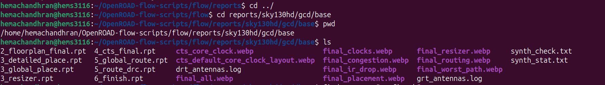
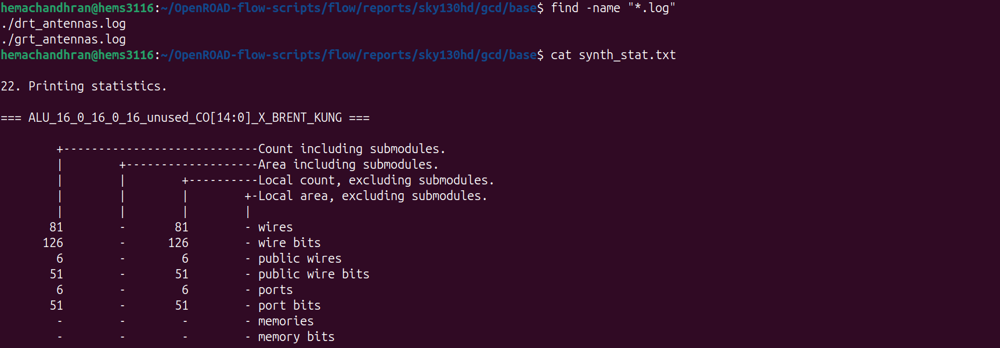
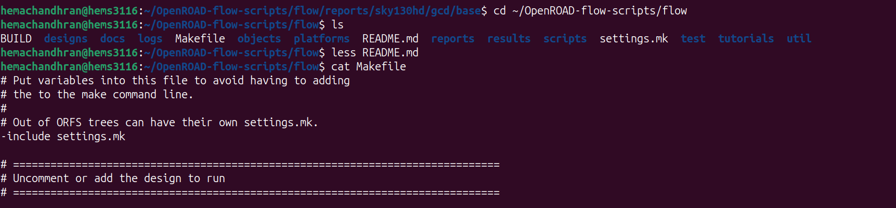

# Phase 5: Exploring ORFS Reports, Logs and Flow Artifacts

---

# Overview

In this phase, the focus shifted from executing the RTL-to-GDSII flow to understanding the artifacts generated by OpenROAD Flow Scripts (ORFS). The generated reports, logs, flow files, and configuration files were explored to understand how ORFS organizes data and how different stages of the ASIC design flow can be analyzed after execution.

The objective was to:

- Explore ORFS report directories
- Understand generated reports and logs
- Examine synthesis statistics
- Investigate Makefiles used for flow orchestration
- Analyze utilization and timing information from logs
- Understand how ORFS manages tool execution

---

# Exploring Generated Reports

The report directory generated during the RTL-to-GDSII flow was explored.



The reports folder contains outputs generated at different stages of the flow, including:

- Floorplan reports
- Placement reports
- CTS reports
- Routing reports
- Final signoff reports
- Layout visualization images
- Congestion and IR-drop reports

These reports provide detailed information about the physical implementation process.

---

# Understanding Report Files

The synthesis statistics file was examined to understand information generated after synthesis.



### Commands Used

```bash
find -name "*.log"
```

Searches recursively for all files with the `.log` extension.

```bash
cat synth_stat.txt
```

Displays the contents of a text file directly in the terminal.

### Observation

The synthesis statistics report contains information such as:

- Number of wires
- Number of ports
- Number of wire bits
- Design hierarchy information
- Logic statistics generated after synthesis

These reports help evaluate the synthesized design before physical implementation begins.

---

# Exploring Flow Configuration Files

The ORFS flow directory and Makefile were examined.



### Commands Used

```bash
ls
```

Lists all files and directories in the current location.

```bash
less README.md
```

Opens a file for viewing page by page.

```bash
cat Makefile
```

Prints the contents of the Makefile.

### Observation

The Makefile acts as the central controller of the ORFS flow. It defines:

- Execution order of stages
- Scripts to be executed
- Design configuration handling
- Flow dependencies

This demonstrates how ORFS automates the complete RTL-to-GDSII flow through GNU Make.

---

# Investigating Timing and Utilization Information

The generated log files were searched for timing and utilization information.


### Commands Used

```bash
grep "tns" logs/sky130hd/gcd/base/*.log
```

Searches all matching log files and displays lines containing the keyword **tns**.

```bash
grep "Utilization" logs/sky130hd/gcd/base/*.log
```

Searches all matching log files and displays lines containing the keyword **Utilization**.

### Observation

The logs revealed:

| Stage | Utilization |
|---------|---------|
| Initial Placement | 53.8% |
| Global Placement | 64.7% |
| Resized Placement | 78.9% |
| Detailed Placement | 74.2% |
| CTS | 88.9% |
| Final Routing | 95.3% |

The logs also showed timing-repair operations performed during:

- Floorplanning
- CTS
- Routing

This demonstrates how ORFS continuously performs optimization and timing repair throughout the implementation flow.

---

# Understanding Environment Variables

The OpenROAD executable path was verified using an environment variable.


### Commands Used

```bash
export OPENROAD_EXE=$HOME/openroad/OpenROAD/build/bin/openroad
```

Creates an environment variable named `OPENROAD_EXE` and assigns the OpenROAD executable path to it.

```bash
echo $OPENROAD_EXE
```

Prints the value stored in the environment variable.

### Observation

Environment variables allow ORFS to locate tool binaries without requiring the full executable path to be specified repeatedly.

This improves portability and simplifies tool invocation within scripts.

---

# Key Learnings

During this phase, the following ORFS components were explored:

- Reports generated after each implementation stage
- Log files used for debugging and analysis
- Synthesis statistics reports
- Makefile-based flow orchestration
- Timing and utilization extraction from logs
- Environment-variable based tool management

This provided a deeper understanding of how ORFS organizes information and automates the complete ASIC implementation flow.

---

# Final Thoughts

This phase focused on understanding the infrastructure around the RTL-to-GDSII flow rather than executing the flow itself. Exploring reports, logs, Makefiles, and environment variables helped reveal how ORFS manages automation, stores intermediate results, and provides visibility into every stage of the design implementation process.

---

## Biggest Takeaway

Running a design flow is only part of the ASIC implementation process. Equally important is understanding the reports, logs, and automation framework that drive the flow. ORFS provides a structured environment where every stage generates artifacts that can be analyzed for debugging, optimization, and design signoff.

---

# Tools Used

* **OpenROAD Flow Scripts (ORFS)** – Flow Automation Framework
* **GNU Make** – Flow Orchestration
* **OpenROAD** – Physical Design Engine
* **Yosys** – Logic Synthesis
* **OpenSTA** – Static Timing Analysis
* **Linux Shell Utilities** (`ls`, `cat`, `less`, `find`, `grep`)
* **Bash Environment Variables** – Tool Path Management
