# RTL-to-GDS Implementation of User Project Wrapper
---

# PHASE 1 – Analyze the Top-Level Wrapper

## Dependency Tree of the Wrapper

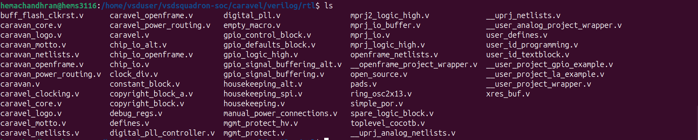
The `user_project_wrapper` is the top-level module responsible for integrating the user project with the Caravel SoC infrastructure. Rather than implementing application logic itself, it provides the interface between the Wishbone bus, GPIO, Logic Analyzer, debug registers, and optional test modules.

The dependency hierarchy of the wrapper is shown below:

```text
user_project_wrapper
│
├── debug_regs
│
├── user_project_gpio_example     (compiled only when GPIO_TESTING is enabled)
│
└── user_project_la_example       (compiled only when LA_TESTING is enabled)
```

The `debug_regs` module is always instantiated to provide Wishbone-accessible debug registers. The GPIO and Logic Analyzer example modules are conditionally included using Verilog preprocessor directives and are mainly intended for testing and validation.

---

## RTL Files Required by the Design

The wrapper depends on multiple RTL source files to build the complete hierarchy. Each file contributes a specific function within the design.

| RTL File                      | Description                                                                              |
| ----------------------------- | ---------------------------------------------------------------------------------------- |
| `user_project_wrapper.v`      | Top-level integration module that interfaces the user project with the Caravel platform. |
| `debug_regs.v`                | Implements the debug register block accessed through the Wishbone interface.             |
| `defines.v`                   | Contains macro definitions and configuration parameters required by the wrapper.         |
| `user_project_gpio_example.v` | Example GPIO module instantiated during GPIO testing.                                    |
| `user_project_la_example.v`   | Example Logic Analyzer module instantiated during LA testing.                            |

Among these, `user_project_wrapper.v` serves as the top module, while the remaining files provide supporting functionality required during synthesis or testing.

---

## Module Hierarchy Explanation

The design follows a simple hierarchical organization with `user_project_wrapper` at the highest level. This module connects the user design to the Caravel SoC by exposing the system clock, reset, Wishbone slave interface, GPIO pins, Logic Analyzer interface, analog I/O, and interrupt signals.

One of the primary responsibilities of the wrapper is address decoding. Based on the incoming Wishbone address, it separates normal user transactions from debug register accesses. Requests targeting the reserved debug address space are routed to the `debug_regs` module, while all other accesses are directed to the user project.

The wrapper also supports optional verification modules. When the `GPIO_TESTING` macro is enabled, the `user_project_gpio_example` module is instantiated to validate GPIO functionality. Likewise, enabling `LA_TESTING` instantiates the `user_project_la_example` module for Logic Analyzer verification. These modules are excluded from the synthesis flow unless the corresponding compile-time flags are defined.

From the compilation perspective, all lower-level modules must be available before the top-level wrapper is elaborated. Maintaining the correct dependency order ensures successful synthesis and prevents unresolved module reference errors during the RTL-to-GDS implementation flow.

---

# PHASE 2 – Prepare the ORFS Design Environment

To perform the RTL-to-GDS implementation, an OpenROAD Flow Scripts (ORFS) design workspace was created for the `user_project_wrapper` design. The required RTL files were collected into a dedicated `rtl` directory, and the necessary configuration files were added to allow the OpenROAD flow to recognize the design hierarchy and timing constraints.

## Directory Structure

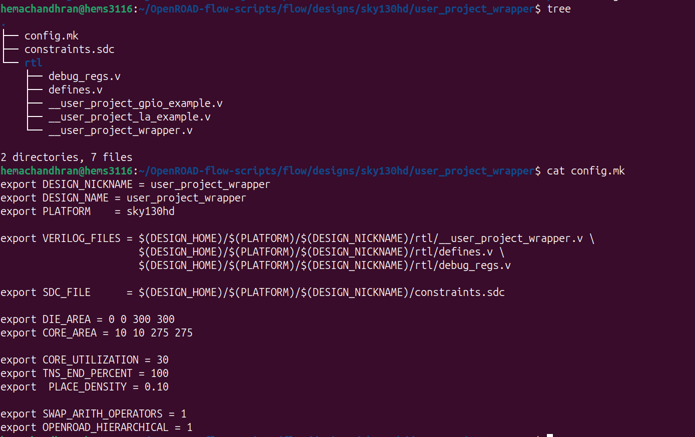

### Directory Description

| File / Directory | Description |
|------------------|-------------|
| `config.mk` | Contains the OpenROAD Flow configuration, including the design name, platform, RTL sources, and implementation parameters. |
| `constraints.sdc` | Defines the timing constraints used during synthesis and timing analysis. |
| `rtl/` | Stores all RTL source files required by the top-level wrapper. |

## RTL Integration

The following RTL files were included in the project:

| RTL File | Purpose |
|----------|---------|
| `__user_project_wrapper.v` | Top-level wrapper connecting the user project to the Caravel SoC infrastructure. |
| `debug_regs.v` | Implements the Wishbone-accessible debug register block. |
| `defines.v` | Contains macro definitions and platform-specific parameters used throughout the design. |
| `__user_project_gpio_example.v` | Optional GPIO demonstration module used when `GPIO_TESTING` is enabled. |
| `__user_project_la_example.v` | Optional Logic Analyzer demonstration module used when `LA_TESTING` is enabled. |

The top module for the design was configured as `user_project_wrapper`, while the RTL source files were referenced through the `VERILOG_FILES` variable in `config.mk`. The design was targeted for the `sky130hd` technology platform.

The configuration file also specifies the die area, core area, placement density, and other implementation parameters required by the OpenROAD flow. These settings allow the synthesis and physical design stages to execute successfully.

---

# PHASE 3 – Apply 100 MHz Clock Constraint

## Constraint File

To ensure correct timing analysis during synthesis and implementation, a Synopsys Design Constraints (SDC) file named `constraints.sdc` was created.

The following clock constraint was added:


This defines a clock with a period of **10 ns**, corresponding to a target operating frequency of **100 MHz**.

## Clock Port Identification

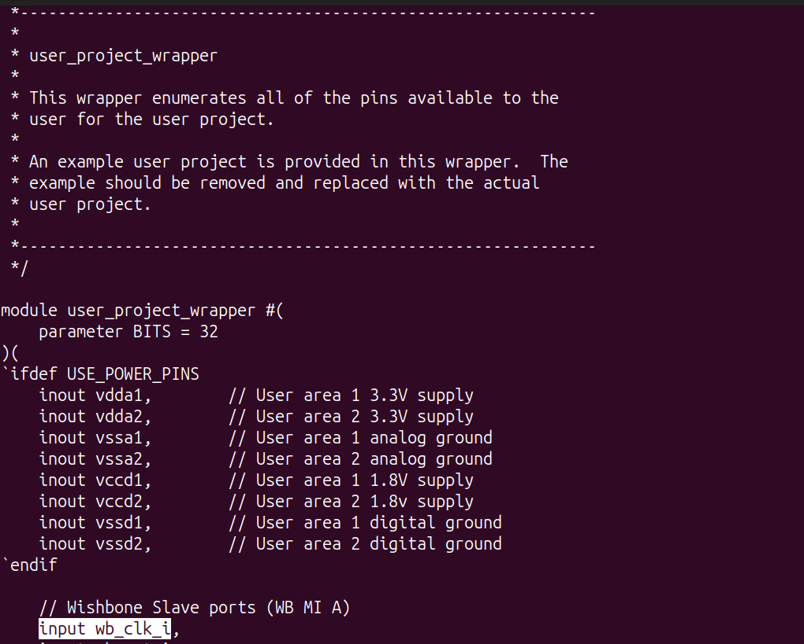
The clock input was identified by examining the top-level module `user_project_wrapper`. Among the module inputs, the signal `wb_clk_i` serves as the primary system clock and is distributed to all synchronous modules, including the debug register block.

Since this signal drives the sequential logic within the design, it was selected as the reference clock for timing analysis.

## Constraint Verification

The constraint file was linked to the OpenROAD Flow through the `SDC_FILE` variable in `config.mk`.

During synthesis and subsequent implementation stages, the timing engine uses this constraint to perform setup and hold analysis based on the specified 10 ns clock period.

The successful loading of the constraint enables the design to be optimized for the required operating frequency while ensuring accurate static timing analysis throughout the RTL-to-GDS implementation flow.

---

# Phase 4: RTL-to-GDSII Implementation using ORFS

## Launching the OpenROAD Flow

The RTL-to-GDSII implementation of the `user_project_wrapper` design was performed using the OpenROAD Flow Scripts (ORFS). The flow was launched using the following Make command:

```bash
make DESIGN_CONFIG=./designs/sky130hd/user_project_wrapper/config.mk
```

Initially, the flow failed because ORFS could not locate the correct Yosys and OpenROAD executables. After identifying the correct executable paths, they were explicitly provided in the Make command, allowing the implementation flow to execute successfully.

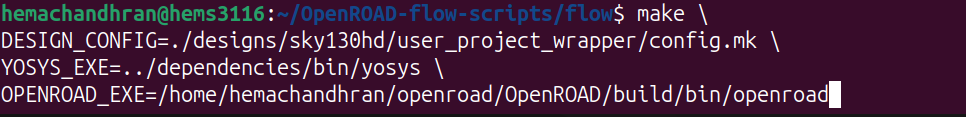

---

## RTL Synthesis

The first stage of the implementation flow performs RTL synthesis, where the Verilog design is converted into a technology-mapped gate-level netlist using the Sky130HD standard-cell library. The synthesized database (`1_synth.odb`) generated in this stage serves as the starting point for physical implementation.

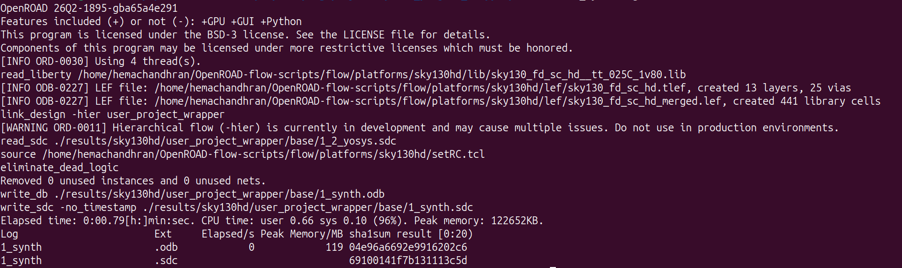

---

## Floorplanning

During floorplanning, the physical dimensions of the chip are established by defining the die and core areas before placement begins.

Initially, the flow terminated with the following error:

> **Floorplan initialization methods are mutually exclusive.**

This occurred because both manual die/core dimensions and `CORE_UTILIZATION` were specified simultaneously in the `config.mk` file. ORFS allows only one method of floorplan initialization. To resolve the issue, the utilization constraint was removed while retaining the manually specified die and core dimensions. After updating the configuration, the floorplanning stage completed successfully.

**Floorplan Error**

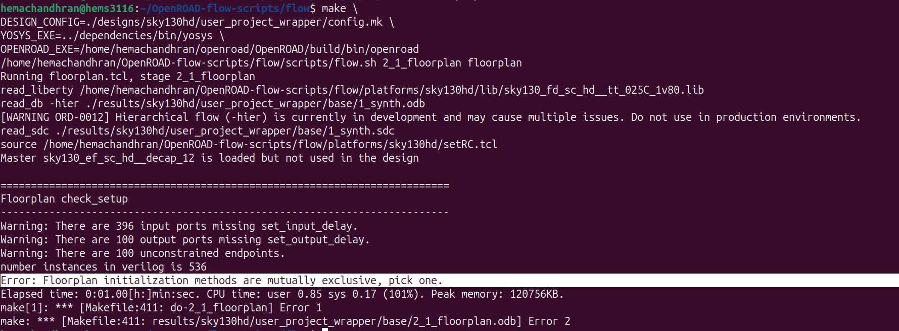

**Successful Floorplan**

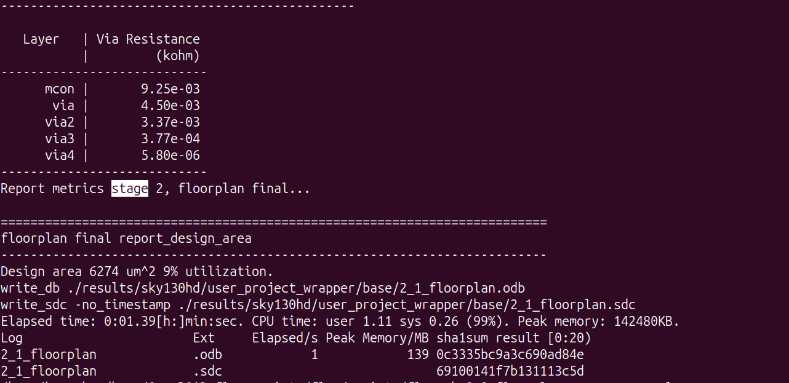

---

## Placement

The placement stage positions all standard cells within the core area while optimizing wirelength and placement quality before routing.

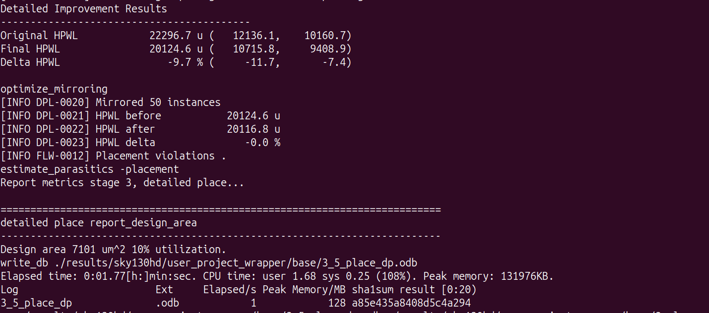

---

## Clock Tree Synthesis (CTS)

Clock Tree Synthesis inserts clock buffers and constructs the clock distribution network to deliver the clock signal uniformly throughout the design.

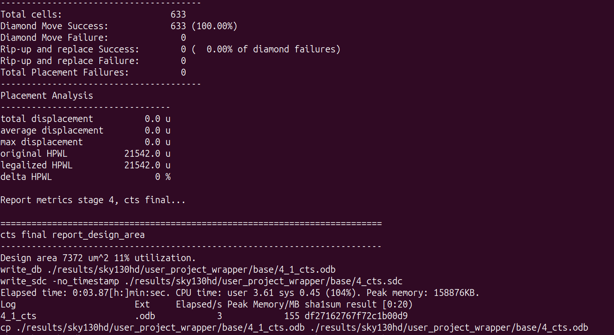

---

## Routing

The routing stage establishes all physical interconnections between the placed standard cells. ORFS performs both global routing and detailed routing before generating the final routed layout.

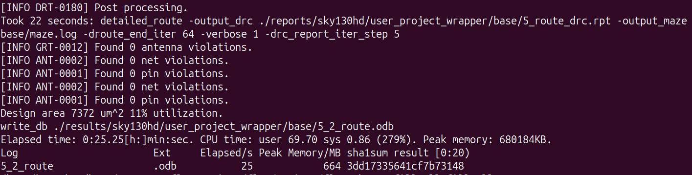

---

## Fill Cell Insertion

After routing, filler cells are inserted into the unused spaces between standard cells. These cells maintain continuous power rails and satisfy fabrication requirements without affecting the circuit functionality.

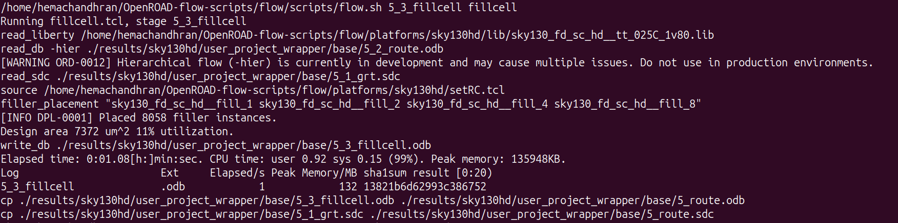

---

## Final Report, GDSII Generation and Timing Summary

The final stage performs implementation reporting, generates the final GDSII layout, and produces the final timing summary.

The generated reports include design area, utilization, IR-drop statistics, cell count, runtime information and timing metrics such as TNS, WNS, worst slack, minimum clock period and clock skew. The final manufacturable GDSII file is also generated during this stage.

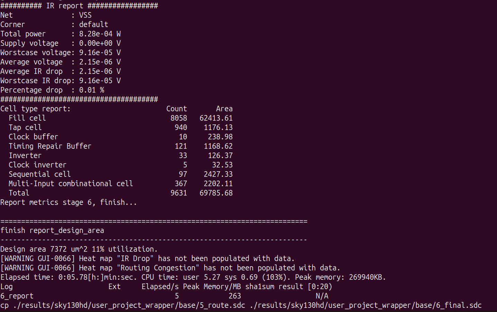

---

# Phase 5: Exploration of ORFS Output Files

The RTL-to-GDS implementation generates three major output directories:

* **logs/**
* **results/**
* **reports/**

Each directory stores a different category of implementation outputs.

---

## logs/

The **logs** directory stores the execution logs generated during every stage of the flow. These files record the commands executed, runtime information, warnings and errors.

The directory mainly contains:

* **.log** → Execution logs for each implementation stage.
* **.json** → Structured runtime and execution metadata generated by ORFS, making it easier for scripts and tools to process stage information programmatically.

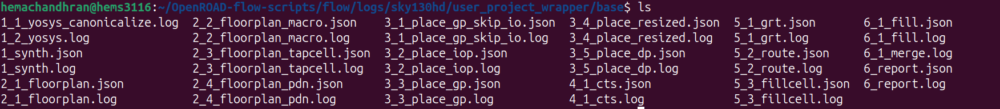

---

## results/

The **results** directory contains the actual implementation outputs generated after every stage. These files represent the progressively updated physical design that is passed from one stage to the next.

Some commonly generated file types include:

* **.odb** → OpenDB physical design database.
* **.def** → Physical layout information in DEF format.
* **.v** → Final gate-level Verilog netlist.
* **.sdc** → Timing constraint files.
* **.spef** → Extracted parasitic RC information.
* **.gds** → Final manufacturable GDSII layout.
* **.json** → Runtime and memory statistics.

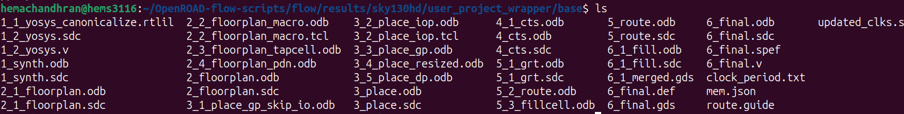

---

## reports/

The **reports** directory contains implementation reports and graphical summaries generated throughout the RTL-to-GDS flow.

The directory includes:

* **.rpt** → Timing, placement, CTS, routing and implementation reports.
* **.webp** → Graphical visualizations such as placement, routing, congestion, clocks and final layout.
* **.log** → Reports generated by antenna and routing analysis.

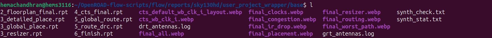

---

# Important Implementation Outputs

The following files are generated during the RTL-to-GDS implementation flow:

| File               | Description                          |
| ------------------ | ------------------------------------ |
| `1_synth.odb`      | Synthesized OpenDB database          |
| `2_floorplan.odb`  | Floorplanned design database         |
| `3_place.odb`      | Placement database                   |
| `4_cts.odb`        | Database after Clock Tree Synthesis  |
| `5_route.odb`      | Database after routing               |
| `5_3_fillcell.odb` | Database after filler cell insertion |
| `6_final.odb`      | Final OpenDB implementation database |
| `6_final.def`      | Final physical DEF file              |
| `6_final.v`        | Final gate-level Verilog netlist     |
| `6_final.sdc`      | Final timing constraint file         |
| `6_final.spef`     | Extracted parasitic information      |
| `6_final.gds`      | Final manufacturable GDSII layout    |
| `route.guide`      | Global routing guide                 |
| `updated_clks.sdc` | Updated clock constraint file        |
| `mem.json`         | Memory and execution statistics      |

---

# Final GDSII Layout

The final GDSII layout generated by ORFS was successfully opened and verified using **KLayout**. The layout confirms the successful completion of the RTL-to-GDSII implementation flow and represents the final manufacturable chip layout generated for the `user_project_wrapper` design.

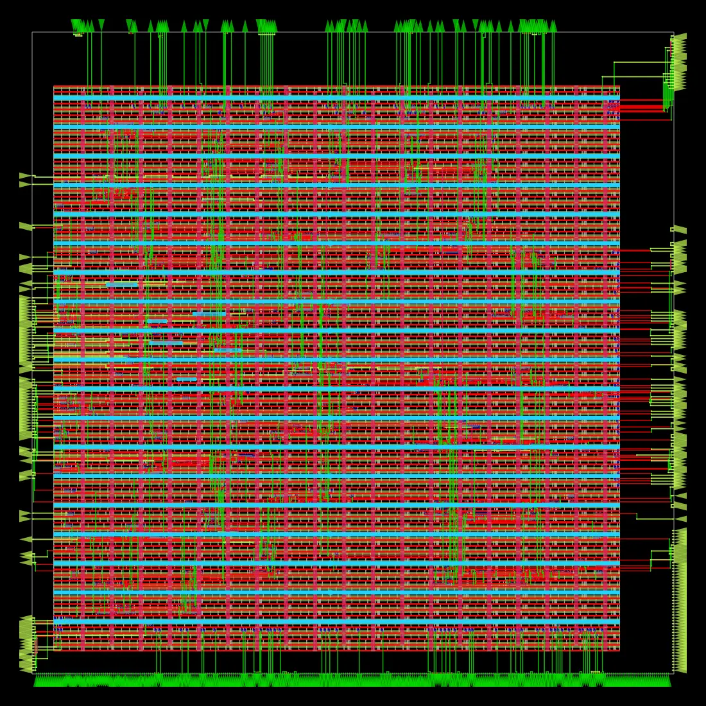

---

# Conclusion

The complete RTL-to-GDSII implementation of the `user_project_wrapper` design was successfully performed using the OpenROAD Flow Scripts. The design progressed through synthesis, floorplanning, placement, clock tree synthesis, routing, fill-cell insertion and final sign-off, ultimately generating the final GDSII layout along with all implementation databases and reports. The generated outputs verify that the design was successfully translated from RTL into a manufacturable physical layout.

---

# Learning Experience

Through this exercise, I gained practical experience with the complete open-source RTL-to-GDSII implementation flow using ORFS. I learned how each stage contributes to the physical realization of a digital design, how to debug common implementation issues such as floorplan configuration errors, and how to interpret the various logs, reports and result files generated during the flow. Additionally, exploring the final GDSII layout using KLayout provided a better understanding of how an RTL design is ultimately transformed into a physical chip layout.

