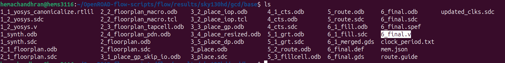
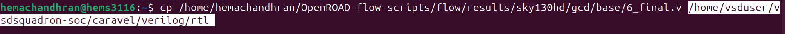
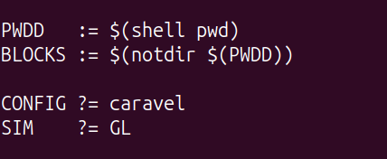
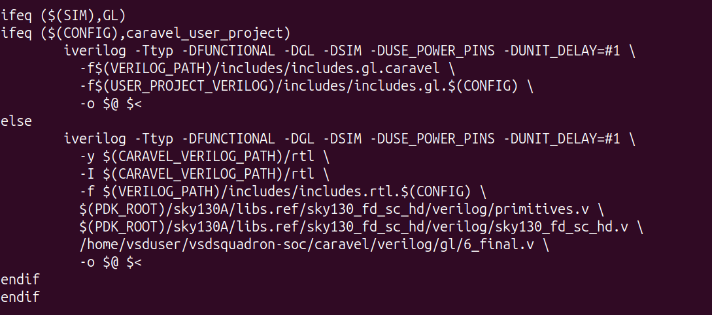
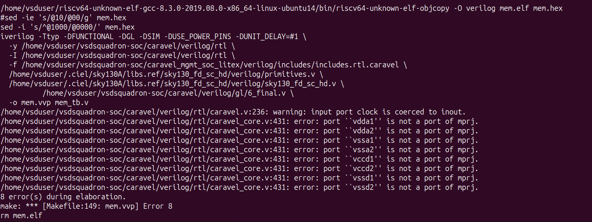
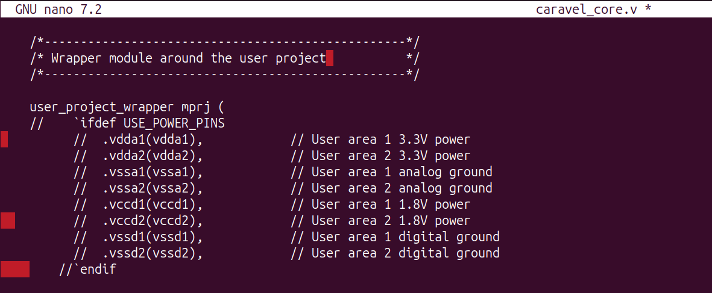

# WEEK 5 – Gate-Level Simulation (GLS) for Full Block Verification

## Phase 1 – Preparing the Gate-Level Netlist

The gate-level netlist generated during Week 4 was used for all GLS verification. Among the files produced by the OpenROAD flow, `6_final.v` represents the final implemented design after placement and routing, making it the correct netlist for gate-level simulation.

The file was copied into the Caravel project so it could be used by the existing verification environment without changing the overall flow.

*Figure 1: Final implementation files generated by OpenROAD.*

 

*Figure 2: Copying `6_final.v` into the Caravel project.*

---

## Phase 2 – Updating the Verification Flow

The Makefiles created during Week 3 were modified so that the simulations use the generated gate-level netlist instead of the RTL source.

The simulation mode was changed from **RTL** to **GL**, and the compilation command was updated to include the generated `6_final.v` file along with the required SKY130 standard-cell libraries (`primitives.v` and `sky130_fd_sc_hd.v`). These libraries are required because the synthesized netlist consists of standard-cell instances rather than behavioral RTL.

The existing testbenches were reused without any modifications.

*Figure 3: Simulation mode changed from RTL to GL.*

 

 

*Figure 4: Updated compilation command using `6_final.v` and the SKY130 standard-cell libraries.*

---

## Phase 3 – Standalone GLS Verification

After updating the verification flow, all standalone tests were executed using the synthesized gate-level netlist. The results were then compared with the RTL verification results obtained during Week 3.

The complete GLS results for the individual standalone block verification is available in **standalone_gls_results.md**.

### Standalone GLS Result Table

| Test       | RTL Status (Week–3) | GLS Status     |
| ---------- | ------------------- | -------------- |
| GPIO Mgmt  | PASS                | PASS           |
| Memory     | PASS                | PASS           |
| UART       | PASS                | PASS           |
| Timer      | FAIL (Timeout)      | FAIL (Timeout) |
| IRQ        | FAIL (Timeout)      | FAIL (Timeout) |
| Debug      | FAIL (Timeout)      | FAIL (Timeout) |
| SPI Master | PASS                | PASS           |

The gate-level simulation results matched the RTL verification results for all standalone tests. Tests that passed during RTL simulation also passed during GLS, while the timeout cases remained unchanged.

---

## Phase 4 – Caravel GLS Verification

The same gate-level netlist was then verified using the complete Caravel test suite. No changes were made to the testbenches, allowing the synthesized design to be validated in the same environment that was used for RTL verification.

The complete GLS results for the individual caravel block verification is available in **caravel_gls_results.md**.

### Caravel GLS Result Table

| Test           | RTL Status (Week–3) | GLS Status     |
| -------------- | ------------------- | -------------- |
| user_pass_thru | PASS                | PASS           |
| uart           | PASS                | PASS           |
| sysctrl        | FAIL (Timeout)      | FAIL (Timeout) |
| sram_exec      | PASS                | PASS           |
| spi_master     | PASS                | PASS           |
| pullupdown     | PASS                | PASS           |
| pll            | FAIL                | FAIL           |
| pass_thru_fix  | PASS                | PASS           |
| mem            | PASS                | PASS           |
| hkspi_power    | PASS                | PASS           |
| gpio_mgmt      | PASS                | PASS           |
| hkspi          | PASS                | PASS           |

The Caravel integration tests also produced results consistent with the RTL verification. All previously passing tests continued to pass during gate-level simulation, while the `sysctrl` timeout and `pll` failure remained unchanged, indicating that these behaviors were already present before synthesis.

---

## Phase 5 – GTKWave Visualization

After completing gate-level simulation, the generated waveforms were analyzed to verify the functionality of the synthesized design. The waveforms confirmed the correct operation of the major modules and were used to compare the behavior of the standalone design with the complete Caravel integration.

### Standalone Gate-Level Simulation

The standalone gate-level waveforms verified the functionality of the individual peripherals, including UART, GPIO Management, Memory, SPI Master, Timer, IRQ, and Debug. These waveforms confirmed that the synthesized design behaved as expected, while also showing the timing effects introduced after synthesis and physical implementation.

The complete waveform analysis for the standalone verification is available in **waveform_analysis.md**.

The overall standalone gate-level verification results are shown below.

 

---

### Caravel Gate-Level Simulation

After standalone verification, the synthesized design was integrated into the Caravel framework and verified using the Caravel gate-level test suite. Waveforms were analyzed for User Pass Through, UART, SysCtrl, SRAM Execution, SPI Master, Pull-up/Pull-down, PLL, Pass-through Fix, Memory, HKSPI Power, GPIO Management, and HKSPI. These waveforms confirmed correct integration of the synthesized netlist within the complete SoC environment.

The complete waveform analysis for the Caravel verification is available in **waveform_analysis.md**.

The overall Caravel gate-level verification results are shown below.

#### NOTE:

The waveform analysis, together with the verification results, confirms that the synthesized design preserved its functionality after synthesis and physical implementation. Although a few timing-sensitive tests showed expected gate-level limitations, the overall functionality of the design remained consistent in both standalone and Caravel gate-level simulations.

---

## Phase 6 – RTL vs GLS Comparison and Debugging

During gate-level simulation, I faced a few issues while integrating the synthesized netlist into the Caravel verification flow.

The first issue was a power pin mismatch. The generated `6_final.v` did not have the power pins expected by the Caravel wrapper, which caused compilation errors. After checking the netlist and Makefile, I updated the verification flow to use the correct gate-level netlist along with the required SKY130 standard-cell libraries. This fixed the compilation issue and the simulations ran successfully.

*Figure 5: Power pin mismatch during the initial GLS compilation.*

 

*Figure 6: Successful gate-level simulation after fixing the verification flow.*

I also noticed some small timing differences compared to RTL simulation. This is expected because gate-level simulation includes clock buffers, routing delays, and gate delays after physical implementation. The reset sequence also took slightly longer than in RTL because the delays are modeled more realistically.

Another issue was that the simulation initially failed because the required SKY130 standard-cell libraries were not included. After adding `primitives.v` and `sky130_fd_sc_hd.v` and updating the Makefile to use `6_final.v`, the existing testbenches worked without any further changes.

Through this debugging process, I learned how gate-level simulation differs from RTL simulation. I understood the importance of using the correct standard-cell libraries, matching the module interfaces, and how physical implementation introduces realistic timing effects while still preserving the functionality of the design.

---

## Conclusion

In this week, the synthesized gate-level netlist generated during Week 4 was successfully integrated into the Caravel verification environment. After updating the Makefiles and resolving the initial integration issues, both the standalone and Caravel test suites were executed using gate-level simulation.

The final GLS results matched the RTL verification results for all functional tests. The remaining timeout and PLL failures were consistent with the Week 3 RTL results, confirming that no new functional issues were introduced during synthesis or physical implementation.

Overall, this week's work verified that the implemented design remained functionally correct after synthesis and physical design, providing confidence in the correctness of the complete ASIC implementation flow.

---

## Learning Experience

This week gave me practical experience in working with gate-level simulation and understanding how it differs from RTL verification. I learned how synthesized netlists are integrated into an existing verification environment, how standard-cell libraries are used during simulation, and how to debug common integration issues such as power-pin mismatches and missing library files.

Working through these problems also helped me understand the impact of clock tree synthesis, routing delays, and reset propagation on the final hardware behavior. Successfully completing both the standalone and Caravel GLS verification gave me a much better understanding of the complete ASIC design and verification flow from RTL to physical implementation.

