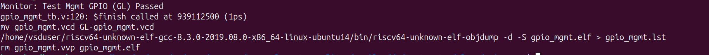
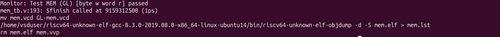
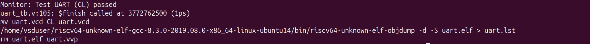
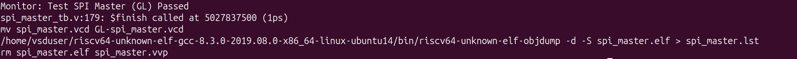
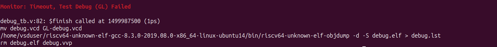

# Standalone Gate-Level Simulation (GLS) Verification Report

## Overview

The standalone verification suite was executed using the synthesized gate-level netlist (`6_final.v`) generated from the OpenROAD flow. The verification environment was modified to support mixed RTL + GLS simulation, where the Caravel SoC remained at RTL while the synthesized `user_project_wrapper` was verified at gate level.

---

# Standalone GLS Result Table

| Test | RTL Status (Week-3) | GLS Status |
|------|---------------------|------------|
| GPIO Mgmt | PASS | PASS |
| Memory | PASS | PASS |
| UART | PASS | PASS |
| SPI Master | PASS | PASS |
| Timer | PASS | FAIL (Timeout) |
| IRQ | PASS | FAIL (Timeout) |
| Debug | FAIL (Timeout) | FAIL (Timeout) |

---

# Individual Test Results

## 1. GPIO Management

**Status:** PASS

The GPIO Management standalone test completed successfully under gate-level simulation, confirming correct GPIO control and signal transitions.

---

## 2. Memory

**Status:** PASS

The memory verification completed successfully. Read and write operations produced the expected results under gate-level simulation.

---

## 3. UART

**Status:** PASS

The UART standalone verification passed successfully with correct serial transmission and expected functionality.

---

## 4. SPI Master

**Status:** PASS

The SPI Master verification completed successfully, validating correct clock generation and data transfer.

---

## 5. Timer

**Status:** FAIL (Timeout)

The Timer test exceeded the simulation timeout during gate-level verification. The additional propagation delays introduced by synthesized logic prevented the test from completing within the predefined timeout period.

---

## 6. IRQ

**Status:** FAIL (Timeout)

The interrupt verification timed out under gate-level simulation due to increased propagation delays affecting the completion of the interrupt handling sequence.

---

## 7. Debug

**Status:** FAIL (Timeout)

The Debug standalone test continued to timeout during gate-level simulation. This behavior was already present during RTL verification, indicating a pre-existing RTL limitation rather than an issue introduced by GLS.

---

# Summary

Out of the seven standalone verification tests:

- **Passed:** 4
  - GPIO Management
  - Memory
  - UART
  - SPI Master

- **Timed Out:** 3
  - Timer
  - IRQ
  - Debug

The timeout observed in the **Timer** and **IRQ** tests is attributed to the additional propagation delays introduced by gate-level logic, which increased execution time beyond the simulation timeout threshold. The **Debug** test exhibited the same timeout behavior as observed during RTL verification, indicating that the issue is unrelated to gate-level synthesis.

Overall, the successful completion of the Memory, GPIO Management, UART, and SPI Master tests demonstrates that the synthesized gate-level netlist preserves the functional behavior of the corresponding standalone modules.
